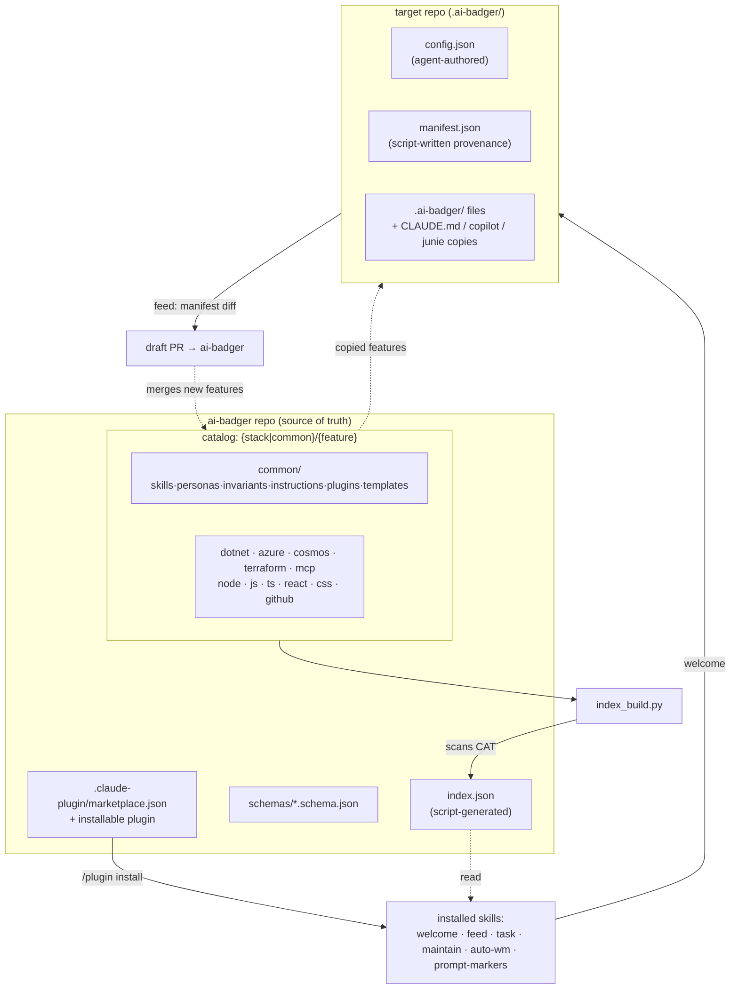
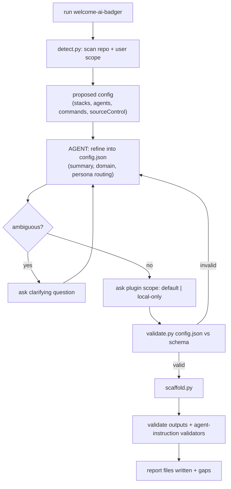

# ai-badger

**ai-badger** is the source of truth for custom Claude Code skills, personas, invariants, and
instructions used across projects. It is three things in one repo:

1. **A catalog** of reusable framework features (skills, personas, invariants, instructions,
   curated plugin bundles) organized by technology stack.
2. **A Claude Code marketplace** — install it once, and it hands you the tooling to use the
   catalog.
3. **A project scaffolder** — `welcome-ai-badger` reads a target repo, proposes a profile, and
   materializes a tailored slice of the catalog into it; `feed-badger` harvests generalizable
   improvements a project made back into the catalog via a draft PR.

Badger-themed name, professional-grade contents: the badger digs the framework into your repo
and digs improvements back out.

## The 3-layer model: `{stack | common}/{feature}`

Everything in the catalog is filed under a **stack** (a technology: `dotnet`, `azure`, `cosmos`,
`terraform`, `mcp`, `node`, `js`, `ts`, `react`, `css`, `github`, or **`common`** for
stack-agnostic content) and a **feature** (a kind of asset: `skills`, `personas`, `invariants`,
`instructions`, `plugins`, and `templates` for `common` only).

```
<stack>/<feature>/<item>
```

- **skills** are directories containing a `SKILL.md`.
- **personas**, **invariants**, and **instructions** are individual `*.md` files, named by
  filename stem.
- **plugins** are directories containing `plugins.json` (which plugins to install) and a
  sibling `marketplaces.json` (where they come from).

A script-generated `index.json` at the repo root scans this tree and is the single source of
truth the scaffolder and feed tooling read — see
[`docs/framework-architecture.md`](docs/framework-architecture.md) for the full model.

## Install

```
/plugin marketplace add Arasz/ai-badger
/plugin install ai-badger
```

This installs the `skills` tooling: `welcome-ai-badger`, `feed-badger`, `task`,
`maintain-agent-instructions`, `auto-wm`, and `prompt-markers`.

## Quickstart

Run **`welcome-ai-badger`** inside a project you want to scaffold:

1. It detects stacks, present agents (`claude`, `copilot`, `junie`), and commands from the repo
   and asks you to confirm/refine a `.ai-badger/config.json` profile (project summary, domain,
   persona routing, plugin scope).
2. It materializes `.ai-badger/` — selected skills, personas, invariants, instructions, an
   assembled `CLAUDE.md`, and plugin installs — recording exactly what it wrote in
   `.ai-badger/manifest.json`.
3. Essential agent-discovery files (`CLAUDE.md`, `.github/copilot-instructions.md`,
   `.junie/AGENTS.md`) are copied into their conventional locations with a header pointing back
   at `.ai-badger/` as the source of truth, since some agent CLIs only look there.

Once you've customized things and want to contribute agnostic improvements back, run
**`feed-badger`**: it diffs the project's `.ai-badger/` tree against `manifest.json`, classifies
each change as project-specific or generalizable, generalizes the generalizable ones, and opens
a draft PR against `ai-badger` with the rationale.

See [`docs/authoring-a-feature.md`](docs/authoring-a-feature.md) for how to add new stacks,
personas, invariants, instructions, plugin entries, or skills to the catalog yourself.

## Architecture overview

```
ai-badger/
  index.json                     # SOURCE OF TRUTH: every feature for every stack, with paths (script-generated)
  README.md   LICENSE (MIT)
  .claude-plugin/marketplace.json   # ai-badger is itself installable
  .claude-plugin/plugin.json        # the installable plugin wrapping common skills
  schemas/                       # JSON Schema for every *.json model (index, config, manifest, feature descriptors…)
  docs/
    framework-architecture.md
    authoring-a-feature.md
    proxy-files-spike.md         # documented feature-plan, not built
    ai-badger-framework-design.md
  common/
    skills/{task, welcome-ai-badger, feed-badger, maintain-agent-instructions, auto-wm, prompt-markers}/
    personas/{architect, test-engineer, code-reviewer}.md
    invariants/*.md              # agnostic invariant snippets
    instructions/*.md            # agnostic scoped instructions (e.g. documentation)
    plugins/*/                   # curated agnostic external plugin+marketplace entries
    templates/                   # CLAUDE.md.tmpl, state.json skeleton, agent-instructions schema+validators
  dotnet/    {personas,invariants,instructions,plugins}/…
  azure/     {personas,invariants,instructions,plugins}/…
  cosmos/    {invariants,instructions,plugins}/…
  terraform/ {instructions,plugins}/…
  mcp/       {instructions,plugins}/…
  github/    {skills(task extensions), plugins}/…
  node/ js/ ts/ react/ css/  {personas,invariants,instructions,plugins}/…
```

### Framework overview — structure & data flow



### welcome-ai-badger — logic flow



`feed-badger` mirrors this in reverse: it diffs the project's `.ai-badger/manifest.json`
against the current `.ai-badger/` tree to find candidate additions, has the agent classify and
generalize them, places them into the right `{stack}/{feature}`, regenerates `index.json`, and
opens a draft PR — see [`docs/framework-architecture.md`](docs/framework-architecture.md) for
the full diagram.

## Requirements

The framework scripts (`index_build.py`, `validate.py`, `detect.py`, `scaffold.py`, …) are
mechanical Python with one dependency:

```bash
python3 -m pip install -r scripts/requirements.txt   # jsonschema
```

## License

MIT — see [`LICENSE`](LICENSE). Copyright (c) 2026 Rafał Araszkiewicz.
