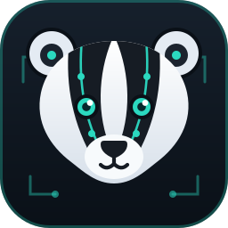
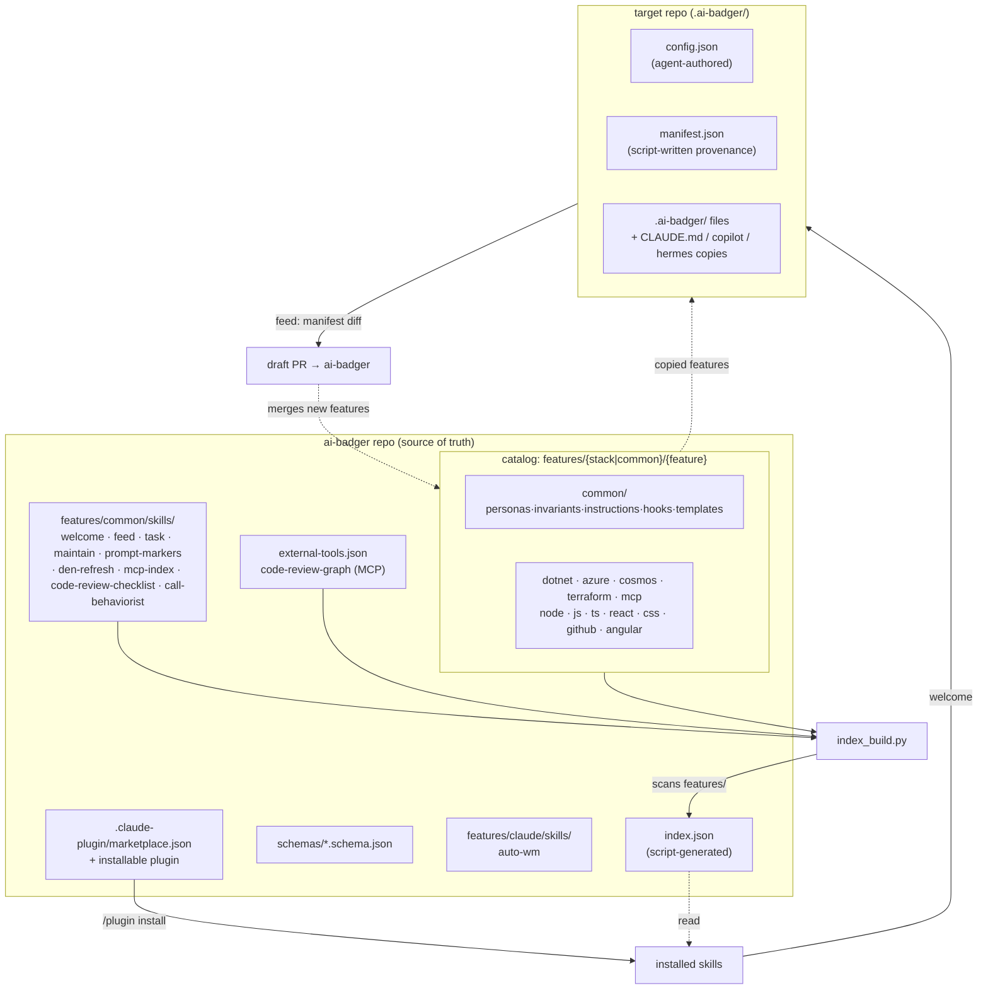
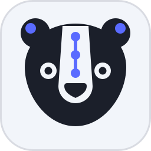

<p align="center">
  
</p>

# ai-badger

**ai-badger** is the source of truth for custom coding agent skills, personas, invariants, and
instructions used across projects. It is three things in one repo:

1. **A catalog** of reusable framework features (skills, personas, invariants, instructions,
   curated plugin bundles) organized by technology stack.
2. **An agent plugin** — install it once for Claude Code, Copilot, Junie, or Hermes, and it
   hands you the tooling to use the catalog.
3. **A project scaffolder** — `welcome-ai-badger` reads a target repo, proposes a profile, and
   materializes a tailored slice of the catalog into it; `feed-badger` harvests generalizable
   improvements a project made back into the catalog via a draft PR; `den-refresh` pulls
   framework updates into an already-scaffolded project.

Badger-themed name, professional-grade contents: the badger digs the framework into your repo
and digs improvements back out.

## Supported agents

| Agent | Status | Notes |
|---|---|---|
| **Claude Code** | Full | Plugin hooks, `CLAUDE.md`, task extensions |
| **Hermes Agent** | Full | `HERMES.md`/`.hermes.md`, `delegate_task`, skill auto-discovery |
| **GitHub Copilot** | Scaffolded | `.github/copilot-instructions.md`, scoped instructions |
| **JetBrains Junie** | Scaffolded | `.junie/AGENTS.md` |

## Supported stacks

`angular`, `azure`, `cosmos`, `css`, `dotnet`, `github`, `hermes`, `js`, `mcp`, `node`,
`python`, `react`, `terraform`, `ts` — plus **`common`** for stack-agnostic content and
agent-specific stacks (`claude`, `copilot`, `junie`).

## Install

```
/plugin marketplace add https://github.com/Arasz/ai-badger
/plugin install ai-badger
```

This installs the operational skills: `welcome-ai-badger`, `feed-badger`, `den-refresh`,
`task`, `maintain-agent-instructions`, `auto-wm`, `prompt-markers`, `mcp-index`,
`code-review-checklist`, and `call-behaviorist`.

## Quickstart

New here? [`docs/getting-started.md`](docs/getting-started.md) walks one project from "found the
repo" to a committed scaffold — the plugin-vs-clone decision, the literal commands with their real
output, and the failures that actually bite.

Run **`welcome-ai-badger`** inside a project you want to scaffold:

1. It detects stacks, present agents (`claude`, `copilot`, `junie`, `hermes`), and commands from
   the repo and asks you to confirm/refine a `.ai-badger/config.json` profile (project summary,
   domain, persona routing, plugin scope).
2. It materializes `.ai-badger/` — selected skills, personas, invariants, instructions, an
   assembled `CLAUDE.md` (or `HERMES.md`), and plugin installs — recording exactly what it wrote
   in `.ai-badger/manifest.json`.
3. Essential agent-discovery files (`CLAUDE.md`, `.github/copilot-instructions.md`,
   `.junie/AGENTS.md`, `HERMES.md`/`.hermes.md`) are copied into their conventional locations
   with a header pointing back at `.ai-badger/` as the source of truth, since some agent CLIs
   only look there.

Once you've customized things and want to contribute agnostic improvements back, run
**`feed-badger`**: it diffs the project's `.ai-badger/` tree against `manifest.json`, classifies
each change as project-specific or generalizable, generalizes the generalizable ones, and opens
a draft PR against `ai-badger` with the rationale.

To pull framework updates into an already-scaffolded project, run **`den-refresh`**: it checks
what changed upstream, re-scaffolds with your existing `config.json`, and reports the result.
Seed-once files (`state.json`, `markers-context.json`) are preserved.

See [`docs/index.md`](docs/index.md) for the full documentation map,
[`docs/dictionary.md`](docs/dictionary.md) for how ai-badger concepts map to each agent's
native terminology, or [`docs/changelog/`](docs/changelog/) for version history.

## The 3-layer model: `features/{stack | common}/{feature}`

Everything in the catalog is filed under a **stack** (a technology) and a **feature** (a kind
of asset: `personas`, `invariants`, `instructions`, `skills`, `hooks`, `adjustments`, `templates`).

```
features/<stack>/<feature>/<item>
```

- **personas**, **invariants**, and **instructions** are individual `*.md` files, named by
  filename stem.
- **skills** — the installable operational skills live at `features/common/skills/` (each
  containing a `SKILL.md` plus scripts/references). Config-gated *extensions* live inline at
  `features/common/skills/<skill>/extensions/<ext>/` with `extension.json` activation
  conditions. Skills may carry a `project-local.md` for project-specific additions (seed-once).
  Skills with a `<!-- MERGE_EXTENSIONS -->` marker in SKILL.md have their extensions merged
  into the skill file at scaffold time; others keep extensions as separate files.
- **hooks** — Claude Code and Hermes Agent hook scripts at `features/common/hooks/` with a
  `hooks-manifest.json` mapping hooks to agents.
- **adjustments** — per-agent scaffold adjustments at `features/{agent}/adjustments/`.

A script-generated `index.json` at the repo root scans this tree and is the single source of
truth the scaffolder and feed tooling read — see
[`docs/framework-architecture.md`](docs/framework-architecture.md) for the full model.

### Scaffolding.json — declarative agent file generation

Each agent has a `features/<agent>/scaffolding.json` that declares what files to scaffold into
a target project. This replaces hardcoded agent-specific logic in `scaffold.py` — all agents
are data-driven. See [`schemas/scaffolding.schema.json`](schemas/scaffolding.schema.json) for
the schema.

## Skills

| Skill | What it does |
|---|---|
| **welcome-ai-badger** | Bootstrap a new project: detect stacks → config → scaffold |
| **feed-badger** | Harvest project improvements back into the framework |
| **den-refresh** | Pull framework updates into an already-scaffolded project |
| **task** | Orchestrate backlog tasks with TDD, delegation, and PR workflow |
| **maintain-agent-instructions** | Keep agent instruction files in sync with the catalog |
| **auto-wm** | Autonomous working mode: partner/away/disable transitions |
| **prompt-markers** | Structured prompt markers (`h:`, `f:`, `e:`) for agent communication |
| **mcp-index** | MCP tool index with tag + intent semantic matching |
| **code-review-checklist** | Aviation-style preflight checks for a PR or diff |
| **call-behaviorist** | Debug audit log for ai-badger's own hooks, and a health report |

## Bundled tools

In addition to skills, ai-badger bundles external MCP tools that are auto-scaffolded into
your project during `welcome-ai-badger` or `den-refresh`:

| Tool | What it does |
|---|---|
| [**code-review-graph**](https://github.com/tirth8205/code-review-graph) | Local-first code intelligence graph for MCP. Builds a persistent map of your codebase so AI coding tools read only what matters — used for code review, impact analysis, and architecture exploration. |

External tools are declared in `features/common/external-tools.json` and merged into
`.mcp.json` during scaffold.

## Architecture overview

```
ai-badger/
  index.json                     # SOURCE OF TRUTH: every feature for every stack (script-generated)
  README.md   LICENSE (MIT)   VERSION   BREAKING_VERSIONS
  CONTRIBUTING.md   SECURITY.md   CODE_OF_CONDUCT.md   RELEASING.md
  .claude-plugin/marketplace.json   # ai-badger is itself installable, plugin source "./"
  .claude-plugin/plugin.json        # the installable plugin wrapping the root skills
  skills/                        # What the plugin exposes to Claude Code (generated from features/)
  schemas/                       # JSON Schema for every *.json model
  engine/                        # The library every bootstrap shim imports (badger_lib)
  tooling/                       # Maintainer catalog and release tooling (no LLM, no network)
  gates/                         # Repo quality gates, run only by CI and the pre-push hook
  docs/                          # Architecture, authoring guides, ADRs
  features/
    common/
      skills/                    # Installable operational skills
        task/ welcome-ai-badger/ feed-badger/ den-refresh/
        maintain-agent-instructions/ prompt-markers/ mcp-index/
        code-review-checklist/ call-behaviorist/
      personas/{architect, test-engineer, code-reviewer}.md
      invariants/*.md            # Agnostic invariant snippets
      instructions/*.md          # Agnostic scoped instructions
      hooks/                     # Claude + Hermes hooks with hooks-manifest.json
      skills-source.json         # External skill sources
      skills.json                # External skills to install
      external-tools.json        # External MCP tools (code-review-graph, …)
      templates/                 # CLAUDE.md.tmpl, HERMES.md.tmpl, state.json, agent-instructions
    dotnet/ azure/ cosmos/ terraform/ mcp/  {personas,invariants,instructions}/…
    github/    (stack-specific features; extensions now inline in skills/)
    claude/    skills/auto-wm/, adjustments/   # agent-specific, not common
    hermes/ copilot/ junie/   adjustments/     # per-agent scaffolding tweaks
    angular/ node/ js/ ts/ react/ css/  {personas,invariants,instructions}/…
    hermes/    {personas,instructions,adjustments}/…
    claude/ copilot/ junie/     Agent-specific templates + plugins-instructions.json
```

### Framework overview — structure & data flow


```mermaid
flowchart TB
  subgraph FW["ai-badger repo (source of truth)"]
    IDX["index.json\n(script-generated)"]
    SCH["schemas/*.schema.json"]
    subgraph CAT["catalog: features/{stack|common}/{feature}"]
      COMMON["common/\npersonas·invariants·instructions·hooks·templates"]
      STACKS["dotnet · azure · cosmos · terraform · mcp\nnode · js · ts · react · css · github · angular"]
    end
    SKILLSDIR["features/common/skills/\nwelcome · feed · task · maintain · prompt-markers\n· den-refresh · mcp-index · code-review-checklist · call-behaviorist"]
    CLAUDESKILLS["features/claude/skills/\nauto-wm"]
    EXTOOLS["external-tools.json\ncode-review-graph (MCP)"]
    MKT[".claude-plugin/marketplace.json\n+ installable plugin"]
  end
  IDXbuild["index_build.py"] -->|scans features/| IDX
  CAT --> IDXbuild
  SKILLSDIR --> IDXbuild
  EXTOOLS --> IDXbuild
  MKT -->|/plugin install| SKILLS["installed skills"]
  IDX -. read .-> SKILLS
  CAT -. copied features .-> PROJ
  subgraph PROJ["target repo (.ai-badger/)"]
    CFG["config.json\n(agent-authored)"]
    MAN["manifest.json\n(script-written provenance)"]
    OUT[".ai-badger/ files\n+ CLAUDE.md / copilot / hermes copies"]
  end
  SKILLS -->|welcome| PROJ
  PROJ -->|feed: manifest diff| PRD["draft PR → ai-badger"]
  PRD -. merges new features .-> CAT
```

## Requirements

The framework scripts (`index_build.py`, `validate.py`, `detect.py`, `scaffold.py`, …) are
mechanical Python with one dependency:

```bash
python3 -m pip install -r engine/requirements.txt   # jsonschema
```

## Logo

Three propositions are on the table and **none has been chosen yet** — the mark at the top of this
file is proposition A, standing in until someone picks. All three are hand-drawn SVG, so no
third-party image licence is attached to any of them.

| A — Circuit Badger | B — Terminal Badger | C — Glyph Badger |
|---|---|---|
|  |  |  |
| The stripes are circuit traces — badger and technology in one mark. | The badger peeks over a terminal, paws on the edge: "digs into your repo", drawn. | Flat geometry with a neural chain down the blaze; still legible at 16 px. |

[`docs/brand/`](docs/brand/README.md) has the trade-offs, the usage rules, and what still needs
doing once a direction is picked.

## Contributing

Read [`CONTRIBUTING.md`](CONTRIBUTING.md) first — it covers setup, the failing-test-first
workflow this repo actually enforces, and every gate CI runs. The short version: branch (never
push to `main`), write the failing test before the code, one task per PR, and let
`gates/release_guard.py` tell you whether a `VERSION` bump and a `docs/changelog/` entry are
due.

Releases are a separate, deliberate step — [`RELEASING.md`](RELEASING.md). Decisions that would
otherwise get re-litigated are recorded as ADRs in [`docs/adr/`](docs/adr/README.md).

Participation is governed by [`CODE_OF_CONDUCT.md`](CODE_OF_CONDUCT.md).

## Security

Do not open a public issue for a security problem — report it privately through GitHub's
**Security → Report a vulnerability** tab. [`SECURITY.md`](SECURITY.md) has the threat model, the
supported-version policy, and what hardening is already in place.

## License

MIT — see [`LICENSE`](LICENSE). Copyright (c) 2026 Rafał Araszkiewicz.
