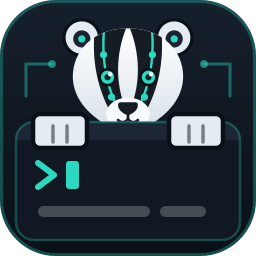
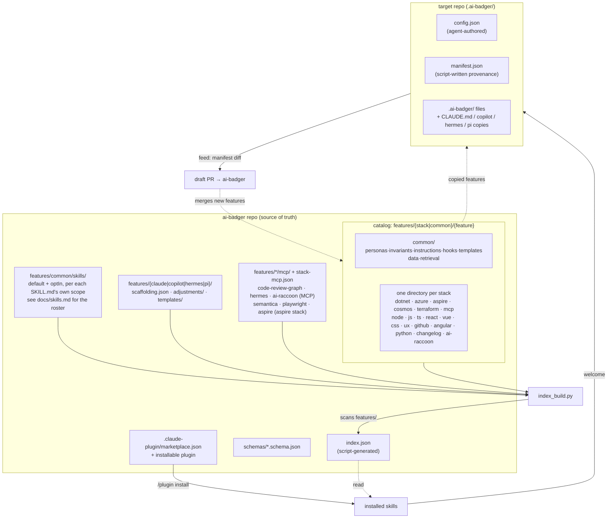

<p align="center">
  
</p>

# ai-badger

**ai-badger** is the source of truth for custom coding agent skills, personas, invariants, and
instructions used across projects. It is three things in one repo:

1. **A catalog** of reusable framework features (skills, personas, invariants, instructions,
   curated plugin bundles) organized by technology stack.
2. **An agent plugin.** Install it once for Claude Code, Copilot, or Hermes, and it
   hands you the tooling to use the catalog.
3. **A project scaffolder.** `welcome-ai-badger` reads a target repo, proposes a profile, and
   materializes a tailored slice of the catalog into it; `feed-badger` harvests generalizable
   improvements a project made back into the catalog via a draft PR; `den-refresh` pulls
   framework updates into an already-scaffolded project.

Badger-themed name, professional-grade contents: the badger digs the framework into your repo
and digs improvements back out.

## Three things it does that instruction files don't

### It measures where your tokens actually go

Of 205 agent dispatches in this repository, **101 named no model** and silently inherited the
session's, which is the expensive one. Nobody chose that. It simply was not recorded, so it
was not visible.

The `/task` skill now reads the session transcript, including `<session-id>/subagents/*.jsonl`
where dispatched work actually lives, and records which model produced each task's output,
how many dispatches ran, and how many declared a model. `task_tracker.py status` prints
`mix=opus-5:69%`, so "delegate the mechanical work" stops being advice and becomes something
you can check afterwards.

The reason to track model mix rather than the obvious alternative: **cache efficiency is
saturated.** Across 1250 sessions it measured 0.975–0.986, on every single one, including
the most expensive. It cannot separate a cheap task from a costly one. Model mix can.

How much it matters, with the conditions attached, because a coefficient without them is
decoration:

```
24 project-days, one developer's machine, three repositories, July 2026
delegation ratio = share of output tokens on non-top-tier models

    $/M output  ≈  237  −  188 × delegation_ratio        r = −0.813  (r² = 0.66)
```

So roughly $19 per million output tokens for every 10 points of delegation. That is a
correlation over a small, single-source sample, and work type is an obvious confound: hard
reasoning legitimately needs the expensive tier, so 100% is not the target. Treat it as a
before/after instrument on comparable work, not a forecast.

Measuring the leak was the first half. Since 0.60.0 it is also closed up front: every persona
in the catalog carries a `model:` lane and a `level:` beside it (ADR-0027), and a `PreToolUse`
gate on `Agent` denies a dispatch that names neither a model of its own nor a persona that has
one (see [ADR-0015](docs/adr/0015-delegation-needs-a-mechanism-not-more-prose.md).

### It ships behaviour that fires without being asked

A skill waits to be invoked. A hook does not. The catalog wires hooks into
`.claude/settings.json`, `.github/hooks/` and the Hermes plugin at scaffold time. The two
tool-event families run on pi as well, through a TypeScript adapter that reads the same
generated `hooks.json` at event time, so a new gate lands on pi with no adapter edit
(ADR-0022).

| Hook | What it does when you did not ask |
|---|---|
| `memory-context` | Searches project memory for each user prompt and injects the matched excerpts (0.178.0, ADR-0031) |
| `context-enrichment` | Recommends MCP tools per turn out of the BM25 index (ADR-0012) |
| `message-delivery` | Puts another session's mail in front of you at session start, every turn, and again at turn end |
| `dispatch-gate` | Denies a subagent dispatch that names no model and whose persona has no lane |
| `generated-file-guard` | Refuses a hand edit to a file the scaffold generated, and names the `features/` source to edit instead |
| `memory-first-gate` | Blocks repo text search until the session has consulted memory (ADR-0017) |
| `git-internals-guard`, `blast-radius-kill-guard` | Refuse the edit or the bare `kill` that damages a repo other lanes are working in |
| `commit-reminder`, `test-run-economy` | Count what you are doing and say something when it crosses the line |
| `grounded-feedback` | Carries a failed command's real output into your next correction turn |
| `drift-notice` | Tells the session its `.ai-badger/` is behind the framework (ADR-0001) |

The table is what Claude Code arms. Copilot and Hermes arm most of it, including the bus
rows; on pi the `PreToolUse` and `PostToolUse` rows run through the adapter while the
session- and turn-level ones are the adapter's own bus router.
`features/common/hooks/hooks-manifest.json` is the full list, one entry per hook per agent,
and [`docs/skills.md`](docs/skills.md) marks which skills are hook-backed rather than named.

### Its gates refuse, rather than warn

Agent-written changes fail quietly: a doc drifts from the code, a test stops being able to
fail, a release ships untagged. ai-badger's gates run in CI and in the pre-push hook, and they
exit non-zero.

Every row below is a real refusal from one day of work on this repo. All of them caught an
agent; several caught this framework's own maintainer.

| Gate | What it caught |
|---|---|
| `index_build` | a `$schema` key in `stack.json`, which is folded wholesale into `index.json` |
| `release_guard` | 0.58.0 had a changelog entry and no git tag |
| `scaffold_freshness_guard` | a scaffolded script left stale by an edit to its source |
| `docs_guard` | a documented command missing the path that makes it copy-pasteable |
| MCP catalog tests | invented tool tags outside the closed vocabulary; a `server.md` 21 lines against a 15-line budget |
| `tdd_guard` | shipped code changed with no test beside it |
| `workflow_lint` | a workflow action pinned to a tag instead of a commit SHA; the invariant it enforces shipped violated nine times over |
| `deps_guard` | an undeclared third-party import in a script that would only fail on someone else's machine |
| `shipped_paths_guard` | `/Users/…` baked into a tracked file, which is how one developer's machine becomes everyone's build |

The budget one is the flavour of the whole thing. `server.md` lands verbatim in every agent
file, every session, so it is capped at 15 lines. Policy, not a manual.

One gate refuses nothing: `gates/consumer_journey.py` installs the plugin the way a stranger
would, scaffolds a throwaway `git init` project, works in it, re-scaffolds, tears it down, and
diffs `$HOME` for anything left behind. It runs on every push.
[`docs/scripts.md`](docs/scripts.md) maps every gate to the CI step that runs it.

What none of this covers yet: the gates check the artefacts, not the reasoning. A confidently
wrong claim in a PR body passes every one of them. That still needs a reviewer.

## Supported agents

| Agent | Support | What it gets | Known gap |
|---|---|---|---|
| **Claude Code** | Full | `CLAUDE.md`, personas as agent modes, plugin hooks, skills, plugin installs, `.mcp.json` | none |
| **Hermes Agent** | Full | `HERMES.md`, personas as native roles, plugin hooks, namespaced skill symlinks under `~/.hermes/skills/` | MCP has no project route, so the block is printed for you to merge (ADR-0014) |
| **GitHub Copilot** | Full | instructions, scoped instructions, custom agents, `.github/hooks/`, skills, `.github/mcp.json` | no plugin install, and `feed-badger` has no programmatic route |
| **pi** | Full | `AGENTS.override.md`, `.pi/agents/` personas, the tool-event hooks through a TS adapter, `.ai-badger/skills`, project-scoped MCP | no plugin install, and `feed-badger` has no programmatic route |

`features/common/support.json` is the matrix of record: one entry per agent per capability,
with the file ai-badger writes or the mechanism it uses. It is the thing to edit when an
agent's surface changes, not this table.

## Supported stacks

`ai-raccoon`, `angular`, `aspire`, `azure`, `changelog`, `cosmos`, `css`, `dotnet`, `github`, `js`,
`mcp`, `node`, `python`, `react`, `terraform`, `ts`, `ux`, `vue`, plus **`common`** for
stack-agnostic content and agent-specific stacks (`claude`, `copilot`, `hermes`, `pi`). Derive it
rather than quoting this line: `ls features/`.

## Install

### Are you using pi?

ai-badger scaffolds pi personas and instructions, and the opinionated extension set designed to work with it lives next door in [pi-badger-integration](https://github.com/Arasz/pi-badger-integration): background delegation, predicate monitors, free-model fallback on router failure, cron, and MCP tools, with the publish flow that installs them to pi's user scope.

```
/plugin marketplace add https://github.com/Arasz/ai-badger
/plugin install ai-badger
```

This installs every skill the catalog marks `scope: default`, which since 0.169.0 is the whole
common catalog: a project that wants less declines by name in `config.exclude.skills`
([ADR-0028](docs/adr/0028-all-catalog-skills-ship-by-default.md)). Two things are not in that
set. The sqlite pair stays `optIn`, because a repo with no SQLite database should not receive
it unasked
([ADR-0029](docs/adr/0029-sqlite-skills-stay-opt-in.md)). And `auto-wm` is stack-local to
`claude` rather than opt-in, so it reaches a project only when Claude is one of its stacks.
The catalog also declares two external Claude plugins, `superpowers` and
`pr-review-toolkit`; the scaffolder resolves each to the install command your agent uses. See
[`docs/skills.md`](docs/skills.md) for what each one does, when to reach for it, and which
arrive unasked.

## Quickstart

New here? [`docs/getting-started.md`](docs/getting-started.md) walks one project from "found the
repo" to a committed scaffold: the plugin-vs-clone decision, the literal commands with their real
output, and the failures that actually bite.

Run **`welcome-ai-badger`** inside a project you want to scaffold:

1. It detects stacks, present agents (`claude`, `copilot`, `hermes`, `pi`), and commands from
   the repo and asks you to confirm/refine a `.ai-badger/config.json` profile (project summary,
   domain, persona routing, plugin scope).
2. It materializes `.ai-badger/` (selected skills, personas, invariants, instructions, an
   assembled `CLAUDE.md` / `HERMES.md` / `AGENTS.override.md`, and plugin installs),
   recording exactly what it wrote in `.ai-badger/manifest.json`.
3. Essential agent-discovery files (`CLAUDE.md`, `.github/copilot-instructions.md`,
   `HERMES.md`/`.hermes.md`, `AGENTS.override.md`) are copied into their conventional locations
   with a header pointing back at `.ai-badger/` as the source of truth, since some agent CLIs
   only look there.

Once you've customized things and want to contribute agnostic improvements back, run
**`feed-badger`**: it diffs the project's `.ai-badger/` tree against `manifest.json`, classifies
each change as project-specific or generalizable, generalizes the generalizable ones, and opens
a draft PR against `ai-badger` with the rationale.

To pull framework updates into an already-scaffolded project, run **`den-refresh`**: it checks
what changed upstream, re-scaffolds with your existing `config.json`, and reports the result.
Seed-once files (`state.json`, `markers-context.json`) are preserved.

See [`docs/README.md`](docs/README.md) for the full documentation map,
[`docs/dictionary.md`](docs/dictionary.md) for how ai-badger concepts map to each agent's
native terminology, or [`docs/changelog/`](docs/changelog/) for version history.

## The 3-layer model: `features/{stack | common}/{feature}`

Everything in the catalog is filed under a **stack** (a technology) and a **feature** (a kind
of asset: `personas`, `invariants`, `instructions`, `skills`, `hooks`, `adjustments`, `mcp`,
`data`, `retrieval`, and `templates` (the last one `common`-only).

```
features/<stack>/<feature>/<item>
```

- **personas**, **invariants**, and **instructions** are individual `*.md` files, named by
  filename stem. A project can add its own invariants: `*.md` files in the scaffolded
  `.ai-badger/invariants/local/` render after the catalog ones and are never overwritten.
- **skills.** The installable operational skills live at `features/common/skills/` (each
  containing a `SKILL.md` plus scripts/references), and a skill declares its own routing in its
  own frontmatter: `stacks:` and `scope:`. Config-gated *extensions* live inline at
  `features/common/skills/<skill>/extensions/<ext>/` with `extension.json` activation
  conditions. Skills may carry a `project-local.md` for project-specific additions (seed-once).
  Skills with a `<!-- MERGE_EXTENSIONS -->` marker in SKILL.md have their extensions merged
  into the skill file at scaffold time; others keep extensions as separate files.
- **hooks.** Hook scripts live at `features/common/hooks/` with a `hooks-manifest.json` naming
  each hook's wiring per agent. Claude, Copilot and Hermes wire from that manifest; pi
  registers no per-hook arm at all, so a new tool-event hook arms pi with no manifest edit
  and no adapter change (ADR-0022).
- **adjustments.** Per-agent scaffold adjustments at `features/{agent}/adjustments/`, each
  driven by an `adjustment.json` that names its scripts.
- **mcp.** One directory per MCP server at `features/<stack>/mcp/{server}/`, each carrying a
  `meta.json` that declares its prerequisite. What a server is *for* travels with the catalog
  whatever route the server arrived by; `features/{stack}/stack-mcp.json` separately declares
  the ones ai-badger may launch (see [ADR-0014](docs/adr/0014-mcp-support-is-configuration-not-retrieval.md)).
- **data** and **retrieval.** `features/common/data/model-groups.json` maps a persona's `model:`
  lane to a real model id, and `features/common/retrieval/` holds the BM25 matcher, tokenizer
  and eval fixtures behind the MCP tool index (ADR-0012). Both are catalog content the
  scaffolder copies; neither is prose.

Three files sit beside the feature directories rather than inside one, because they describe
the stack rather than belonging to it: `stack-mcp.json` (which servers this stack wants),
`support.json` and `dependencies.json` (what a feature needs installed before it works).

A script-generated `index.json` at the repo root scans this tree and is the single source of
truth the scaffolder and feed tooling read. See
[`docs/framework-architecture.md`](docs/framework-architecture.md) for the full model, and
[`docs/retrieval.md`](docs/retrieval.md) for how the tool index is searched.

### Scaffolding.json: declarative agent file generation

Each agent has a `features/<agent>/scaffolding.json` that declares what files to scaffold into
a target project. This replaces hardcoded agent-specific logic in `scaffold.py`, so every
agent is data-driven. See [`schemas/scaffolding.schema.json`](schemas/scaffolding.schema.json) for
the schema. pi's stack is the one with compiled surface: its `adjustments/adapter/` is
TypeScript with its own `package.json` and tests, because pi loads extensions as `.ts`
modules that shell out to the Python hooks.

## Skills

A skill is a directory with a `SKILL.md`: a name, a description the agent matches on, and the
workflow itself. Most are invoked by name; the hook-backed ones fire on their own.

| Skill | What it does |
|---|---|
| **welcome-ai-badger** | Bootstrap a project: detect stacks, author the config, scaffold `.ai-badger/` |
| **den-refresh** | Pull framework updates into an already-scaffolded project |
| **feed-badger** | Harvest project improvements back into the framework |
| **task** | Run one backlog task end to end (TDD, delegation, PR) and own a git worktree for it |
| **quick-task** | Ship a one-surface change as one commit on a branch merged by auto-merge |
| **status-report** | Answer "where are we" mid-task, from the tracking files, without re-deriving them |
| **create-task-spec** | Interrogate an idea into a Gherkin specification plus the manifest `task` consumes |
| **owner-gate-review** | Turn a document's open decisions into a per-decision review form |
| **code-review-checklist** | Aviation-style pass/fail preflight for a PR or diff |
| **design-tests** / **review-tests** | Write tests to a fail-under-a-plausible-bug standard; judge tests that already exist |
| **review-changes** / **complete-project-scope-code-review** | Rank a diff by blast radius and check the risk is tested; review a whole project through parallel expert lanes |
| **code-review-evidence** | Re-derive wrapped-library claims from the upstream source instead of the comment |
| **debug-issue** / **explore-codebase** / **refactor-safely** | Trace a symptom to its entry point; orient in an unfamiliar repo; enumerate every affected site before a rename |
| **differential-feature-refactor** / **spec-driven-refactoring** | Separate design intent from accumulated cruft; gate a large multi-file change on a spec |
| **documentation** | Route to the documentation member that matches: scaffold the tree, update it, or migrate it |
| **mcp-index** | Curate the MCP tool index the per-turn context hook searches |
| **ai-raccoon-memory** | Project memory: search first, write durable facts with source paths, watch a docs directory |
| **send-message** / **multi-agent-communication** | Reach another session, a project or the whole machine over the message bus; coordinate parallel sessions without stepping on each other |
| **git-work** | Recover a failed push, triage red CI, run the PR lifecycle outside a tracked task |
| **archify** | Author architecture, workflow, sequence and lifecycle diagrams as standalone HTML, with Mermaid as the fallback |
| **humanizer** | Strip AI writing artifacts out of prose you are writing |
| **browser-usage** | Browser automation and manual E2E verification through Playwright MCP |
| **maintain-agent-instructions** | Reconcile `CLAUDE.md` and its siblings against one machine-readable model |
| **prompt-markers** / **commit-reminder** / **test-economy** / **call-behaviorist** | Hook-backed: prompt prefixes, a nudge at uncommitted work, a word on repeated full-suite runs, an audit log of ai-badger's own hooks |
| **auto-wm** | Autonomous working mode: partner, away, disable (Claude only) |

[`docs/skills.md`](docs/skills.md) is the roster: what every skill changes on disk, the
situation that calls for it, and which arrive unasked.

## Bundled MCP servers

In addition to skills, ai-badger bundles MCP servers that are auto-scaffolded into
your project during `welcome-ai-badger` or `den-refresh`:

| Server | What it does |
|---|---|
| [**code-review-graph**](https://github.com/tirth8205/code-review-graph) | Local-first code intelligence graph for MCP. Builds a persistent map of your codebase so AI coding tools read only what matters, used for code review, impact analysis, and architecture exploration. |
| [**ai-raccoon**](https://github.com/Arasz/ai-raccoon) | Project memory server: semantic search, durable-fact writes, workspaces, docs watching. Declared only when `ai-raccoon` is on PATH. |
| [**semantica**](https://github.com/semantica-agi/semantica) | Graph-native knowledge infrastructure: entity extraction, decisions with W3C PROV-O provenance, causal chains. Declared only when `semantica-mcp` is on PATH. |
| [**playwright**](https://playwright.dev/docs/getting-started-mcp) | Browser automation over MCP: accessibility snapshots, element refs, network inspection. Declared only when `npx` is available, since it launches through `npx -y`. |
| [**hermes**](https://hermes-agent.nousresearch.com/docs/user-guide/features/mcp#running-hermes-as-an-mcp-server) | Hermes Agent's stdio MCP bridge: list conversations, read history, poll live events, send messages, manage approvals. Declared only when `hermes` is on PATH. |

Each server is a catalog item under `features/<stack>/mcp/<server>/`, carrying the prose
injected into every agent file, its prerequisite and its install command. `features/common/stack-mcp.json`
says which servers the `common` stack wants and which of them are written into `.mcp.json`
during scaffold (ADR-0014); the `hermes`, `ai-raccoon`, `semantica` and `playwright` entries
are each conditional on their own launcher being present. A server can also be catalogued
without being launched: the `aspire` stack carries its own `aspire agent mcp` entry, which is
the Aspire CLI's own surface rather than something to install.

> **Hermes users:** Hermes reads MCP servers only from `~/.hermes/config.yaml`
> (`mcp_servers:`). It has no project route, so a server written to `.mcp.json` is
> invisible to Hermes sessions. ai-badger prints the block to merge instead of writing
> user-global config (ADR-0014 decision 6); run `hermes mcp add <name> --command <cmd>`
> once per machine (or merge the printed block) to make a server available to Hermes.

## Architecture overview

```
ai-badger/
  index.json                     # SOURCE OF TRUTH: every feature for every stack (script-generated)
  README.md   LICENSE (MIT)   VERSION   BREAKING_VERSIONS
  CONTRIBUTING.md   SECURITY.md   CODE_OF_CONDUCT.md   RELEASING.md
  .claude-plugin/marketplace.json   # ai-badger is itself installable, plugin source "./"
  .claude-plugin/plugin.json        # the installable plugin wrapping the root skills
  skills/                        # What the plugin exposes to Claude Code (generated from features/)
  hooks/hooks.json               # The plugin's own runtime wiring (the drift-notice hook)
  schemas/                       # JSON Schema for every *.json model
  engine/                        # The library every bootstrap shim imports: badger_lib, badger_store
  tooling/                       # Maintainer catalog and release tooling (no LLM, no network)
  gates/                         # Repo quality gates, run only by CI and the pre-push hook
  tests/                         # The suite the gates are themselves verified against
  docs/                          # Architecture, authoring guides, ADRs
  features/
    common/
      skills/                    # default + optIn, per each SKILL.md's own scope (see docs/skills.md)
      personas/{architect, test-engineer, code-reviewer, qa, delegator}.md
      invariants/*.md            # Agnostic invariant snippets
      instructions/*.md          # Agnostic scoped instructions
      hooks/                     # Hook scripts + hooks-manifest.json (claude, copilot, hermes)
      retrieval/                 # BM25 matcher, tokenizer, eval fixtures for the MCP tool index
      data/model-groups.json     # A persona's model: lane mapped to a real model id
      skills-source.json         # External skill sources
      skills.json                # External skills to install
      mcp/                       # MCP server catalog (code-review-graph, ai-raccoon, semantica, …)
      mcp-tags.json              # The closed tag vocabulary an MCP tool must draw from
      stack-mcp.json             # Which MCP servers this stack wants, and how to launch them
      support.json               # Agent capability matrix
      dependencies.json          # What a feature needs installed before it works
      templates/                 # CLAUDE.md.tmpl, HERMES.md.tmpl, delegation.md.tmpl,
                                 # state.json, agent-instructions
    dotnet/ azure/ aspire/ cosmos/ terraform/ mcp/ changelog/ python/  {personas,invariants,instructions}/…
    github/ react/ vue/ angular/ node/ js/ ts/ css/ ux/  {personas,invariants,instructions}/…
    ai-raccoon/                  # The memory server's own stack: its skill and its CLI dependency
    claude/ copilot/ hermes/ pi/ # Agent stacks: scaffolding.json, adjustments/, templates/
                                 # pi additionally ships the TypeScript hook adapter and its tests
```

### Framework overview: structure & data flow


```mermaid
flowchart TB
  subgraph FW["ai-badger repo (source of truth)"]
    IDX["index.json\n(script-generated)"]
    SCH["schemas/*.schema.json"]
    subgraph CAT["catalog: features/{stack|common}/{feature}"]
      COMMON["common/\npersonas·invariants·instructions·hooks·templates\ndata·retrieval"]
      STACKS["one directory per stack\ndotnet · azure · aspire · cosmos · terraform · mcp\nnode · js · ts · react · vue · css · ux · github · angular · python · changelog · ai-raccoon"]
    end
    SKILLSDIR["features/common/skills/\ndefault + optIn, per each SKILL.md's own scope\nsee docs/skills.md for the roster"]
    AGENTS["features/{claude|copilot|hermes|pi}/\nscaffolding.json · adjustments/ · templates/"]
    MCPCAT["features/*/mcp/ + stack-mcp.json\ncode-review-graph · hermes · ai-raccoon (MCP)\nsemantica · playwright · aspire (aspire stack)"]
    MKT[".claude-plugin/marketplace.json\n+ installable plugin"]
  end
  IDXbuild["index_build.py"] -->|scans features/| IDX
  CAT --> IDXbuild
  SKILLSDIR --> IDXbuild
  AGENTS --> IDXbuild
  MCPCAT --> IDXbuild
  MKT -->|/plugin install| SKILLS["installed skills"]
  IDX -. read .-> SKILLS
  CAT -. copied features .-> PROJ
  subgraph PROJ["target repo (.ai-badger/)"]
    CFG["config.json\n(agent-authored)"]
    MAN["manifest.json\n(script-written provenance)"]
    OUT[".ai-badger/ files\n+ CLAUDE.md / copilot / hermes / pi copies"]
  end
  SKILLS -->|welcome| PROJ
  PROJ -->|feed: manifest diff| PRD["draft PR → ai-badger"]
  PRD -. merges new features .-> CAT
```

## Requirements

The framework scripts (`index_build.py`, `validate.py`, and the `detect.py` / `scaffold.py`
pair inside `welcome-ai-badger`) are mechanical Python 3.10+ with one required dependency:

```bash
python3 -m pip install -r engine/requirements.txt   # jsonschema
```

`jsonschema` is required because validation refuses rather than silently passing. `pyyaml` is
optional and guarded, degrading to a printed note, and `semantica` is needed only by the
optional Semantica wrapper.

## Logo

The mark at the top of this file is a badger whose stripes are circuit traces, peeking over a
terminal with its paws on the edge: the name and the "digs into your repo" line, drawn. It is
hand-authored SVG, so no third-party image licence attaches to it.
[`docs/brand/`](docs/brand/README.md) has the palette, the usage rules, and the variants not yet
drawn.

## Contributing

Read [`CONTRIBUTING.md`](CONTRIBUTING.md) first. It covers setup, the failing-test-first
workflow this repo actually enforces, and every gate CI runs. The short version: branch (never
push to `main`), write the failing test before the code, one task per PR, and let
`gates/release_guard.py` tell you whether a `VERSION` bump and a `docs/changelog/` entry are
due. A docs-only change is outside the shipped surface, so it needs neither.

Releases are a separate, deliberate step, in [`RELEASING.md`](RELEASING.md). Decisions that would
otherwise get re-litigated are recorded as ADRs in [`docs/adr/`](docs/adr/README.md).

Participation is governed by [`CODE_OF_CONDUCT.md`](CODE_OF_CONDUCT.md).

## Security

Do not open a public issue for a security problem. Report it privately through GitHub's
**Security → Report a vulnerability** tab. [`SECURITY.md`](SECURITY.md) has the threat model, the
supported-version policy, and what hardening is already in place.

## License

MIT, per [`LICENSE`](LICENSE). Copyright (c) 2026 Rafał Araszkiewicz.
