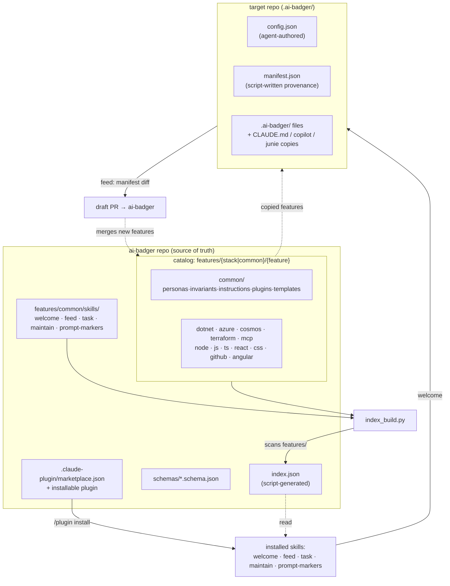
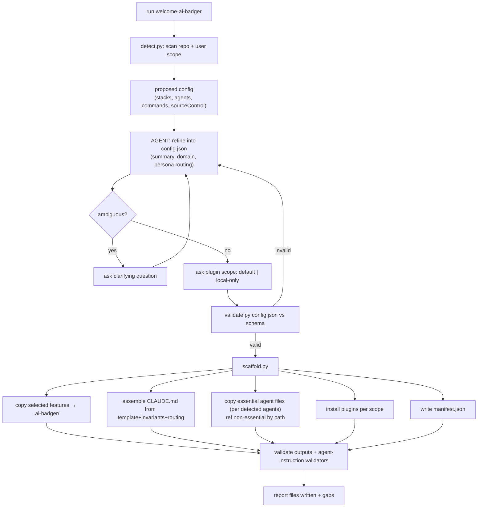
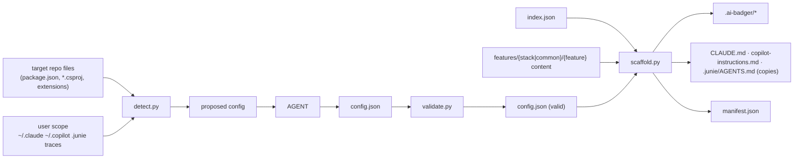
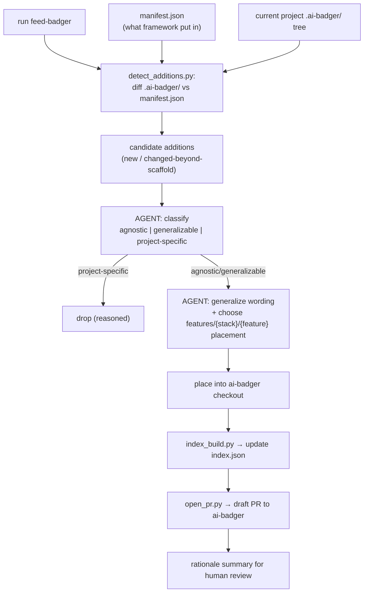

# ai-badger — framework design (v2)

**Date:** 2026-07-18 (rev 2026-07-19)
**Status:** Shipped v0.1.0 (2026-07-19). Dogfooded on arasz-home-page (branch `ai-badger-bootstrap`). Angular stack added during dogfood; feed round-trip logic-tested. See `known-gaps.md`.
**Owner:** Rafał Araszkiewicz (Arasz)

## 1. Goal

Make our custom Claude/agent skills, personas, and instructions **usable across projects**.
`ai-badger` is a single public repo that stores a **complete catalog of framework features for
every technology we use**, plus tooling to push a tailored selection *into* a project
(`welcome-ai-badger`) and harvest agnostic improvements *back out* (`feed-badger`).

**Generalization means:** no project-specific paths, no domain-coupled models. But stack-level
knowledge that is reusable across projects sharing a stack — a persona routing table, module
invariants like *Domain purity* / *single-writer-Cosmos* / *MCP-thin* — is kept, filed under
its stack.

## 2. Architecture: `features/{stack | common}/{feature}`

The framework repo is organized as **stack × feature**, rooted under `features/`:

- **stack** — a technology: `dotnet`, `azure`, `cosmos`, `terraform`, `mcp`, `node`, `js`,
  `ts`, `react`, `css`, `github`, `angular`, … plus **`common`** for stack-agnostic content.
- **feature** — a kind of framework asset: **`personas`**, **`invariants`**,
  **`instructions`**, **`plugins`**. (Marketplaces are merged into `plugins` — see §6.) The
  **installable operational skills** are the one exception and live at the repo-root `skills/`,
  not under `features/` — see §9.

```
ai-badger/
  index.json                     # SOURCE OF TRUTH: every feature for every stack, with paths (script-generated)
  README.md   LICENSE (MIT)   VERSION
  .claude-plugin/marketplace.json   # ai-badger is itself installable, plugin source "./" (see §9)
  .claude-plugin/plugin.json        # the installable plugin wrapping the root skills — see §9
  schemas/                       # JSON Schema for every *.json model (index, config, manifest, feature descriptors…)
  scripts/
  docs/
    framework-architecture.md
    authoring-a-feature.md
    proxy-files-spike.md         # documented feature-plan (see §8)
    ai-badger-framework-design.md
  skills/                         # INSTALLABLE operational skills (root — the one exception, §9)
    task/ welcome-ai-badger/ feed-badger/ maintain-agent-instructions/ prompt-markers/
  features/
    common/
      personas/{architect, test-engineer, code-reviewer}.md
      invariants/*.md              # agnostic invariant snippets
      instructions/*.md            # agnostic scoped instructions (e.g. documentation)
      plugins/plugins.json         # curated agnostic external plugins (single list)
      plugins/marketplaces.json    # marketplaces those plugins install from
      templates/                   # CLAUDE.md.tmpl, state.json skeleton, agent-instructions schema+validators
    dotnet/    {personas,invariants,instructions,plugins}/… + stack.json
    azure/     {personas,invariants,instructions,plugins}/…
    cosmos/    {invariants,instructions,plugins}/…
    terraform/ {instructions,plugins}/…
    mcp/       {instructions,plugins}/…
    github/    {plugins, skills/task-extensions/github}/…
    angular/ node/ js/ ts/ react/ css/  {personas,invariants,instructions,plugins}/…
```

Each feature item is a small, self-describing unit. Personas/invariants/instructions are
markdown; `plugins` is a single `plugins.json` list + sibling `marketplaces.json` per stack
(§6); the installable skills are directories at the repo root (§9).

### `index.json` (root, source of truth)

Script-generated by scanning the tree; **regenerated on every framework content change**
(`schemas/index.schema.json`). Consumed by `welcome`/`feed` for access.

```jsonc
{
  "frameworkVersion": "0.1.0",
  "stacks": {
    "common": {
      "skills":       [ { "name": "task", "path": "skills/task", "extensions": ["github"] }, … ],
      "personas":     [ { "name": "architect", "path": "features/common/personas/architect.md" }, … ],
      "invariants":   [ { "name": "tdd", "path": "features/common/invariants/tdd.md" }, … ],
      "instructions": [ … ],
      "plugins":      [ { "name": "superpowers", "path": "features/common/plugins/plugins.json" }, … ]
    },
    "dotnet": { "personas": [ { "name": "dotnet-engineer", "path": "features/dotnet/personas/dotnet-engineer.md" } ], "invariants": […], "instructions": […], "plugins": […] },
    "react":  { … }, "ts": { … }, "node": { … }, "github": { … }
  }
}
```

Note `skills` entries live under `stacks.common` but their `path` points at the root `skills/`
directory, not `features/common/` — the root-`skills/` exception (§9).

## 3. Decisions (locked)

| # | Decision | Choice |
|---|----------|--------|
| 1 | Scope | MVP vertical slice: full structure + real common + representative stacks (frontend real, .NET reused), both skills, docs, dogfood |
| 2 | Packaging | Single installable `ai-badger` plugin wrapping the `skills` |
| 3 | License | MIT · Public repo |
| 4 | Bootstrap intelligence | Auto-detect (best-effort) + agent asks clarifying questions only when unclear |
| 5 | Repo layout | `features/{stack\|common}/{feature}`, with the installable `skills/` at the repo root as the one exception (§2, §9) |
| 6 | Plugins | marketplaces merged into `plugins` feature; compact single `plugins.json` list + sibling `marketplaces.json` per stack; scope default(inherit)/local/user (§6) |
| 7 | Plugin scope prompt | welcome asks **default \| local-only** (no "user-only") |
| 8 | task | generic base + **config-gated extensions**; GH PR/issue mgmt is an extension |
| 9 | Target structure | `.ai-badger/` holds framework files + `manifest.json` + `config.json`; agent files copied/referenced (§8) |
| 10 | Agents handled | `claude`, `copilot`, `junie`; detect present ones (repo + user scope), init only those |
| 11 | Script vs agent | scripts do ALL mechanical work; agent only authors `config.json` (script-validated) |
| 12 | Schemas | every `*.json` has a schema with a required subset |
| 13 | feed output | draft PR to ai-badger; this effort build+logic-test only |
| 14 | Dogfood | welcome → branch on arasz-home-page, no PR |

## 4. The two contracts (schemas required)

### `config.json` — project profile (agent authors, script validates)
Lives at `.ai-badger/config.json`. The single input skills read.

```jsonc
{
  "$schema": "…/config.schema.json",
  "frameworkVersion": "0.1.0",
  "project": { "name": "…", "summary": "…", "domain": "…" },          // required subset: name
  "stacks": ["ts", "react", "node", "css"],                            // required
  "agents": ["claude", "copilot"],                                     // required (detected)
  "sourceControl": { "platform": "github", "repoUrl": "https://github.com/Arasz/arasz-home-page", "projectUrl": null },
  "commands": { "build": "bun run build", "test": "bun run test", "lint": "bun run lint", "run": "bun run dev" },
  "personaRouting": [ { "work": "frontend UI/UX", "agent": "frontend-engineer" }, … ],
  "pluginScope": "default",                                            // default | local
  "docs": { "architecture": "docs/…" }
}
```

Extensions activate **iff** their required data exists in config. Example: the `task` GitHub
extension (create/track issues + PRs) activates only when `sourceControl.platform == "github"`
AND `sourceControl.repoUrl` is set (project/board features need `sourceControl.projectUrl`).

### `manifest.json` — provenance (script writes during scaffold)
Lives at `.ai-badger/manifest.json`. Records exactly what the framework put in, so `feed` can
diff project vs framework.

```jsonc
{
  "$schema": "…/manifest.schema.json",
  "frameworkVersion": "0.1.0",
  "generatedAt": "…",                    // stamped by orchestrator post-run (scripts avoid Date.now)
  "agents": ["claude", "copilot"],
  "pluginScope": "default",
  "entries": [
    { "feature": "skills",  "stack": "common", "name": "task",           "source": "skills/task",              "target": ".ai-badger/skills/task",          "frameworkVersion": "0.1.0", "hash": "…" },
    { "feature": "personas","stack": "react",  "name": "frontend-engineer","source": "react/personas/frontend-engineer.md","target": ".ai-badger/agents/frontend-engineer.md","frameworkVersion":"0.1.0","hash":"…" }
  ]
}
```

## 5. Script vs agent responsibility (hard split)

**Scripts (mechanical, deterministic, no LLM):**
- `index_build.py` — scan tree → `index.json` (+ validate against schema)
- `validate.py` — validate any model against its schema (config/manifest/index/feature)
- `detect.py` — best-effort detection: stacks (package files/extensions), agents (CLAUDE.md,
  `.github/copilot-instructions.md`, `.junie/`, user-scope `~/.claude` `~/.copilot`), commands →
  emits a *proposed* config for the agent to refine
- `scaffold.py` — given validated `config.json` + framework checkout + `index.json`: materialize
  `.ai-badger/` (copy selected features), assemble `CLAUDE.md` from template + selected
  invariants/instructions/routing, create agent-file copies/refs (§8), install plugins per scope,
  write `manifest.json`
- feed: `detect_additions.py` — diff `.ai-badger/manifest.json` vs current project `.ai-badger/`
  tree → candidate additions; `open_pr.py` — branch/commit/`gh pr create --draft` on ai-badger

**Agent (creative only):**
- Author/refine `config.json` (project summary, domain, persona routing, resolve detection
  ambiguities via clarifying questions) — then hand to `validate.py`.
- In `feed`: classify candidates agnostic/generalizable/project-specific, generalize wording,
  choose target `features/{stack}/{feature}` placement.

## 6. `plugins` feature (marketplaces merged in, compact single-file model)

`plugins` is **compact**: each stack has at most one `features/<stack>/plugins/plugins.json`
(a single list) and one sibling `marketplaces.json` — no per-plugin subdirectories.
- `plugins.json` (`schemas/plugins.schema.json`) —
  `{ "plugins": [ { "name": "...", "marketplace": "<name in marketplaces.json>", "scope":
  "default"|"local"|"user", "description": "..." }, ... ] }`. **default = inherit the current
  scope** chosen at init.
- `marketplaces.json` (`schemas/marketplaces.schema.json`) — all marketplaces this stack's
  plugins install from, e.g. `{ "marketplaces": [ { "name": "…", "source":
  "https://github.com/Owner/repo" } ] }` — full GitHub repo URLs, not `github:Owner/repo`
  shorthand.

`welcome` asks **plugin scope: default | local-only**. `default` honors each entry's declared
scope; `local-only` forces every install to project/local scope. No user-only option.
`scaffold.py` runs the appropriate `claude plugin marketplace add` / `plugin install` per scope
(or records the intended commands when it can't shell out).

## 7. `task` = base + config-gated extensions

- **Base `task`** (root `skills/task`): orchestration, Fable/Sonnet/Haiku delegation, TDD,
  token tracking, resume cron, finish protocol, review loop — all reading `config.json`.
  No hardcoded GitHub, no dashboard, no `dotnet`.
- **Extensions** (`features/<stack>/skills/task-extensions/<name>`, e.g.
  `features/github/skills/task-extensions/github/`): opt-in slices embedded into the scaffolded
  skill when config supplies their data:
  - `github`: create/track **issues + PRs**, Copilot review loop — needs `sourceControl.github` +
    `repoUrl`; project-board bits need `projectUrl`.
  - (future) `dotnet-verify`: `dotnet build && dotnet test` gate — needs dotnet stack + commands.
- `prompt-markers` (ADR-0017) ships as its own skill at the root `skills/prompt-markers` (hook +
  `markers-context.json` + `marker-state.json`), referenced by base task.

## 8. Target repo structure (`.ai-badger/`)

`scaffold.py` produces:
```
target-repo/
  .ai-badger/
    manifest.json            # provenance (§4)
    config.json              # project profile (§4)
    CLAUDE.md                # framework-managed source of the claude instructions
    AGENTS.md                # framework-managed junie source (if junie present)
    copilot-instructions.md  # framework-managed copilot source (if copilot present)
    agents/*.md              # scaffolded personas
    instructions/*.md        # scoped instructions
    invariants/*.md
    skills/…                 # embedded skills (task + extensions, etc.)
    state.json               # empty task index
    agent-instructions/{schema.json, model.json, validators}
  CLAUDE.md                  # COPY of .ai-badger/CLAUDE.md, header: "source of truth: .ai-badger/CLAUDE.md"
  .github/
    copilot-instructions.md  # COPY (copilot present) — header note
    instructions/*.instructions.md   # COPY per module (copilot discovery)
  .junie/AGENTS.md           # COPY (junie present) — header note
```

**Copy vs reference rule:** files *core to agent performance* that the agent CLI discovers by
convention (`CLAUDE.md`, `.github/copilot-instructions.md`, `.github/instructions/*`,
`.junie/AGENTS.md`) are **copied** with a header pointing at `.ai-badger` as source of truth.
Non-essential/custom files are **referenced by path** into `.ai-badger`. Copilot needs the
copies because its CLI won't follow a reference. **Feature-plan (documented, not built):** a
*proxy-files spike* to replace full copies with thin delegating stubs — `docs/proxy-files-spike.md`.

**Agent detection:** `detect.py` marks an agent present if repo or user scope shows its traces
(claude: `CLAUDE.md`/`~/.claude`; copilot: `.github/copilot-instructions.md`/`~/.copilot`;
junie: `.junie/`). Only present agents get files initialized.

## 9. Installable plugin + marketplace, and the root `skills/` exception

`ai-badger` is itself a Claude marketplace: `.claude-plugin/marketplace.json` declares one
plugin with `"source": "./"` — the whole repo is the plugin root — wrapping the root `skills/`
(`welcome-ai-badger`, `feed-badger`, `task`, `maintain-agent-instructions`,
`prompt-markers`). Install:
`/plugin marketplace add https://github.com/Arasz/ai-badger` → `/plugin install ai-badger` →
run `welcome-ai-badger`.

This is why the installable skills sit at the repo-root `skills/` rather than under
`features/common/skills/`: the Claude Code plugin loader only discovers skills at the plugin
root's `skills/` directory, so with `source: "./"` that root is the ai-badger repo root itself.
Stack-scoped skill *extensions* (e.g. `features/github/skills/task-extensions/github/`) stay
under `features/` since they aren't independently installed — `index_build.py` attaches them to
their base skill by directory convention (§7). (The plugin references the root `skills/` dirs;
catalog stacks under `features/` are data the skills read.)

## 10. welcome-ai-badger — flow

1. `detect.py` → proposed config (stacks, agents, commands, sourceControl).
2. Agent refines `config.json`; asks clarifying questions only for genuine ambiguity; ask plugin
   scope (default|local-only).
3. `validate.py config.json` — must pass.
4. `scaffold.py` → materialize `.ai-badger/` + agent copies + plugin installs + `manifest.json`.
5. `validate.py` on outputs + agent-instruction validators; report.

## 11. feed-badger — flow

1. `detect_additions.py` (manifest diff) → candidates.
2. Agent classifies + generalizes + places into `features/{stack}/{feature}`.
3. Update `index.json` via `index_build.py`.
4. `open_pr.py` → draft PR to ai-badger with rationale. (This effort: logic-test only, no live PR.)

## 12. Dogfood & validation

- welcome on `arasz-home-page` (ts/react/node/css; claude + maybe copilot; bun commands; **no
  .NET leakage**) → branch `ai-badger-bootstrap`, push, no PR.
- feed logic-test on a constructed agnostic addition (no live PR).

## 13. Out of scope

Full persona extraction for every stack; migrating job-search-ai-assistant to consume the
marketplace; the proxy-files spike (documented only); non-Arasz distribution.

## 14. Diagrams

### 14.1 Framework overview — structure & data flow



### 14.2 welcome-ai-badger — logic flow



### 14.3 welcome-ai-badger — data flow



### 14.4 feed-badger — logic & data flow



## 15. Risks

- `task` generalization must leave **zero** stack-specific literals in the base skill — grep the
  result for `dotnet`/`Cosmos`/`gh `/hardcoded repo before shipping.
- Base invariants must be genuinely universal; anything arguable goes to a stack.
- `scaffold.py` must be idempotent (re-runnable) using the manifest.
- Scope of catalog authoring is large — reuse existing .NET assets verbatim; author frontend
  clean; keep other stacks minimal-but-real.
