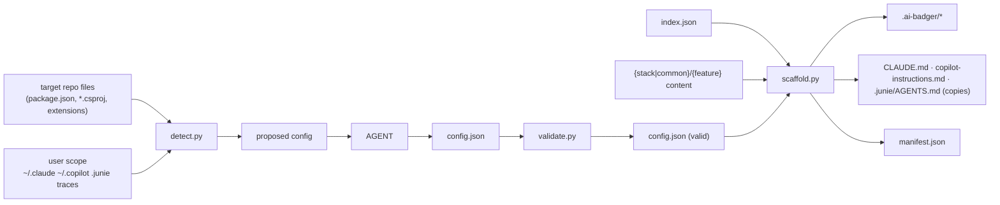
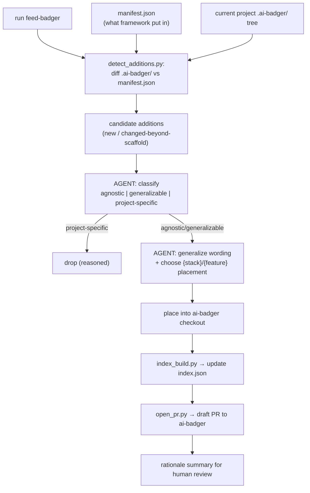

# ai-badger framework architecture

This document explains how ai-badger is put together: the stack×feature catalog model, the two
JSON contracts that connect the framework to a target project, the hard split between what
scripts do and what the agent does, how plugins and the `task` skill compose, and the structure
`welcome-ai-badger` produces inside a target repo. It assumes you've read the top-level
[`README.md`](../README.md) quickstart first.

## 1. The stack×feature catalog model

The framework repo is organized as **stack × feature**:

- **stack** — a technology: `dotnet`, `azure`, `cosmos`, `terraform`, `mcp`, `node`, `js`, `ts`,
  `react`, `css`, `github`, … plus **`common`** for stack-agnostic content.
- **feature** — a kind of framework asset: `skills`, `personas`, `invariants`, `instructions`,
  `plugins`, and — `common`-only — `templates`.

```
<stack>/<feature>/<item>
```

Each feature item is a small, self-describing unit:

| feature | shape | discovery rule |
|---|---|---|
| `skills` | directory | contains a `SKILL.md` |
| `personas` | `*.md` file | named by filename stem |
| `invariants` | `*.md` file | named by filename stem |
| `instructions` | `*.md` file | named by filename stem |
| `plugins` | directory | contains `plugins.json` (+ sibling `marketplaces.json`) |
| `templates` (`common` only) | file/dir | every top-level entry |

This keeps every asset generalizable at the point of authorship: a persona, invariant, or
instruction that is genuinely stack-agnostic goes in `common`; anything that only makes sense
given a specific technology (a routing table entry, a module invariant like *Domain purity* or
*single-writer-Cosmos*) is filed under its owning stack instead of being force-generalized or
duplicated.

### `index.json` — the source of truth

`index.json` at the repo root is **script-generated** by `scripts/index_build.py`, which scans
the tree above and never accepts hand edits. It is regenerated after *any* framework content
change and is the one thing `welcome-ai-badger` and `feed-badger` read to know what exists and
where:

```jsonc
{
  "frameworkVersion": "0.1.0",
  "stacks": {
    "common": {
      "skills":       [ { "name": "task", "path": "skills/task", "extensions": ["github"] } ],
      "personas":     [ { "name": "architect", "path": "common/personas/architect.md" } ],
      "invariants":   [ /* … */ ],
      "instructions": [ /* … */ ],
      "plugins":      [ { "name": "superpowers", "path": "common/plugins/superpowers" } ]
    },
    "dotnet": { "personas": [ /* … */ ], "invariants": [ /* … */ ], "instructions": [ /* … */ ], "plugins": [ /* … */ ] },
    "react":  { /* … */ }
  }
}
```

Because it's derived, `index.json` can never drift from the tree by construction — as long as
you remember to regenerate it (see [`authoring-a-feature.md`](authoring-a-feature.md)).
`scripts/validate.py --all` checks it against `schemas/index.schema.json` along with every other
model in the repo.

## 2. The two contracts

Two JSON files connect the framework to a target project. Both are schema-validated
(`schemas/config.schema.json`, `schemas/manifest.schema.json`) with a required subset, the same
way every `*.json` model in ai-badger is.

### `config.json` — project profile (agent authors, script validates)

Lives at `.ai-badger/config.json` in the target repo. It's the single input the scaffolded
skills read at runtime — everything downstream (which invariants apply, which `task` extensions
activate, what commands to run) is derived from it.

```jsonc
{
  "$schema": "…/config.schema.json",
  "frameworkVersion": "0.1.0",
  "project": { "name": "…", "summary": "…", "domain": "…" },
  "stacks": ["ts", "react", "node", "css"],
  "agents": ["claude", "copilot"],
  "sourceControl": { "platform": "github", "repoUrl": "https://github.com/Arasz/arasz-home-page", "projectUrl": null },
  "commands": { "build": "bun run build", "test": "bun run test", "lint": "bun run lint", "run": "bun run dev" },
  "personaRouting": [ { "work": "frontend UI/UX", "agent": "frontend-engineer" } ],
  "pluginScope": "default",
  "docs": { "architecture": "docs/…" }
}
```

Its role is to **gate extensions**: a `task` extension or a plugin entry activates *iff* the
data it needs is present in `config.json`. For example, the `task` GitHub extension (issue/PR
creation, Copilot review loop) only turns on when `sourceControl.platform == "github"` and
`sourceControl.repoUrl` is set; project-board features additionally need
`sourceControl.projectUrl`.

`detect.py` produces a *proposed* `config.json` mechanically (stacks from package/project files,
agents from `CLAUDE.md`/`.github/copilot-instructions.md`/`.junie/` traces in repo and user
scope, commands from common scripts). The agent then refines it — filling in project summary,
domain, and persona routing, asking clarifying questions only for genuine ambiguity — before
handing it to `validate.py`.

### `manifest.json` — provenance (script writes during scaffold)

Lives at `.ai-badger/manifest.json`. It records exactly what `scaffold.py` put into the project
— every file, its framework source path, its target path, and a content hash — so `feed-badger`
can later diff "what the framework gave you" against "what's there now" to find candidate
additions.

```jsonc
{
  "$schema": "…/manifest.schema.json",
  "frameworkVersion": "0.1.0",
  "generatedAt": "…",
  "agents": ["claude", "copilot"],
  "pluginScope": "default",
  "entries": [
    { "feature": "skills",  "stack": "common", "name": "task",             "source": "skills/task",                  "target": ".ai-badger/skills/task",               "frameworkVersion": "0.1.0", "hash": "…" },
    { "feature": "personas","stack": "react",  "name": "frontend-engineer","source": "react/personas/frontend-engineer.md","target": ".ai-badger/agents/frontend-engineer.md","frameworkVersion": "0.1.0", "hash": "…" }
  ]
}
```

`generatedAt` is stamped by the orchestrator after the run completes — `scaffold.py` itself
avoids nondeterministic clocks so its output stays reproducible/diffable.

## 3. Script vs. agent responsibility (hard split)

This split exists so that everything deterministic and mechanical is deterministic and
mechanical — no LLM call decides a file path or writes JSON by hand — and the agent is reserved
for the genuinely creative decisions.

**Scripts do all mechanical work, no LLM, no network (except `open_pr.py`'s `gh` call):**

- `index_build.py` — scan the catalog tree → `index.json`, validated against its schema.
- `validate.py` — validate any model (`config` / `manifest` / `index` / `plugin-entry` /
  `marketplaces`) against its schema; `--all` validates the whole repo (schemas self-check +
  `index.json` + every plugin entry).
- `detect.py` — best-effort detection: stacks from package/project files and extensions, agents
  from `CLAUDE.md` / `.github/copilot-instructions.md` / `.junie/` traces (repo *and* user
  scope: `~/.claude`, `~/.copilot`), commands from stack metadata → emits a *proposed*
  `config.json` for the agent to refine.
- `scaffold.py` — given a validated `config.json` + a framework checkout + `index.json`:
  materialize `.ai-badger/` (copy selected features), assemble `CLAUDE.md` from the template
  plus selected invariants/instructions/routing, create the agent-file copies/references
  (§5 below), install plugins per scope, and write `manifest.json`.
- `detect_additions.py` (feed) — diff `.ai-badger/manifest.json` against the current project
  `.ai-badger/` tree → candidate additions.
- `open_pr.py` (feed) — branch/commit/`gh pr create --draft` against `ai-badger`.

**The agent is reserved for creative judgment only:**

- Authoring/refining `config.json` — project summary, domain, persona routing, resolving
  detection ambiguities via clarifying questions — then handing off to `validate.py`.
- In `feed-badger`: classifying candidates as agnostic / generalizable / project-specific,
  generalizing wording, and choosing the target `{stack}/{feature}` placement.

If a step can be expressed as a deterministic rule, it belongs in a script, not a prompt.

## 4. Plugins as a feature, with scope

`plugins` is a first-class feature, not a separate concept — Claude Code marketplaces are
merged into it rather than tracked independently. A plugins entry is a directory at
`<stack>/plugins/<name>/` containing:

- **`plugins.json`** (`schemas/plugin-entry.schema.json`) — `{ name, scope, plugins: [...] }`
  where `scope` is `"default" | "local" | "user"` and `"default"` means *inherit the scope
  chosen at init*.
- **`marketplaces.json`** (`schemas/marketplaces.schema.json`) — the custom marketplaces this
  entry needs, e.g. `{ "marketplaces": [ { "name": "…", "source": "github:Owner/repo" } ] }`.

At `welcome-ai-badger` time, the agent asks a single **plugin scope: default | local-only**
question. `default` honors each entry's own declared `scope`; `local-only` forces every install
to project/local scope regardless of what an entry declares. There is deliberately no
user-only option at this prompt — a project scaffold should never silently reach into the
user's global Claude Code config. `scaffold.py` then runs the appropriate
`claude plugin marketplace add` / `plugin install` per scope, or records the intended commands
when it can't shell out.

## 5. `task` = generic base + config-gated extensions

The `task` skill ships in two parts:

- **Base** (`skills/task`): orchestration, model delegation (Fable plans/reviews, Sonnet
  implements), TDD enforcement, token tracking, resume cron, finish protocol, review loop — all
  driven purely by reading `config.json`. It contains no hardcoded GitHub, no dashboard, no
  `dotnet` — nothing stack- or platform-specific.
- **Extensions** (`<stack>/skills/task-extensions/<name>/`, e.g. under `github/`) are opt-in
  slices embedded into the scaffolded skill only when `config.json` supplies the data they need:
  - `github` — create/track issues + PRs, Copilot review loop; needs `sourceControl.platform ==
    "github"` and `sourceControl.repoUrl`; project-board features additionally need
    `sourceControl.projectUrl`.
  - (future) `dotnet-verify` — a `dotnet build && dotnet test` gate; needs the `dotnet` stack
    plus `commands.build`/`commands.test`.

`index_build.py` links an extension to its base by directory convention: a directory named
`<base>-extensions/<ext>/` under any stack's `skills/` attaches `<ext>` to the skill named
`<base>`, wherever that base skill lives.

`prompt-markers` ships as its own `common` skill (hook + `markers-context.json` +
`marker-state.json`, see ADR-0017 in the design doc) and is referenced by the base `task` skill
rather than folded into it.

**Risk to watch:** the base `task` skill must carry zero stack-specific literals — grep the
generated skill for `dotnet`, `Cosmos`, `gh `, or a hardcoded repo name before shipping a change
to it.

## 6. Target repo structure (`.ai-badger/`)

`scaffold.py` produces this shape in a target repo:

```
target-repo/
  .ai-badger/
    manifest.json            # provenance
    config.json               # project profile
    CLAUDE.md                # framework-managed source of the claude instructions
    AGENTS.md                # framework-managed junie source (if junie present)
    copilot-instructions.md  # framework-managed copilot source (if copilot present)
    agents/*.md              # scaffolded personas
    instructions/*.md        # scoped instructions
    invariants/*.md
    skills/…                 # embedded skills (task + extensions, etc.)
    state.json               # empty task index
    agent-instructions/{schema.json, model.json, validators}
  CLAUDE.md                  # COPY of .ai-badger/CLAUDE.md, header: "source of truth: .ai-badger/CLAUDE.md"
  .github/
    copilot-instructions.md  # COPY (copilot present) — header note
    instructions/*.instructions.md   # COPY per module (copilot discovery)
  .junie/AGENTS.md           # COPY (junie present) — header note
```

Everything the framework put in lives under `.ai-badger/` — that's the actual source of truth
for the project's agent configuration. The files outside `.ai-badger/` exist only because agent
CLIs discover instructions by convention at fixed paths.

### Copy-vs-reference rule

- Files that are **core to agent performance** *and* that the agent CLI discovers purely by
  filesystem convention (`CLAUDE.md`, `.github/copilot-instructions.md`,
  `.github/instructions/*`, `.junie/AGENTS.md`) are **copied** into their conventional location,
  each with a header pointing back at `.ai-badger/` as the source of truth. Copilot in
  particular needs the physical copy — its CLI does not follow a reference.
- Everything else — non-essential or custom framework files — is **referenced by path** into
  `.ai-badger/` rather than duplicated.

This copy requirement is also why `scaffold.py` must be **idempotent**: re-running it (using
`manifest.json` to know what it previously wrote) must reconcile the copies with any
`.ai-badger/` source changes without clobbering project-specific edits made outside the
manifest's tracked entries.

A follow-up spike, not yet built, proposes replacing the full copies with thin delegating
"proxy files" — see [`proxy-files-spike.md`](proxy-files-spike.md).

**Agent detection** (`detect.py`): an agent counts as "present" if the repo *or* the user scope
shows its traces — `claude`: `CLAUDE.md` or `~/.claude`; `copilot`:
`.github/copilot-instructions.md` or `~/.copilot`; `junie`: `.junie/`. Only present agents get
files initialized; ai-badger never adds an agent a project doesn't already use.

## 7. Data flow, end to end





## 8. Related docs

- [`authoring-a-feature.md`](authoring-a-feature.md) — how to add a stack, persona, invariant,
  instruction, plugin entry, or skill, and the two commands you must run afterward.
- [`proxy-files-spike.md`](proxy-files-spike.md) — the documented-but-not-built plan to replace
  full agent-file copies with thin proxies.
- [`ai-badger-framework-design.md`](ai-badger-framework-design.md) — the original design doc
  this repo implements, including the full decision log and risk list.
