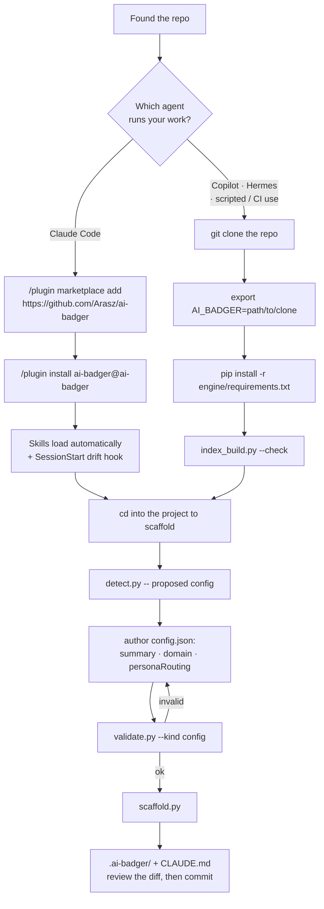
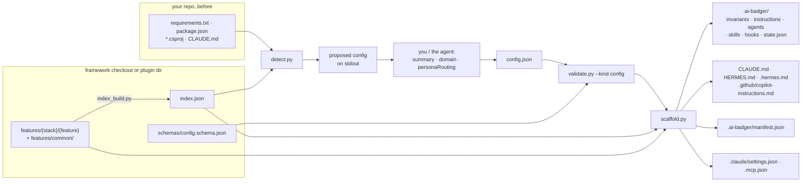
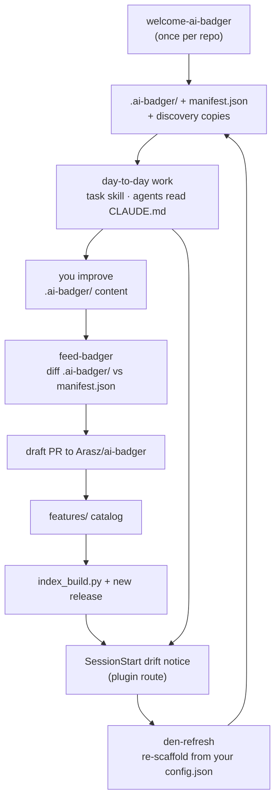

# Getting started

You found this repository and you do not yet know whether it is for you. This page answers that
in the first two sections, then walks one project from nothing to a committed scaffold.

**The commands and flags below are current** — re-run against `0.97.0` on 2026-08-07, and they
still work as written. **The quoted output is a transcript from `0.27.1`**, kept because it is
real output rather than an invented sample, and it has moved since: the catalog is larger, the
scaffolder wires more hooks, and two of the note strings it prints were reworded. The counts you
see are the counts for *your* repo, not these. Where a number matters, the deltas are called out
next to the block it appears in.

---

## 1. What ai-badger is

ai-badger is a **versioned catalog of agent instructions** — invariants, scoped instructions,
personas, and skills — plus scripts that materialize a project-tailored slice of that catalog
into any repository as a `.ai-badger/` directory and the agent-discovery files each coding agent
looks for (`CLAUDE.md`, `.github/copilot-instructions.md`, `HERMES.md`). It
exists so that the rules you want an AI coding agent to follow live in one maintained place
instead of being retyped, drifting, and rotting in every repo separately. It runs in two
directions: `welcome-ai-badger` / `den-refresh` push the catalog into a project, `feed-badger`
pulls generalizable improvements back out.

### Who it is not for

- **You do not use one of the three supported agents.** Only `claude`, `copilot`, and
  `hermes` are valid values in `config.json` (see [`schemas/config.schema.json`](../schemas/config.schema.json)).
  Nothing here generates instructions for an agent outside that list.
- **You want a linter, a test runner, or CI enforcement.** ai-badger writes instruction files.
  It does not check your code. The only thing it enforces mechanically is its own catalog's
  integrity.
- **You want a library to import.** The scripts are standalone Python files with no install
  step and no public API.
- **You are on Windows.** The scripts themselves are portable, but the `task` skill declares
  `platforms: [linux, macos]` — it uses `fcntl` and `crontab`.
- **You want zero generated files in your repo.** A scaffold writes dozens of files under
  `.ai-badger/` plus copies at conventional paths — a one-file demo repo produced 71 entries at
  `0.97.0`, and a real project produces more. They are meant to be committed.

Requirements: **Python 3.8+** (CI floor) and the two dependencies in
[`engine/requirements.txt`](../engine/requirements.txt).

---

## 2. The first decision: plugin or clone



### Route A — install as a Claude Code plugin

```
/plugin marketplace add https://github.com/Arasz/ai-badger
/plugin install ai-badger@ai-badger
```

The marketplace is [`.claude-plugin/marketplace.json`](../.claude-plugin/marketplace.json); its
single plugin entry has `"source": "./"`, so **the installed plugin is a full copy of this
repository** — `features/`, `engine/`, `tooling/`, `schemas/`, `index.json`, `VERSION` and all.
On a Mac it lands at `~/.claude/plugins/cache/ai-badger/ai-badger/<version>/`.

What that buys you:

- The plugin's `skills/` directory is the one place Claude Code scans for a plugin's skills
  (see [ADR-0008](adr/0008-plugin-skills-live-at-the-plugin-skill-path.md)), so
  `welcome-ai-badger`, `den-refresh`, `feed-badger`, `task`, `create-task-spec`,
  `maintain-agent-instructions`, `mcp-index`, `prompt-markers`, `auto-wm`, `call-behaviorist`,
  `code-review-checklist`, `owner-gate-review`, `commit-reminder`, `differential-feature-refactor`
  and `ai-raccoon-memory` are available as
  `ai-badger:<name>` without any setup — see [`skills.md`](skills.md) for what each one does.
- [`hooks/hooks.json`](../hooks/hooks.json) registers a `SessionStart` hook that compares the
  plugin's `VERSION` against a project's `.ai-badger/manifest.json` and prints a one-line notice
  when they differ. That notice is your cue to run `den-refresh`. It only fires for the plugin —
  a hook wired through your own `.claude/settings.json` never gets `${CLAUDE_PLUGIN_ROOT}` and so
  cannot locate the plugin to compare against.
- You get whatever release the marketplace resolves, pinned to an immutable tag. See
  [ADR-0001](adr/0001-versioning-and-release-model.md) for why a version denotes exactly one
  commit and why `git push` is not a release.

### Route B — clone the framework and point `$AI_BADGER` at it

```bash
git clone https://github.com/Arasz/ai-badger
cd ai-badger
export AI_BADGER="$PWD"
python3 -m pip install -r engine/requirements.txt
python3 tooling/index_build.py --check
```

What that buys you:

- It works for Copilot, Hermes, and from a shell script or CI job — nothing depends on
  Claude Code being installed.
- You choose the commit. You can run `main`, a tag, or a branch you are testing.
- It is the only route that lets you **contribute back**: `feed-badger` step 3 writes generalized
  files into a framework checkout before opening the PR.

The cost: you install the dependencies and keep the checkout current yourself, and there is no
drift notice — you have to remember to refresh.

### They are the same catalog

Every script resolves the framework root the same way, in this order: `--root`, then an
ancestor walk from the script's own location, then `$AI_BADGER`, then the root recorded in the
nearest `.ai-badger/manifest.json` **above the script**, then an already-populated
`~/.ai-badger/framework/` (`badger_lib.resolve_framework_root`,
[ADR-0007](adr/0007-no-python-distribution.md),
[ADR-0009](adr/0009-one-framework-root-resolution.md)). A root is a directory holding
`schemas/`, `features/` and `engine/badger_lib.py`.

Two consequences worth knowing:

- **A script inside a checkout always uses that checkout.** `$AI_BADGER` is consulted only when
  no framework stands above the script, so a stale export cannot pair one clone's engine with
  another's catalog — which matters if you keep several checkouts or work in git worktrees.
- **Your working directory is never consulted.** Resolution reads only what the operator
  declared and what sits above the script itself, so a repository you merely cloned cannot
  point the framework at code of its own.

So `--root` is usually optional, and if you took Route A your `$AI_BADGER` is simply the
plugin's install directory — but if you set either one and it is not a framework root, the
script says so instead of quietly resolving something else. Passing `--root` explicitly is
still the safe habit — every example below does.

You can do both: install the plugin for day-to-day use, and keep a clone for contributing.

---

## 3. The first run, end to end

Run these from the root of the project you want to scaffold. `$AI_BADGER` is a framework
checkout or the plugin install directory.

### Step 0 — dependencies

```bash
python3 -m pip install -r "$AI_BADGER/engine/requirements.txt"
```

Two packages: `jsonschema` and `pyyaml`. Skipping this is the single most common failure — see
[Troubleshooting](#7-troubleshooting).

### Step 1 — detect

```bash
python3 "$AI_BADGER/features/common/skills/welcome-ai-badger/scripts/detect.py" \
    --target . --root "$AI_BADGER" > /tmp/ai-badger-config.json
```

Nothing is written to your repo. `detect.py` prints a *proposed* config to stdout. For a small
Python project it produces:

```json
{
  "$schema": "./schemas/config.schema.json",
  "frameworkVersion": "0.27.1",
  "project": { "name": "demo1", "summary": "", "domain": "" },
  "stacks": ["python"],
  "agents": ["claude", "copilot", "hermes"],
  "sourceControl": { "platform": "none", "repoUrl": null, "projectUrl": null },
  "commands": {},
  "personaRouting": [],
  "skillScope": "default",
  "docs": {}
}
```

Stacks come from each stack's `detectionSignals`; vendored and agent-tooling directories
(`node_modules`, `.venv`, `.claude`, `.ai-badger`, …) are ignored. An agent counts as present if
it has traces in the repo *or* in your user scope — that is why `copilot` and `hermes` appear
above for a repo that contains neither.

### Step 2 — author the config

This is the only creative step, and the reason `welcome-ai-badger` is a skill rather than a
script. Fill in:

- `project.summary` and `project.domain` — the domain is the *business* purpose, never a stack.
- `stacks` — trim what detection over-guessed, add what it missed.
- `personaRouting` — `[{ "work": "...", "agent": "..." }]`, mapping kinds of work to the personas
  that will be scaffolded (`architect`, `test-engineer`, `code-reviewer`, plus each stack's
  engineer persona).
- `commands` — `build` / `test` / `lint` / `run`. The `task` skill reads these.
- `sourceControl` — setting `platform: "github"` with a `repoUrl` activates the `task` skill's
  GitHub PR/issue extension at scaffold time.
- `skillScope` — `"default"` honours each skill's declared scope; `"local"` forces every install
  to project scope.
- `agentDocs` — `{"maxChars": N, "maxLines": N}`, raising the size budget the `task` skill's stop
  hook enforces on the generated discovery files. Set it when the breach comes from content the
  framework renders and the project cannot shorten without declining policy. A non-positive or
  non-integer value is ignored, so a typo cannot silently disable the check.
- `exclude` — what this project declines, by catalog name:
  `{"skills": ["mcp-index"], "invariants": ["pr-per-task"]}`. Keys are `skills`, `personas`,
  `invariants` and `instructions`; anything else is a validation error, so a typo cannot become
  a silent no-op. See [declining an artifact](#declining-an-artifact) below.

The full contract is [`schemas/config.schema.json`](../schemas/config.schema.json). It sets
`additionalProperties: false`, so a stray key is a hard validation failure, not a warning.

### Step 3 — validate

```bash
python3 "$AI_BADGER/tooling/validate.py" --kind config /tmp/ai-badger-config.json
```

```
ok       /tmp/ai-badger-config.json
ok       config stack membership
```

Exit 0 valid, 1 invalid, 2 usage error. An invalid config names the offending path:

```
INVALID  /tmp/ai-badger-config.json
    - $: Additional properties are not allowed ('pluginScope' was unexpected)
```

Loop between steps 2 and 3 until it says `ok`.

### Step 4 — scaffold

```bash
python3 "$AI_BADGER/features/common/skills/welcome-ai-badger/scripts/scaffold.py" \
    --config /tmp/ai-badger-config.json --target . --root "$AI_BADGER" \
    --generated-at "$(date -u +%Y-%m-%dT%H:%M:%SZ)"
```

Real output, abridged:

```
scaffolded 50 entries into /path/to/demo1/.ai-badger
  note: skill 'auto-wm' not in index common.skills — skipped
  note: extension 'github' for 'task' skipped (config requirements not met)
  note: embedded extension 'claude' into skill 'task' (requirements met)
  note: wired 2 hook(s) into .claude/settings.json
  note: adjustment 'skills' for 'copilot': Symlinked 8 skill(s) into .github/skills/
  note: generated .mcp.json with 1 external tool(s)
  note: skill auto-install requested but deferred to report (run the commands below manually or via --execute)
  plugin setup commands (run per chosen scope):
    $ claude plugin marketplace add https://github.com/anthropics/claude-plugins-official
    $ claude plugin install superpowers@claude-plugins-official
    ...
```

Read the notes. They are the honest record of what was skipped and why.

*What has changed since that `0.27.1` transcript, measured on 2026-08-07 at `0.97.0`:* the entry
count and the hook/skill counts are all higher and depend on the repo and the agents detected —
a one-file demo scaffolded **71** entries and wired **6** hooks here, not 50 and 2. Two of the
note strings above can no longer be printed as written: the skip note now reads
`skill '<name>' not in any configured stack — skipped`
(`skill_delivery.py`), and the MCP line reads `generated .mcp.json with N MCP server(s)`, not
`N external tool(s)` — MCP servers became a catalog feature type in 0.51.0
([ADR-0014](adr/0014-mcp-support-is-configuration-not-retrieval.md)). The scaffolder also prints
a `prerequisite —` note per declared server now. Run it and read your own notes; do not calibrate
against these.

Useful flags: `--overwrite-agent-files` (replace hand-authored discovery files instead of
preserving them), `--execute` (actually run the printed plugin-install commands),
`--no-install`, `--reset-seed-files`, `--skills <a,b,c>`. An explicitly empty `--skills`
means "the set already scaffolded", read from `.ai-badger/manifest.json` — not "none" — so
`--skills ""` never silently unlinks every skill discovery symlink. Omitting `--skills`
altogether is different: it scaffolds the catalog defaults, which for a project that has
narrowed its set will both add skills back and prune the ones outside the defaults.

### What appears on disk

```
your-repo/
  .ai-badger/                       # the source of truth for everything below
    config.json                     # the profile you just authored
    manifest.json                   # provenance: frameworkVersion, commit, every entry written
    CLAUDE.md  HERMES.md  copilot-instructions.md
    agents/architect.md  agents/code-reviewer.md  agents/test-engineer.md
    delegation.md                   # generated: personas + model lanes, routing, verifiers
    invariants/*.md                 # guard-clauses, tdd-mandatory, no-hardcoded-secrets, …
    invariants/local/*.md           # project-owned invariants (rendered into the section)
    instructions/*.instructions.md  # path-scoped instructions per stack
    skills/                         # real copies of the scaffolded skills, with scripts/
    skills-data/  hooks/  agent-instructions/
    state.json                      # empty task index (seed-once)
  CLAUDE.md                         # COPY, with a managed header
  HERMES.md  .hermes.md             # COPY (hermes present)
  .github/copilot-instructions.md   # COPY (copilot present)
  .github/instructions/*.md         # COPY per scoped instruction
  .github/agents/*.agent.md         # personas as Copilot custom agents
  .github/skills/*                  # symlinks into .ai-badger/skills/
  .claude/agents/*.md               # personas as Claude Code subagents
  .claude/settings.json             # hooks wired
  .mcp.json                         # external MCP tools merged in
```

Files outside `.ai-badger/` are copies that exist only because agent CLIs discover instructions
by filesystem convention. Each carries a header:

```
<!-- Managed by ai-badger. Source of truth: .ai-badger/CLAUDE.md. Do not edit this copy by hand; edit the source and re-run welcome-ai-badger. -->
```

### Preserved regions

A managed file is regenerated in full on every re-scaffold, so anything you add to it is
dropped. To keep a block of your own in one, wrap it in keep markers:

```markdown
<!-- ai-badger:keep-start -->

- `api-routes.instructions.md` → `.github/instructions/api-routes.instructions.md` — project-owned.

<!-- ai-badger:keep-end -->
```

Every marked block is carried into the regenerated file verbatim, in the order you wrote them,
and the scaffold reports `note: carried preserved regions into <file>`. The rules:

- **Where they land.** At the end of the file. The templates have no anchors to re-seat a block
  at, so position is not preserved — only content and relative order. A rule that must live
  inside the invariants section is a project-local invariant (`invariants/local/*.md` in the
  tree above) — keep regions still land at file end.
- **Which files.** Every file the scaffolder generates from an agent template: `CLAUDE.md`,
  `HERMES.md`, `.hermes.md`, `.github/copilot-instructions.md`, the scoped
  `.github/instructions/*.md`, and their `.ai-badger/` source-of-truth copies — the source of
  truth on the same terms as the copy, so the two cannot drift the way they used to. All are
  Markdown, which is why an HTML comment works as the marker in all of them; a non-Markdown
  agent file would need a marker in its own comment syntax and does not get one for free.
- **Content is never interpreted.** A block that points at a section the template no longer has
  is carried anyway, still pointing at nothing. Fixing that is yours.
- **Malformed markers cost nothing.** A `keep-start` with no `keep-end`, a stray `keep-end`, or a
  nested pair means the file is *not rewritten at all* — it stays exactly as you left it and the
  scaffold says why: `note: <file> left untouched — ai-badger:keep-start at line 42 has no
  matching keep-end; fix the markers and re-run to refresh it`. A typo can cost you a refresh,
  never your content.
- **Removing a block** means deleting the markers. `--overwrite-agent-files` does not discard
  preserved regions; it governs whole-file preservation of *unmarked* hand-authored files.
- **Fresh scaffolds** have no prior file to read, so nothing is carried and no markers are added.

### Review this before you commit

- **`CLAUDE.md`** — read it top to bottom once. It is what your agent reads on every turn.
- **`.ai-badger/config.json`** — the summary and domain are yours; the rest is what you approved.
- **Invariants** under `.ai-badger/invariants/` — these are non-negotiable rules you are agreeing
  to. Decline the ones you do not want by name in `config.exclude.invariants` and re-scaffold;
  deleting the file only lasts until the next refresh (see below). Some arrive with every
  project (from `common`); others arrive only when a stack's evidence is detected — e.g. the
  concrete changelog-file convention ships with the `changelog` stack, not always-on. Project
  rules of your own belong in `.ai-badger/invariants/local/` — start each file with a single
  `# ` heading (it renders as `###` inside the section), files render in sorted order after the
  framework invariants, and editing or deleting them changes what renders.
- **`.claude/settings.json` and `.mcp.json`** — hooks and MCP servers were wired in. If your repo
  already had these files, check the merge.
- **The printed plugin-setup commands** — these were *not* run. Run them yourself, or re-scaffold
  with `--execute`.
- **A hand-authored `CLAUDE.md` is preserved, not overwritten.** A discovery file that exists and
  does not carry the managed header is left alone, and the scaffold says so:
  `note: preserved hand-authored CLAUDE.md (source written to .ai-badger/; pass
  --overwrite-agent-files to replace)`. Its `.ai-badger/` source copy is still written, so
  reconcile the two yourself.
- **Writes outside the repo.** If `hermes` is in `agents`, the scaffold installs hook scripts into
  `~/.hermes/plugins/` and symlinks the scaffolded skills into `~/.hermes/skills/<project>/`.
  That is by design
  ([ADR-0003](adr/0003-hermes-skill-discovery-via-namespaced-symlinks.md)) but it is not in your
  `git status`.

### Declining an artifact

Deleting a scaffolded file is not a decision the framework can read: `.ai-badger/` is tracked in
git, so a revert, a bad merge or a stash pop would look exactly like "we do not want this". The
next scaffold or refresh puts it back. The supported way to say no is a line in
`.ai-badger/config.json`:

```json
"exclude": {
  "skills": ["mcp-index"],
  "invariants": ["pr-per-task"]
}
```

- **What can be declined:** `skills`, `personas`, `invariants`, `instructions` — the catalog items
  addressed by their own name. Templates, hooks, adjustments and mcp cannot: they materialise
  output under names of their own — or, for `mcp`, no per-item output at all — so an index name
  has nothing to point at there.
- **What an exclusion does.** Neither `welcome-ai-badger` nor `den-refresh` delivers the item
  again, an excluded invariant stops being rendered into `CLAUDE.md`, and the discovery symlinks
  ai-badger placed for an excluded skill (`.claude/skills/`, `.github/skills/`,
  `~/.hermes/skills/<project>/`) are removed. Its hooks are not wired, and one an earlier run
  already put in `.claude/settings.json` is taken out again. An excluded `*.md` item that a
  previous run copied under `.ai-badger/` is deleted — unless you edited it, in which case it is
  yours and the scaffold says so.
- **What it does not do.** A copy already under `.ai-badger/skills/<name>/` is left on disk — it
  may hold project-local files, and a config edit does not `rm -rf` a directory behind your back.
  The scaffold reminds you it is there; remove it by hand.
- **Un-declining** is deleting the line. The next run delivers the item fresh.
- **A name that matches nothing** is reported (`exclusion 'foo' matches no catalog skill — safe to
  remove from config.json`), never fatal: when the framework drops an item you had excluded, your
  next upgrade must not break.

---

## 4. What just happened

Three inputs, one script, four kinds of output. Nothing is magic and nothing is generated by a
model — `scaffold.py` is mechanical, offline, and deterministic.



The three moving parts:

1. **The catalog** — `features/{stack|common}/{feature}/`. A *stack* is a technology (`python`,
   `dotnet`, `react`, …, plus `common` for stack-agnostic content); a *feature* is a kind of asset
   (`personas`, `invariants`, `instructions`, `skills`, `hooks`, `adjustments`, `templates`,
   `mcp`).
2. **`index.json`** — script-generated from that tree by `index_build.py`, and the only thing the
   scaffolder reads to find catalog items. Never hand-edited. If it is stale, items that exist on
   disk are invisible to the scaffold (see [Troubleshooting](#7-troubleshooting)).
3. **`config.json`** — your project's selection: which stacks, which agents, which commands. It
   decides which slice of the catalog is materialized, and which config-gated skill extensions are
   embedded.

`manifest.json` closes the loop: it records the framework version, the framework commit, and every
entry the scaffold wrote. `den-refresh` and `feed-badger` both read it — the first to know what to
refresh, the second to know what you added that the framework did not.

The full model is in [framework-architecture.md](framework-architecture.md); the script reference
is [scripts.md](scripts.md).

---

## 5. Day two onward



**Updating — [`den-refresh`](../features/common/skills/den-refresh/SKILL.md)**

```bash
python3 "$AI_BADGER/features/common/skills/den-refresh/scripts/refresh.py" --target . --root "$AI_BADGER"
```

Runs drift detection, backs up `.ai-badger/` to `.ai-badger.bckp`, re-scaffolds from your existing
`config.json` — no re-detection, no questions — and prints a JSON report. Always present:
`frameworkVersion` (an object — `scaffolded`, `current`, `manifest` — not a scalar),
`breakingChange` (`isBreaking`, `backupPath`), `drift.changed`, `drift.removed`, `newStacks`,
`reScaffolded`. Present when they apply: `scaffold`, `forced`, `note`, `hermesSkillLinks`,
`skillUsage`, `availableOptIn`, `frameworkCopies`, `cache`. Seed-once files
(`state.json`, `markers-context.json`, `model.json`) survive. Review `git diff` before committing.
Why this is a separate skill rather than a mode of `welcome-ai-badger`:
[ADR-0002](adr/0002-den-refresh-skill.md). Versions that *require* a re-scaffold are listed in
[`BREAKING_VERSIONS`](../BREAKING_VERSIONS).

**Contributing back — [`feed-badger`](../features/common/skills/feed-badger/SKILL.md)**

```bash
python3 "$AI_BADGER/features/common/skills/feed-badger/scripts/detect_additions.py" --target . --root "$AI_BADGER"
```

Diffs `.ai-badger/` against `manifest.json` and lists what you added or changed. You then classify
each candidate (agnostic / generalizable / project-specific), generalize the keepers, place them
into a framework checkout, rebuild the index, and open a **draft** PR with `open_pr.py`. Only paths
you name with `--path` are staged, and every one is scanned for credential-shaped literals first.
For the mechanics of contributing to this repo — the gates, the failing-test-first rule, when a
change is a release — read [`CONTRIBUTING.md`](../CONTRIBUTING.md).

**Working — [`task`](../features/common/skills/task/SKILL.md)**

The day-to-day loop. One backlog task, run end to end as a token-tracked unit of work: a
high-reasoning model plans and reviews, implementation models do the typing. It reads
`commands.build`/`test`/`lint` and `personaRouting` from your `config.json`, and its GitHub
PR/review-loop behaviour activates only when `sourceControl.platform == "github"` with a
`repoUrl`. Tracking lives in `.ai-badger/task-tracking/`. `platforms: [linux, macos]`.

---

## 6. Where to go next

| You want | Read |
|---|---|
| The reference model — contracts, script/agent split, target repo shape | [framework-architecture.md](framework-architecture.md) |
| To run the scripts directly, or the test suite | [scripts.md](scripts.md) |
| How ai-badger's vocabulary maps to each agent's own | [dictionary.md](dictionary.md) |
| To add a stack, persona, invariant, instruction, or skill | [authoring-a-feature.md](authoring-a-feature.md) |
| To contribute code | [`CONTRIBUTING.md`](../CONTRIBUTING.md) |
| Why something is the way it is | [`adr/`](adr/README.md) |
| What changed between versions | [changelog/](changelog/README.md) |

---

## 7. Troubleshooting

### `ModuleNotFoundError: No module named 'jsonschema'`

```
  File ".../engine/badger_lib.py", line 696, in validate
    validator = _jsonschema().Draft202012Validator(schema)
  File ".../engine/badger_lib.py", line 685, in _jsonschema
    import jsonschema  # pylint: disable=import-outside-toplevel
ModuleNotFoundError: No module named 'jsonschema'
```

`badger_lib` imports `jsonschema` **on first use**, inside `_jsonschema()`, not at module level —
deferred because 11 of its 13 entry points never validate (ADR-0011, D1). The import is still
unguarded, so validation refuses rather than silently passing: `validate.py`, `scaffold.py` and
`refresh.py` all die with the traceback above. `detect.py` does not — it never validates, so it
completes with exit 0 on an interpreter that has no `jsonschema` at all.

```bash
python3 -m pip install -r "$AI_BADGER/engine/requirements.txt"
```

The other dependency, **`pyyaml`, is guarded and degrades to a note**: without it the Copilot
adjustment prints `PyYAML not available — Copilot custom agents not generated; pip install
pyyaml (engine/requirements.txt)` and the scaffold continues, and `mcp-index` prints
`mcp-index needs PyYAML: pip install pyyaml (it is in engine/requirements.txt)`. Install both
anyway. (The Hermes MCP adjustment used to print a note of its own here; it now builds its
`mcp_servers:` snippet as plain text so pyyaml is never needed for it.)

If you are running the scripts with a system interpreter that has neither, use a virtualenv and
call its `python3` explicitly.

### A catalog item exists on disk but never appears in the scaffold

`index.json` is stale. `scaffold.py` reads `index.json`, never the `features/` tree, and there is
no freshness check at scaffold time — a file added to `features/` after the last index build is
simply absent from the output, **silently**. Reproduced by adding a throwaway invariant under
`features/common/invariants/` and scaffolding without rebuilding: it never reached
`.ai-badger/invariants/`, and nothing warned.

Detect it:

```bash
python3 "$AI_BADGER/tooling/index_build.py" --check
```

```
index.json is missing or stale — run index_build.py
```

(exit 1). Fix it by dropping `--check`. This only affects the clone route where you edit
`features/` yourself; a released plugin ships a matching index.

### `note: skill '<name>' not in any configured stack — skipped`

You named a skill that no stack in your `config.json` provides. The scaffold resolves a skill
against the stacks you configured plus `common`, and says so rather than guessing.

`auto-wm` is the usual case, and it is not always an error: it lives under
`features/claude/skills/`, and `claude` **is** a stack (`features/claude/stack.json`, and
`"claude"` is in `schemas/config.schema.json`'s `stacks` enum) as well as an agent. Put `claude`
in `stacks` and `SkillDelivery.discover_stack_local()` picks `auto-wm` up automatically and
delivers it into `.ai-badger/skills/auto-wm/` — no note at all. Leave `claude` out of `stacks`
and you get the note above.

This entry previously quoted the message as `not in index common.skills — skipped` and said
`claude` was an agent and not a stack. Both were wrong; corrected 2026-08-07.

### `can't open file '.../skills/welcome-ai-badger/scripts/detect.py'`

**Fixed in 0.28.3.** Before that release, the skill files spelled their script paths as
`$AI_BADGER/skills/<skill>/scripts/…`, and **there is no `skills/` directory at a framework
checkout's root** — the catalog path is `features/common/skills/<skill>/scripts/…`. If you see
this error, you are on 0.28.2 or older, or following a stale copy of a `SKILL.md`: insert
`features/common/` into the path, and update.

### `den-refresh` reports `newStacks` but does not re-scaffold

Expected, not a contradiction. `newStacks` is advisory: a re-scaffold runs your existing
`config.json`, so it cannot deliver a stack the config does not name. Two paths, depending on
whether the detection is right:

- **Accept it** — add the stack to `config.stacks` and run `den-refresh` again. The edit is
  self-executing: the config change is itself drift, so the next run re-scaffolds and delivers the
  stack's instructions.
- **Decline it** — add the stack name to `.ai-badger/stack-ignore.json`. That file is project-owned
  and no re-scaffold ever rewrites it. Use it for stacks that exist in your tree as a transitive or
  tool dependency rather than as something you write.

If `newStacks` names a stack you never introduced — an agent you configured, or something that
looks like the scaffold's own output — that was a bug fixed in 0.47.0; upgrade.

### `ai-badger framework root not found above …`

Raised by `badger_lib.find_root` when no ancestor of the script satisfies the root predicate —
`schemas/`, `features/` and `engine/badger_lib.py` together — and `~/.ai-badger/framework/` is
not populated. Pass `--root <framework checkout>` explicitly. Lookup is pure — it never fetches
anything as a side effect.

### Two drift notices in one session, at two different versions

Not a versioning bug in the framework — two installs are answering. The `SessionStart` drift
notice fires once per tree that claims to be ai-badger, each comparing your scaffold against
*its own* `VERSION`, so a machine carrying more than one tree gets one notice per tree. Since
0.39.0 the notice names the path and version of every tree it can see, and says who owns each:

- **`~/.ai-badger/framework/`** — ai-badger's own fallback clone, made only when nothing else
  answers, and **never updated in place**: it can sit many releases behind indefinitely. It is
  the one tree ai-badger created, so it is the one tree ai-badger will remove — on request:

  ```bash
  python3 "$AI_BADGER/features/common/skills/den-refresh/scripts/refresh.py" \
    --target . --root "$AI_BADGER" --prune-cache
  ```

  Without the flag the refresh reports the path, its version and this command, and deletes
  nothing. The flag refuses if that path is not a framework root, is a symlink or holds one
  that leaves it, or is the root the run itself is using.

- **`~/.claude/plugins/cache/ai-badger/ai-badger/<version>/`** — Claude Code's, one directory
  per installed version. ai-badger only ever reads it and never deletes from it. Use Claude
  Code's own plugin commands if you want old versions gone.

- **A framework checkout** — yours, and out of scope for either tool.

### `... is not an ai-badger framework root (no schemas/ + features/ + scripts/badger_lib.py)`

Your project was scaffolded before the release that split `scripts/` into `engine/` and
`tooling/` (ADR-0011), so the entry points vendored into `.ai-badger/` still look for
`scripts/badger_lib.py`. **`--root`, `$AI_BADGER`, `PYTHONPATH` and `~/.ai-badger/framework`
all fail here** — the stale copy validates them with the old predicate — so the repair has to
come from the framework, not from the project. Run this once, from the project directory:

```bash
python3 "$AI_BADGER/features/common/skills/den-refresh/scripts/refresh.py" --target . --root "$AI_BADGER"
```

`$AI_BADGER` is a current framework checkout or the installed plugin
(`~/.claude/plugins/cache/ai-badger/ai-badger/<version>/`) — no clone needed if you have the
plugin. It backs `.ai-badger/` up, re-scaffolds every vendored entry point, and re-copies
`~/.hermes/plugins/`.

### `validate.py` says `Additional properties are not allowed`

`config.schema.json` is closed (`additionalProperties: false`) at every level. The one that
catches people: the key is **`skillScope`**, not `pluginScope`, which the schema rejects
outright. `welcome-ai-badger`'s own instructions named the wrong key until 0.28.3; `detect.py`
always emitted the right one.

### The scaffold printed plugin-install commands but did not run them

By design: `note: skill auto-install requested but deferred to report`. Run them yourself, or
re-scaffold with `--execute`.

### Your hand-written `CLAUDE.md` did not change

Also by design. A discovery file without the ai-badger managed header is treated as
hand-authored and preserved; its framework version is written to `.ai-badger/CLAUDE.md` instead.
Merge by hand, or re-scaffold with `--overwrite-agent-files`.
