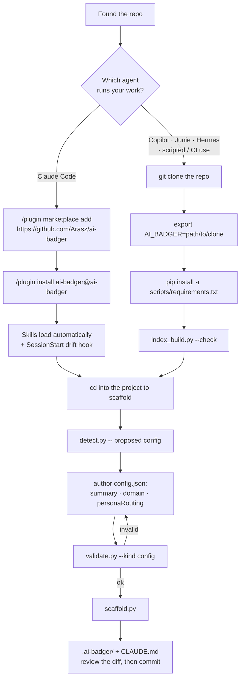
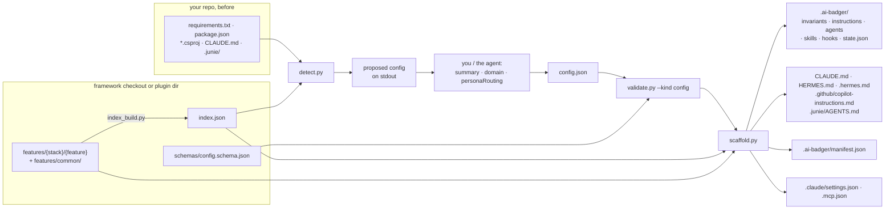
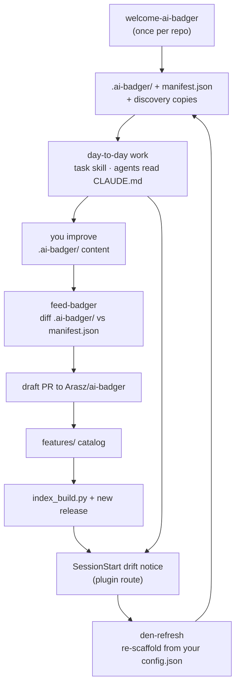

# Getting started

You found this repository and you do not yet know whether it is for you. This page answers that
in the first two sections, then walks one project from nothing to a committed scaffold.

Everything below was run against the code in this repo at version `0.27.1`. Where a command's
output is quoted, it is the real output.

---

## 1. What ai-badger is

ai-badger is a **versioned catalog of agent instructions** — invariants, scoped instructions,
personas, and skills — plus scripts that materialize a project-tailored slice of that catalog
into any repository as a `.ai-badger/` directory and the agent-discovery files each coding agent
looks for (`CLAUDE.md`, `.github/copilot-instructions.md`, `.junie/AGENTS.md`, `HERMES.md`). It
exists so that the rules you want an AI coding agent to follow live in one maintained place
instead of being retyped, drifting, and rotting in every repo separately. It runs in two
directions: `welcome-ai-badger` / `den-refresh` push the catalog into a project, `feed-badger`
pulls generalizable improvements back out.

### Who it is not for

- **You do not use one of the four supported agents.** Only `claude`, `copilot`, `hermes`, and
  `junie` are valid values in `config.json` (see [`schemas/config.schema.json`](../schemas/config.schema.json)).
  Nothing here generates instructions for an agent outside that list.
- **You want a linter, a test runner, or CI enforcement.** ai-badger writes instruction files.
  It does not check your code. The only thing it enforces mechanically is its own catalog's
  integrity.
- **You want a library to import.** The scripts are standalone Python files with no install
  step and no public API.
- **You are on Windows.** The scripts themselves are portable, but the `task` skill declares
  `platforms: [linux, macos]` — it uses `fcntl` and `crontab`.
- **You want zero generated files in your repo.** A scaffold writes roughly fifty files under
  `.ai-badger/` plus copies at conventional paths. They are meant to be committed.

Requirements: **Python 3.8+** (CI floor) and the two dependencies in
[`scripts/requirements.txt`](../scripts/requirements.txt).

---

## 2. The first decision: plugin or clone



### Route A — install as a Claude Code plugin

```
/plugin marketplace add https://github.com/Arasz/ai-badger
/plugin install ai-badger@ai-badger
```

The marketplace is [`.claude-plugin/marketplace.json`](../.claude-plugin/marketplace.json); its
single plugin entry has `"source": "./"`, so **the installed plugin is a full copy of this
repository** — `features/`, `scripts/`, `schemas/`, `index.json`, `VERSION` and all. On a Mac it
lands at `~/.claude/plugins/cache/ai-badger/ai-badger/<version>/`.

What that buys you:

- The plugin's `.claude/skills/` directory is discovered by Claude Code, so `welcome-ai-badger`,
  `den-refresh`, `feed-badger`, `task`, `maintain-agent-instructions`, `mcp-index`,
  `prompt-markers`, `auto-wm`, and `code-review-checklist` are available as skills without any
  setup. (That directory also carries four code-review-graph skills — `debug-issue`,
  `explore-codebase`, `refactor-safely`, `review-changes` — which are managed outside this
  catalog.)
- [`hooks/hooks.json`](../hooks/hooks.json) registers a `SessionStart` hook that compares the
  plugin's `VERSION` against a project's `.ai-badger/manifest.json` and prints a one-line notice
  when they differ. That notice is your cue to run `den-refresh`. It only fires for the plugin —
  a hook wired through your own `.claude/settings.json` never gets `${CLAUDE_PLUGIN_ROOT}` and so
  cannot locate the plugin to compare against.
- You get whatever release the marketplace resolves, pinned to an immutable tag. See
  [ADR-0001](adr/0001-versioning-and-release-model.md) for why a version denotes exactly one
  commit and why `git push` is not a release.

### Route B — clone the framework and point `$AI_BADGER` at it

```bash
git clone https://github.com/Arasz/ai-badger
cd ai-badger
export AI_BADGER="$PWD"
python3 -m pip install -r scripts/requirements.txt
python3 scripts/index_build.py --check
```

What that buys you:

- It works for Copilot, Junie, Hermes, and from a shell script or CI job — nothing depends on
  Claude Code being installed.
- You choose the commit. You can run `main`, a tag, or a branch you are testing.
- It is the only route that lets you **contribute back**: `feed-badger` step 3 writes generalized
  files into a framework checkout before opening the PR.

The cost: you install the dependencies and keep the checkout current yourself, and there is no
drift notice — you have to remember to refresh.

### They are the same catalog

The scripts find the framework root by walking up from their own location for a directory that
holds both `schemas/` and `features/`, falling back to an already-populated
`~/.ai-badger/framework/` (`badger_lib.find_root`). So `--root` is usually optional, and if you
took Route A your `$AI_BADGER` is simply the plugin's install directory. Passing `--root`
explicitly is still the safe habit — every example below does.

You can do both: install the plugin for day-to-day use, and keep a clone for contributing.

---

## 3. The first run, end to end

Run these from the root of the project you want to scaffold. `$AI_BADGER` is a framework
checkout or the plugin install directory.

### Step 0 — dependencies

```bash
python3 -m pip install -r "$AI_BADGER/scripts/requirements.txt"
```

Two packages: `jsonschema` and `pyyaml`. Skipping this is the single most common failure — see
[Troubleshooting](#7-troubleshooting).

### Step 1 — detect

```bash
python3 "$AI_BADGER/features/common/skills/welcome-ai-badger/scripts/detect.py" \
    --target . --root "$AI_BADGER" > /tmp/ai-badger-config.json
```

Nothing is written to your repo. `detect.py` prints a *proposed* config to stdout. For a small
Python project it produces:

```json
{
  "$schema": "./schemas/config.schema.json",
  "frameworkVersion": "0.27.1",
  "project": { "name": "demo1", "summary": "", "domain": "" },
  "stacks": ["python"],
  "agents": ["claude", "copilot", "hermes"],
  "sourceControl": { "platform": "none", "repoUrl": null, "projectUrl": null },
  "commands": {},
  "personaRouting": [],
  "skillScope": "default",
  "docs": {}
}
```

Stacks come from each stack's `detectionSignals`; vendored and agent-tooling directories
(`node_modules`, `.venv`, `.claude`, `.ai-badger`, …) are ignored. An agent counts as present if
it has traces in the repo *or* in your user scope — that is why `copilot` and `hermes` appear
above for a repo that contains neither.

### Step 2 — author the config

This is the only creative step, and the reason `welcome-ai-badger` is a skill rather than a
script. Fill in:

- `project.summary` and `project.domain` — the domain is the *business* purpose, never a stack.
- `stacks` — trim what detection over-guessed, add what it missed.
- `personaRouting` — `[{ "work": "...", "agent": "..." }]`, mapping kinds of work to the personas
  that will be scaffolded (`architect`, `test-engineer`, `code-reviewer`, plus each stack's
  engineer persona).
- `commands` — `build` / `test` / `lint` / `run`. The `task` skill reads these.
- `sourceControl` — setting `platform: "github"` with a `repoUrl` activates the `task` skill's
  GitHub PR/issue extension at scaffold time.
- `skillScope` — `"default"` honours each skill's declared scope; `"local"` forces every install
  to project scope.

The full contract is [`schemas/config.schema.json`](../schemas/config.schema.json). It sets
`additionalProperties: false`, so a stray key is a hard validation failure, not a warning.

### Step 3 — validate

```bash
python3 "$AI_BADGER/scripts/validate.py" --kind config /tmp/ai-badger-config.json
```

```
ok       /tmp/ai-badger-config.json
```

Exit 0 valid, 1 invalid, 2 usage error. An invalid config names the offending path:

```
INVALID  /tmp/ai-badger-config.json
    - $: Additional properties are not allowed ('pluginScope' was unexpected)
```

Loop between steps 2 and 3 until it says `ok`.

### Step 4 — scaffold

```bash
python3 "$AI_BADGER/features/common/skills/welcome-ai-badger/scripts/scaffold.py" \
    --config /tmp/ai-badger-config.json --target . --root "$AI_BADGER" \
    --generated-at "$(date -u +%Y-%m-%dT%H:%M:%SZ)"
```

Real output, abridged:

```
scaffolded 50 entries into /path/to/demo1/.ai-badger
  note: skill 'auto-wm' not in index common.skills — skipped
  note: extension 'github' for 'task' skipped (config requirements not met)
  note: embedded extension 'claude' into skill 'task' (requirements met)
  note: wired 2 hook(s) into .claude/settings.json
  note: adjustment 'skills' for 'copilot': Symlinked 8 skill(s) into .github/skills/
  note: generated .mcp.json with 1 external tool(s)
  note: skill auto-install requested but deferred to report (run the commands below manually or via --execute)
  plugin setup commands (run per chosen scope):
    $ claude plugin marketplace add https://github.com/anthropics/claude-plugins-official
    $ claude plugin install superpowers@claude-plugins-official
    ...
```

Read the notes. They are the honest record of what was skipped and why.

Useful flags: `--overwrite-agent-files` (replace hand-authored discovery files instead of
preserving them), `--execute` (actually run the printed plugin-install commands),
`--no-install`, `--reset-seed-files`, `--skills <a,b,c>`.

### What appears on disk

```
your-repo/
  .ai-badger/                       # the source of truth for everything below
    config.json                     # the profile you just authored
    manifest.json                   # provenance: frameworkVersion, commit, every entry written
    CLAUDE.md  HERMES.md  copilot-instructions.md
    agents/architect.md  agents/code-reviewer.md  agents/test-engineer.md
    invariants/*.md                 # guard-clauses, tdd-mandatory, no-hardcoded-secrets, …
    instructions/*.instructions.md  # path-scoped instructions per stack
    skills/                         # real copies of the scaffolded skills, with scripts/
    skills-data/  hooks/  agent-instructions/
    state.json                      # empty task index (seed-once)
  CLAUDE.md                         # COPY, with a managed header
  HERMES.md  .hermes.md             # COPY (hermes present)
  .github/copilot-instructions.md   # COPY (copilot present)
  .github/instructions/*.md         # COPY per scoped instruction
  .github/agents/*.agent.md         # personas as Copilot custom agents
  .github/skills/*                  # symlinks into .ai-badger/skills/
  .claude/settings.json             # hooks wired
  .mcp.json                         # external MCP tools merged in
```

Files outside `.ai-badger/` are copies that exist only because agent CLIs discover instructions
by filesystem convention. Each carries a header:

```
<!-- Managed by ai-badger. Source of truth: .ai-badger/CLAUDE.md. Do not edit this copy by hand;
     edit the source and re-run welcome-ai-badger. -->
```

### Review this before you commit

- **`CLAUDE.md`** — read it top to bottom once. It is what your agent reads on every turn.
- **`.ai-badger/config.json`** — the summary and domain are yours; the rest is what you approved.
- **Invariants** under `.ai-badger/invariants/` — these are non-negotiable rules you are agreeing
  to. Delete the ones you do not want *before* committing.
- **`.claude/settings.json` and `.mcp.json`** — hooks and MCP servers were wired in. If your repo
  already had these files, check the merge.
- **The printed plugin-setup commands** — these were *not* run. Run them yourself, or re-scaffold
  with `--execute`.
- **A hand-authored `CLAUDE.md` is preserved, not overwritten.** A discovery file that exists and
  does not carry the managed header is left alone, and the scaffold says so:
  `note: preserved hand-authored CLAUDE.md (source written to .ai-badger/; pass
  --overwrite-agent-files to replace)`. Its `.ai-badger/` source copy is still written, so
  reconcile the two yourself.
- **Writes outside the repo.** If `hermes` is in `agents`, the scaffold installs hook scripts into
  `~/.hermes/plugins/` and symlinks the scaffolded skills into `~/.hermes/skills/<project>/`.
  That is by design
  ([ADR-0003](adr/0003-hermes-skill-discovery-via-namespaced-symlinks.md)) but it is not in your
  `git status`.

---

## 4. What just happened

Three inputs, one script, four kinds of output. Nothing is magic and nothing is generated by a
model — `scaffold.py` is mechanical, offline, and deterministic.



The three moving parts:

1. **The catalog** — `features/{stack|common}/{feature}/`. A *stack* is a technology (`python`,
   `dotnet`, `react`, …, plus `common` for stack-agnostic content); a *feature* is a kind of asset
   (`personas`, `invariants`, `instructions`, `skills`, `hooks`, `adjustments`, `templates`).
2. **`index.json`** — script-generated from that tree by `index_build.py`, and the only thing the
   scaffolder reads to find catalog items. Never hand-edited. If it is stale, items that exist on
   disk are invisible to the scaffold (see [Troubleshooting](#7-troubleshooting)).
3. **`config.json`** — your project's selection: which stacks, which agents, which commands. It
   decides which slice of the catalog is materialized, and which config-gated skill extensions are
   embedded.

`manifest.json` closes the loop: it records the framework version, the framework commit, and every
entry the scaffold wrote. `den-refresh` and `feed-badger` both read it — the first to know what to
refresh, the second to know what you added that the framework did not.

The full model is in [framework-architecture.md](framework-architecture.md); the script reference
is [scripts.md](scripts.md).

---

## 5. Day two onward



**Updating — [`den-refresh`](../features/common/skills/den-refresh/SKILL.md)**

```bash
python3 "$AI_BADGER/features/common/skills/den-refresh/scripts/refresh.py" --target . --root "$AI_BADGER"
```

Runs drift detection, backs up `.ai-badger/` to `.ai-badger.bckp`, re-scaffolds from your existing
`config.json` — no re-detection, no questions — and prints a JSON report (`frameworkVersion`,
`drift.changed`, `drift.removed`, `newStacks`, `reScaffolded`, `scaffold`). Seed-once files
(`state.json`, `markers-context.json`, `model.json`) survive. Review `git diff` before committing.
Why this is a separate skill rather than a mode of `welcome-ai-badger`:
[ADR-0002](adr/0002-den-refresh-skill.md). Versions that *require* a re-scaffold are listed in
[`BREAKING_VERSIONS`](../BREAKING_VERSIONS).

**Contributing back — [`feed-badger`](../features/common/skills/feed-badger/SKILL.md)**

```bash
python3 "$AI_BADGER/features/common/skills/feed-badger/scripts/detect_additions.py" --target . --root "$AI_BADGER"
```

Diffs `.ai-badger/` against `manifest.json` and lists what you added or changed. You then classify
each candidate (agnostic / generalizable / project-specific), generalize the keepers, place them
into a framework checkout, rebuild the index, and open a **draft** PR with `open_pr.py`. Only paths
you name with `--path` are staged, and every one is scanned for credential-shaped literals first.
For the mechanics of contributing to this repo — the gates, the failing-test-first rule, when a
change is a release — read [`CONTRIBUTING.md`](../CONTRIBUTING.md).

**Working — [`task`](../features/common/skills/task/SKILL.md)**

The day-to-day loop. One backlog task, run end to end as a token-tracked unit of work: a
high-reasoning model plans and reviews, implementation models do the typing. It reads
`commands.build`/`test`/`lint` and `personaRouting` from your `config.json`, and its GitHub
PR/review-loop behaviour activates only when `sourceControl.platform == "github"` with a
`repoUrl`. Tracking lives in `.ai-badger/task-tracking/`. `platforms: [linux, macos]`.

---

## 6. Where to go next

| You want | Read |
|---|---|
| The reference model — contracts, script/agent split, target repo shape | [framework-architecture.md](framework-architecture.md) |
| To run the scripts directly, or the test suite | [scripts.md](scripts.md) |
| How ai-badger's vocabulary maps to each agent's own | [dictionary.md](dictionary.md) |
| To add a stack, persona, invariant, instruction, or skill | [authoring-a-feature.md](authoring-a-feature.md) |
| To contribute code | [`CONTRIBUTING.md`](../CONTRIBUTING.md) |
| Why something is the way it is | [`adr/`](adr/README.md) |
| What changed between versions | [changelog/](changelog/README.md) |

---

## 7. Troubleshooting

### `ModuleNotFoundError: No module named 'jsonschema'`

```
  File ".../scripts/badger_lib.py", line 20, in <module>
    import jsonschema  # scripts/requirements.txt: jsonschema>=4
ModuleNotFoundError: No module named 'jsonschema'
```

Every script imports `badger_lib`, and `badger_lib` imports `jsonschema` at module level with no
guard. Missing it is a traceback and a non-zero exit from `detect.py`, `validate.py`,
`scaffold.py`, and `refresh.py` alike — not a degraded run.

```bash
python3 -m pip install -r "$AI_BADGER/scripts/requirements.txt"
```

The other dependency, **`pyyaml`, is guarded and degrades to a note**: without it the scaffold
prints `note: yaml not available — skipping hermes user MCP config` and continues, and
`mcp-index` prints `mcp-index needs PyYAML: pip install pyyaml (it is in
scripts/requirements.txt)`. Install both anyway.

If you are running the scripts with a system interpreter that has neither, use a virtualenv and
call its `python3` explicitly.

### A catalog item exists on disk but never appears in the scaffold

`index.json` is stale. `scaffold.py` reads `index.json`, never the `features/` tree, and there is
no freshness check at scaffold time — a file added to `features/` after the last index build is
simply absent from the output, **silently**. Reproduced: adding
`features/common/invariants/demo-invariant.md` and scaffolding without rebuilding produced a
`.ai-badger/invariants/` with no `demo-invariant.md` and no warning.

Detect it:

```bash
python3 "$AI_BADGER/scripts/index_build.py" --check
```

```
index.json is missing or stale — run index_build.py
```

(exit 1). Fix it by dropping `--check`. This only affects the clone route where you edit
`features/` yourself; a released plugin ships a matching index.

### `note: skill 'auto-wm' not in index common.skills — skipped`

Expected, not an error. `auto-wm` lives under `features/claude/skills/`, and the scaffold only
resolves the stacks in your config plus `common` — `claude` is an agent, not a stack. `auto-wm`
reaches you through the Claude Code plugin, not through `.ai-badger/skills/`.

### `den-refresh` reports `newStacks: ["claude", "hermes", …]` right after a scaffold

The scaffold's own output is a detection signal: a root `CLAUDE.md` means the `claude` stack,
`.hermes.md` means `hermes`. Suppress the false positives with a project-owned
`.ai-badger/stack-ignore.json`:

```json
{ "ignore": ["claude", "hermes"] }
```

It is never overwritten by a re-scaffold.

### `can't open file '.../skills/welcome-ai-badger/scripts/detect.py'`

The skill files under `features/common/skills/` (and their scaffolded copies) spell the script
paths as `$AI_BADGER/skills/<skill>/scripts/…`. **There is no `skills/` directory at a framework
checkout's root** — the catalog path is `features/common/skills/<skill>/scripts/…`, which is what
[scripts.md](scripts.md) and this page use. If you are following a `SKILL.md` by hand, insert
`features/common/`.

### `ai-badger framework root not found above …`

Raised by `badger_lib.find_root` when no ancestor of the script holds both `schemas/` and
`features/` and `~/.ai-badger/framework/` is not populated. Pass `--root <framework checkout>`
explicitly. Lookup is pure — it never fetches anything as a side effect.

### `validate.py` says `Additional properties are not allowed`

`config.schema.json` is closed (`additionalProperties: false`) at every level. The one that
catches people: the key is **`skillScope`**, not `pluginScope` — the latter was renamed in 0.7.0
and is now rejected outright.

### The scaffold printed plugin-install commands but did not run them

By design: `note: skill auto-install requested but deferred to report`. Run them yourself, or
re-scaffold with `--execute`.

### Your hand-written `CLAUDE.md` did not change

Also by design. A discovery file without the ai-badger managed header is treated as
hand-authored and preserved; its framework version is written to `.ai-badger/CLAUDE.md` instead.
Merge by hand, or re-scaffold with `--overwrite-agent-files`.
