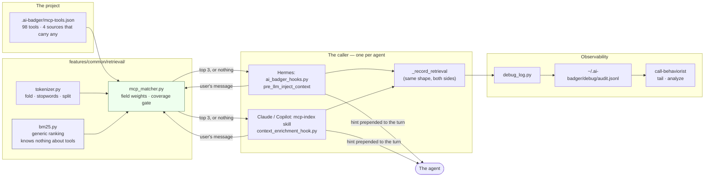
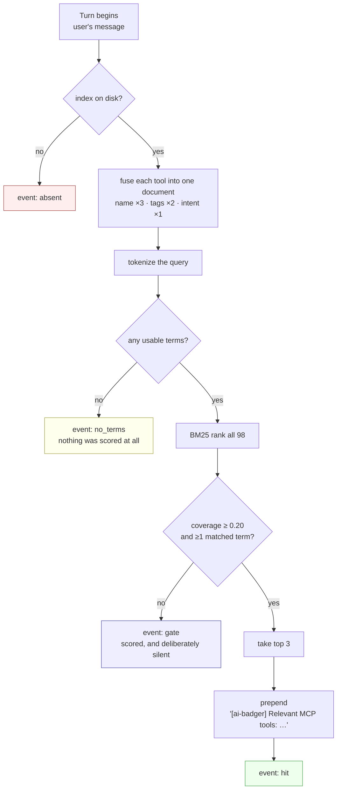
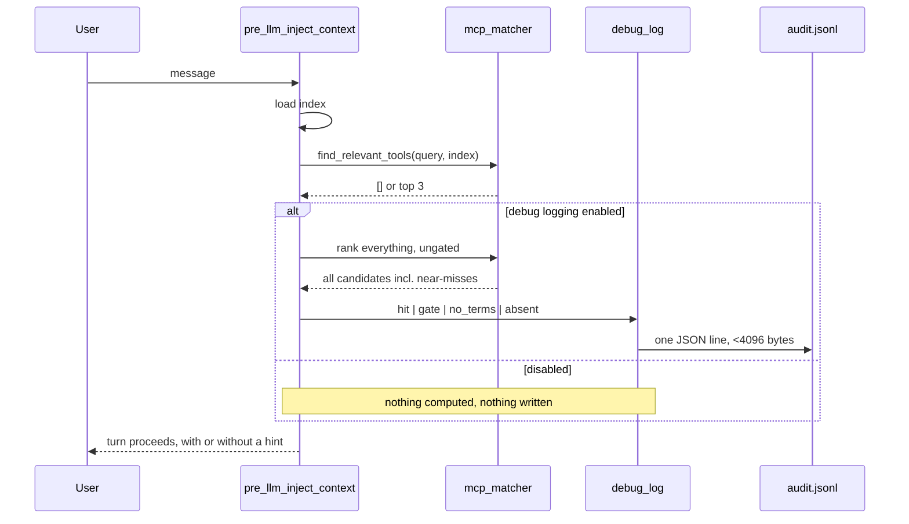

# How retrieval works

An agent's context window is a budget, and every tool description, skill listing and instruction
file spends from it before the user has said anything. ai-badger's retrieval layer exists to turn
that fixed cost into a variable one: instead of putting *every* MCP tool in front of the model,
put the two or three that this turn is actually about, and stay silent otherwise.

This document explains what that layer does, how a single query travels through it, why it is
built out of BM25 rather than the two more obvious alternatives, and — the part most write-ups
leave out — how we can tell whether it is working at all.

- **The pieces:** [`features/common/retrieval/`](../features/common/retrieval) — `tokenizer.py`,
  `bm25.py`, `mcp_matcher.py`, `context_enrichment.py`, and two eval fixture sets; the runner is
  [`tooling/retrieval_eval.py`](../tooling/retrieval_eval.py).
- **The decisions:** [ADR-0004](adr/0004-mcp-tool-index.md) introduced the tool index;
  [ADR-0012](adr/0012-bm25-retrieval-with-a-falsifiable-eval.md) replaced its keyword matcher.
- **The releases:** [`0.47.0-retrieval-that-can-fail.md`](changelog/0.47.0-retrieval-that-can-fail.md)
  and [`0.47.0-retrieval-tells-you-what-it-did.md`](changelog/0.47.0-retrieval-tells-you-what-it-did.md).

---

## 1. The problem

A project that connects a handful of MCP servers can easily reach a hundred tools. In this
repository's own index there are **98 tools**, spread very unevenly across 9 configured
sources — four of them carry all 98 (41, 30, 24 and 3), and five carry none at all. Each one
carries a name, a
description, and a schema; all of it is loaded whether or not the conversation will ever touch
it. The same pressure applies to skills, where hosts have started shipping explicit budgets — a
listing that overflows gets silently truncated rather than prioritised.

The naive fixes both fail in interesting ways:

- **Show everything.** Predictable, and the reason context budgets get eaten by tools nobody
  calls.
- **Show nothing and let the agent ask.** Cheap, but the agent can only ask for what it knows
  exists.

Retrieval is the third option: keep the catalogue on disk, and put a small, ranked slice of it in
front of the model when the turn looks like it needs one. The interesting engineering is not the
ranking — BM25 is fifty-year-old arithmetic — it is **knowing when to say nothing**, and being
able to prove afterwards which of those silences were correct.

## 2. Architecture



Two boundaries in that picture are load-bearing.

**`bm25.py` knows nothing about MCP tools.** It takes a mapping of document id → weighted
term-frequency `Counter` and returns scores. That is the whole interface. Anything with fields
and an id — tools today, skills next — can be ranked by it without the ranker growing a special
case.

**The hook only calls; it does not score.** `ai_badger_hooks.py` (Hermes) and
`context_enrichment_hook.py` (Claude/Copilot) each load the matcher lazily by path and degrade to
"no recommendations" when it is missing, which is what lets a project scaffolded by an older
version — or one where the retrieval-module copy step has not run yet — keep working instead of
crashing on an import.

## 3. One query, end to end



Four terminal states, four distinct records. That is not bookkeeping pedantry — see §6.

### Tokenizing

`tokenize()` lowercases, splits on non-alphanumerics, drops 109 function words and any token
under two characters, then folds a small set of suffixes (`ies → y`, then `ing|ed|es|s` when at
least three characters remain).

The split matters more than the folding. The matcher this replaced tested `keyword in query` —
substring containment — so the tag `ts` matched the word "tests", and `go` matched "going",
"category" and "algorithm". Splitting first makes token identity exact, and that single change
removed a whole class of confident wrong answers.

### Fusing fields

Each tool becomes **one** document rather than three, with its fields folded together at
different weights:

```python
documents[full_name] = fuse_document([
    (tokenize(full_name.replace(":", " ")), NAME_WEIGHT),    # 3.0
    (tokenize(" ".join(tags)),             TAGS_WEIGHT),     # 2.0
    (tokenize(intent),                     INTENT_WEIGHT),   # 1.0
])
```

A token from the tool's own name contributes 3 to the term count instead of 1. This is a
deliberately cheap approximation of BM25F, which would score each field as its own sub-document
with its own length normalisation. The approximation is chosen on corpus shape: these documents
have a median of **nine** distinct tokens and an `intent` a median of **six**. There is
essentially nothing to length-normalise, so the machinery BM25F adds has almost no signal to
work with here. That is an argument from the corpus, not a measurement — we have not run a
controlled BM25F comparison on this index, and this document does not claim one.

Curated `tags` were kept, not thrown away. They stopped being a lookup key and became a weighted
field — which means the human curation still pays, but a query that misses every tag can still
find the tool through its name or intent.

### Ranking

Textbook BM25 with `k1 = 1.2`, `b = 0.75`:

$$\text{idf}(t) = \log\left(1 + \frac{N - \text{df}(t) + 0.5}{\text{df}(t) + 0.5}\right)$$

Ties break deterministically on `(-score, -coverage, doc_id)`, so the same query against the
same index always produces the same list — a property tests depend on and users never notice
until it is absent.

## 4. The gate is coverage, not score

This is the part worth stealing for other systems.

The obvious way to decide "is this good enough to show?" is a score threshold. It does not
survive contact with a second corpus, because BM25 scores are not comparable across corpora of
different size: `idf` depends on `N`, so the same query against 13 documents and against 98
produces different absolute numbers for an equally good match. A threshold tuned on one is
meaningless on the other.

So the gate is a ratio instead:

$$\text{coverage} = \frac{\sum \text{idf}(\text{matched terms})}{\sum \text{idf}(\text{all query terms})}$$

"What fraction of this query's *information* did the best document actually account for?" — a
number between 0 and 1, on the same scale whatever the corpus size. A document clears the gate at
**0.20**. The code also requires at least one matched term, which is worth flagging as
decoration rather than a safeguard: coverage is a sum over matched terms, so it is provably 0
when nothing matched, and the threshold already excludes that case.

It emphatically does **not** stop a single term from carrying a match on its own. All four false
fires in our eval set are single-term matches, and they are the kind of thing a reader should see
rather than take on trust:

| Query that should return nothing | What fired | Terms matched |
|---|---|---|
| "write a poem about autumn" | `rider:apply_patch`, `rider:replace_text_in_file`, `rider:create_new_file` | 1 — *write* |
| "how many days until new year" | `rider:create_new_file` | 1 — *new* |
| "scaffold this repo" | `code-review-graph:list_repos_tool` | 1 — *repo* |
| "start task 12" | `code-review-graph:get_minimal_context_tool` | 1 — *task* |

A rare enough term clears a 0.20 coverage bar by itself, and "write" against a corpus of
file-editing tools is exactly that. This is the layer's most visible weakness.

Two further caveats, measured rather than assumed:

- **0.20 is a ceiling, not a comfortable setting.** It is the highest value at which
  zero-result-on-positives stays at 0 for our fixture set. On this 98-tool corpus the margin to
  the first failure is **0.0089** — raise the threshold by one hundredth and a true positive
  disappears. Because `idf` depends on the corpus size `N`, that margin is a property of *this*
  index and not a constant; a smaller consumer index is a different measurement, and we have not
  made it.

  **Two different numbers are called a "margin" here, and they disagree in sign on purpose.**
  The 0.0089 above is *threshold headroom*: how far the gate can move before it costs a positive.
  The `coverage_margin` that [`tooling/retrieval_eval.py`](../tooling/retrieval_eval.py) reports
  is *class separation*: the tightest true positive's coverage minus the worst false fire's. That
  one is **negative** — −0.201 on the easy set — because a false fire ("scaffold this repo",
  coverage 0.410) sits well above the tightest true positive. Both are true. The first says the
  threshold is finely balanced; the second says no threshold, anywhere, cleanly separates the two
  classes, which is the point below.
- **No scalar threshold cleanly separates good from bad here.** Driving false fires to zero costs
  true positives. We chose to keep the positives and accept that some turns get a suggestion they
  did not need.

Also worth knowing: field weights **cannot** change the false-fire rate, and this is structural
rather than empirical. Coverage is a ratio of `idf` sums; `idf` depends only on document
frequency; and `fuse_document` scales term counts without ever making a present term absent or an
absent term present. Sweeping all 343 combinations of `{0.5, 1, 1.5, 2, 3, 4, 5}` across the three
field weights leaves `false_fire` at exactly 0.2667 in every one, as the algebra says it must.

The one thing that *does* move it is changing which fields exist at all: dropping `tags`
entirely takes false fire from 0.267 to 0.200, because it removes terms from the corpus rather
than reweighting them. Knobs in the interior are theatre; the field set is not.

## 5. Falsifiability

The matcher ships with two fixture sets, deliberately kept apart so neither is silently
reinterpreted as the other.

[`eval/mcp_queries.jsonl`](../features/common/retrieval/eval/mcp_queries.jsonl) is the regression
gate: **58 fixtures — 43 queries with an expected tool, 15 that must return nothing.** A test runs
it against the repository's real index on every suite run, so a change that improves top-1 by
wrecking silence fails immediately.

[`eval/mcp_queries_hard.jsonl`](../features/common/retrieval/eval/mcp_queries_hard.jsonl) is the
instrument, not a gate: **70 fixtures** across five classes, and nothing asserts a recall bar
against it. It exists to say where the matcher actually stands, which a gate cannot do — a gate
you can always pass tells you only that you have not regressed.

Both sets are run by a checked-in runner, [`tooling/retrieval_eval.py`](../tooling/retrieval_eval.py),
against a named fixture file and a named index. That matters more than it sounds: ADR-0004 once
claimed "100% accuracy on a 16-query spike suite" whose script lived in another repository, could
not be run, and could not fail. A number nobody can reproduce is not a measurement.

| Metric | Easy set (58) | Hard set (70) |
|---|---|---|
| recall@1 | 0.930 | **0.442** |
| recall@3 | 1.000 | **0.481** |
| false fire on negatives | 0.267 | 0.333 |

The easy set is **saturated** — recall@3 of 1.000 leaves nothing for a reranking technique to
improve — and it is biased in a way worth stating plainly, because every hand-written eval set
has this problem. Mean token overlap between a query and the tool it should find is **0.781**,
with 40 of 43 fixtures at 0.50 or above. The fixtures are written in the vocabulary of the
documents they are meant to find, by the same person who wrote those documents.

**So we wrote the harder set, and it moved the answer from "no headroom" to "we were measuring
the wrong thing."** Broken out by class, the collapse is not uniform:

| Class | recall@1 | recall@3 | mean overlap |
|---|---|---|---|
| near-dup — real near-duplicate tools to disambiguate | 1.000 | 1.000 | 0.783 |
| user-voice — how a person asks, not how the implementer wrote it | 0.200 | 0.333 | 0.229 |
| paraphrase — zero lexical overlap, mechanically enforced | **0.000** | **0.000** | 0.000 |

BM25 is not ranking badly. On `near-dup` — the class designed to be hard — it is perfect, because
precise vocabulary is exactly what lexical retrieval is good at. It simply cannot answer a
question that shares no words with the answer:

> *"everywhere this identifier appears, swap in a new label instead"* → **nothing returned**.
> The tool is `rider:rename_refactoring`, whose document says "rename", "refactoring", "symbol".

Zero of seventeen paraphrases retrieved anything at rank 3. That is not a tuning problem, and no
weight sweep or threshold change will touch it — the terms are not in the corpus.

### It looked like a vocabulary problem. It is an answerability problem.

The obvious reading of the table above is that the matcher lacks vocabulary, and the obvious fix
is to supply some: synonyms, query expansion, or a semantic signal that does not care about
words at all. All three were measured. The reading is wrong.

Sentence embeddings do close the vocabulary gap, and by a lot. Ranked without the gate, a 7.6 MB
static embedding table takes recall@3 from 0.481 to **0.731** and the paraphrase class from 0.000
to **0.47**; a BM25-plus-cosine hybrid reaches 0.750. It retrieves `rider:rename_refactoring` for
the "swap in a new label" query above. Capacity is not the constraint either — the 7.6 MB static
table matches a 33 M-parameter contextual encoder, because a document here is a median of nine
tokens and there is little for a bigger model to use.

Then the gate takes it all back. Sweeping ~1,000 operating points per model, the best setting
that does not raise the false-fire rate returns the paraphrase class to **0.000–0.059**. Buying
paraphrase@3 of 0.47 costs firing on 93% of the easy set's negatives.

The reason is the finding, and it is not about words:

> **Every one of the 17 paraphrase positives scores at or below the best adjacent negative** —
> for a static encoder and a contextual one alike. Ranked by semantic similarity, the area under
> the curve for separating "paraphrase we should answer" from "adjacent query we must not" is
> **0.196** for one model and **0.520** for another: no better than chance, and for one of them
> actively inverted.

*"which routines have grown way past a reasonable length"* is answerable — `find_large_functions`
exists. *"profile this code to find performance bottlenecks"* is not — no profiler is in this
index. The two sit at the same distance from a corpus of developer tools, because they are about
equally *similar* to it. Nothing in a similarity function encodes which of them the index can
serve, since that is a fact about the index's contents rather than about the language.

So the gap is **answerability**, not vocabulary. That is worth stating plainly because it
redirects the work: a better similarity signal — any of them — improves ranking among things
worth returning, and does nothing for the decision of whether to return anything at all. The gate
is doing that job on a scalar that provably cannot separate the two classes here.

And the tempting shortcut is a trap. Fitting a probe on our own 43 easy positives reaches
**recall@1 of 1.000** in-sample, and **0.070–0.256** under leave-one-out — worse than the
untrained baseline on the hard set. With ~100 documents and ~900 content tokens in total, a
"perfect matcher" trained on our own descriptions is memorising the vocabulary of whoever wrote
them, which is the exact bias the hard set exists to expose.

The honest summary is that **the first fixture set was measuring the matcher's strongest case and
reporting it as the whole picture.** The saturation was real; the conclusion drawn from it —
"there is no headroom" — was an artefact of the instrument. Sample sizes are small on both sides
(Wilson 95% on the easy set's 40/43 is [0.814, 0.976]; on the hard set's 23/52, [0.316, 0.577]),
so treat the gap between them as the finding, not the third decimal of either.

## 6. Telemetry, and why silence needs more than one name

A retrieval layer that recommends nothing looks identical, from the outside, to one that is not
running. This is the failure mode that hides itself: everything appears fine, forever.

So every terminal state writes a record under the `ai_badger_hooks/mcp_retrieval` component:

| Event | Means | The mistake it prevents |
|---|---|---|
| `hit` | Something cleared the gate and was recommended | — |
| `gate` | Everything was scored; nothing cleared the threshold | Reading a correct, frequent silence as a fault |
| `no_terms` | The query tokenized to nothing, so **no candidate was ever compared to the threshold** | Reporting a tokenizer miss as a threshold miss — misattributing the exact failure the telemetry exists to count |
| `absent` | There is no index to search | Reading "no index" as "no match" |
| `legacy` | There *is* an index, in the pre-0.48.0 YAML format this path no longer reads | Reading "not migrated yet" as "never had one" |

Two more events, `known` and `unknown`, share the same component name: they come from a separate
after-the-fact check of whether a tool the agent actually called was one the index knew about.
Worth knowing before you tail the log and wonder where the extra names came from.

`legacy` is the newest of these and arrived the way the others did — from someone noticing a
silence with two meanings. Moving the index from YAML to JSON in 0.48.0 made the reader
JSON-only, which quietly gave `absent` a second sense: "no index" and "an index I no longer
read" became the same record. The rule that produced `gate` and `no_terms` produced this one too.

The `gate`/`no_terms` split was not designed in; it came out of reviewing the first version, where
a query that produced no terms was recorded as `gate` with a threshold field attached — a record
that asserted a comparison which never happened.

A `gate` record carries the query, the extracted terms, the candidate count, the top three scored
candidates as `name:score:coverage`, and the threshold in force — so a later threshold change is
attributable rather than mysterious. A `no_terms` record carries neither the threshold nor any
candidates, and the reason is worth following: scoring needs query terms, and `no_terms` is
precisely the case where there are none. There is no "suppressed top scorer" to show. That is a
real difference from the keyword-map era this event was designed in, when a query could produce
no *tags* while still being perfectly rankable — under BM25, no terms means nothing was ever
scored, full stop.



Note the `alt`. The near-miss scoring exists only for telemetry, and it is not cheap: to show you
the candidates that *didn't* make it, it rebuilds the corpus and re-ranks everything the gated
retrieval just ranked. An early version did that unconditionally. Measured over the 58 eval
queries on this index, the instrumented path costs **about 1.6× the retrieval alone** — paid on
every turn, to fill a log nobody had switched on. It is now behind the enabled check. An
observability feature that taxes the thing it observes gets switched off, and then observes
nothing.

### The query field, and the redaction flag

One field carries user content: `q`, the message that drove retrieval. It is indispensable —
it is how you diagnose a miss, and it is the raw material for new eval fixtures — and it is the
one field someone may not want on disk.

It is recorded by default. Setting `AI_BADGER_DEBUG_REDACT` drops **that field only** from every
record written afterwards, leaving the terms, scores, counts and outcome intact, so the log stays
useful for counting even when it can no longer be read for content.

The drop happens inside `log_event` at the point of writing, not in a post-processing pass. A
redacted record never contains the text at all, so there is nothing to scrub, nothing to leak
through a crash between write and scrub, and no window where a partially-processed log is more
revealing than a finished one. Redaction that runs after the write is a cleanup job pretending to
be a guarantee.

The log itself is user-level and `0600`, capped at 5000 records, and every record stays under
`PIPE_BUF` (4096 bytes) so concurrent appends from several hooks cannot interleave. That budget
is why the keys are single letters, with the legend in `debug_log.KEY_NAMES` rather than repeated
on every line.

## 7. What this has cost, and what it has taught

The honest summary of the first two releases of this layer:

**The parts that worked.** Replacing substring containment with tokenized BM25 removed a class of
confidently-wrong matches. Making the gate a coverage ratio made the threshold portable across
corpus sizes. Shipping an eval fixture set meant the next change to the matcher has to argue with
data rather than with taste.

**The part that did not, for two releases.** This ran nowhere on Claude Code. Debug logging is
what surfaced it — **501 records, zero of them `mcp_retrieval`.** A feature implemented, tested,
documented and released, that had never executed a single query on the host this project is
distributed as a plugin for.

The cause narrowed in two steps before it closed. `mcp_matcher.py`, `bm25.py` and `tokenizer.py`
were copied into the *Hermes* deployment shape by the 0.48.0 index migration, but that copy is
gated on `"hermes" in config.agents` (`features/hermes/adjustments/adjust_hooks.py`) and writes
to `.ai-badger/hooks/` — a directory Claude's own hook wiring never reads. A Claude-only project
had none of the three files anywhere, confirmed by scaffolding one fresh rather than reasoning
from this repository's own tree (which configures both agents, and so had them by that
coincidence alone). And even with the modules present, `context-enrichment` in
`hooks-manifest.json` named only `hermes`, so the code was present, importable, correct, and
never called.

**Issue #147 closed both halves.** `context_enrichment_hook.py` (mcp-index skill) is the
Claude/Copilot adapter — same telemetry component, same event names, same hint format as the
Hermes path — wired via `hooks-manifest.json`'s now-three-agent `context-enrichment` entry, with
`features/claude/adjustments/adjust_retrieval.py` and its Copilot twin delivering the retrieval
modules to `.ai-badger/skills/mcp-index/scripts/`, where Claude's and Copilot's own hook wiring
actually look. A structural test
(`tests/test_hooks_manifest_agent_coverage.py`, backed by `tooling/validate.py`'s
`hooks_manifest_agent_gaps`) now asserts every hook in the manifest names every agent capable of
its event, or records why it deliberately does not — the test the issue itself asked for, so a
fourth occurrence of this shape fails the build instead of waiting to be found by accident.

That was the same defect shape three times over in this repository's history: a component that is
built, covered by tests, copied into place by the scaffolder, and **registered nowhere**. Tests
passed because they called the code directly. The scaffold looked right because the file was
there. The only thing missing was the line that caused it to run, and nothing in the pipeline was
watching for that until this issue's own structural test.

The generalisable lesson is not "write more tests". It is that **shipped and running are
different claims, and only one of them was ever being checked.** The telemetry above exists
because we could not answer the second question, and the first time we could answer it on Claude
Code, the answer was no. It is now yes.

---

## Reading further

- [ADR-0012](adr/0012-bm25-retrieval-with-a-falsifiable-eval.md) — the decision, the sweep tables,
  and what was rejected.
- [ADR-0004](adr/0004-mcp-tool-index.md) — the index itself: why it exists and where it comes
  from. The curation commands, and what `status: removed` means, are in
  [`mcp-index/SKILL.md`](../features/common/skills/mcp-index/SKILL.md).
- [`call-behaviorist`](../features/common/skills/call-behaviorist/SKILL.md) — switching the log
  on, reading it, and producing a health report from it.
- [`framework-architecture.md`](framework-architecture.md) — where retrieval sits in the wider
  scaffolding model.
