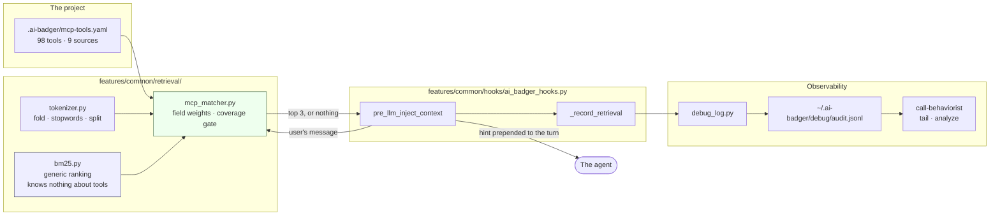
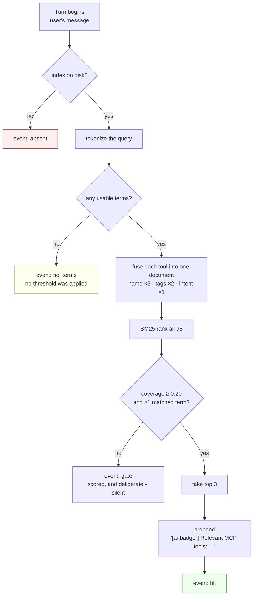
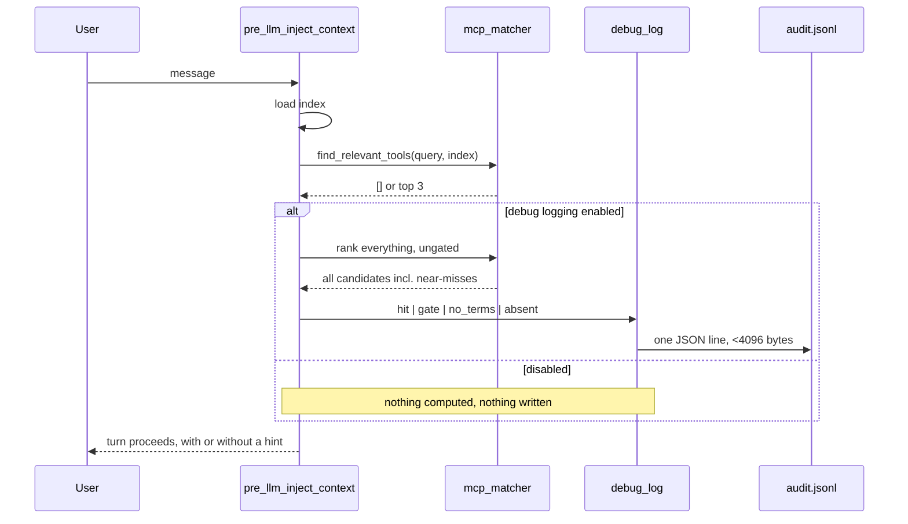

# How retrieval works

An agent's context window is a budget, and every tool description, skill listing and instruction
file spends from it before the user has said anything. ai-badger's retrieval layer exists to turn
that fixed cost into a variable one: instead of putting *every* MCP tool in front of the model,
put the two or three that this turn is actually about, and stay silent otherwise.

This document explains what that layer does, how a single query travels through it, why it is
built out of BM25 rather than the two more obvious alternatives, and — the part most write-ups
leave out — how we can tell whether it is working at all.

- **The pieces:** [`features/common/retrieval/`](../features/common/retrieval) — `tokenizer.py`,
  `bm25.py`, `mcp_matcher.py`, and an eval fixture set.
- **The decisions:** [ADR-0004](adr/0004-mcp-tool-index.md) introduced the tool index;
  [ADR-0012](adr/0012-bm25-retrieval-with-a-falsifiable-eval.md) replaced its keyword matcher.
- **The releases:** [`0.47.0-retrieval-that-can-fail.md`](changelog/0.47.0-retrieval-that-can-fail.md)
  and [`0.47.0-retrieval-tells-you-what-it-did.md`](changelog/0.47.0-retrieval-tells-you-what-it-did.md).

---

## 1. The problem

A project that connects a handful of MCP servers can easily reach a hundred tools. In this
repository's own index there are **98 tools across 9 sources**. Each one carries a name, a
description, and a schema; all of it is loaded whether or not the conversation will ever touch
it. The same pressure applies to skills, where hosts have started shipping explicit budgets — a
listing that overflows gets silently truncated rather than prioritised.

The naive fixes both fail in interesting ways:

- **Show everything.** Predictable, and the reason context budgets get eaten by tools nobody
  calls.
- **Show nothing and let the agent ask.** Cheap, but the agent can only ask for what it knows
  exists.

Retrieval is the third option: keep the catalogue on disk, and put a small, ranked slice of it in
front of the model when the turn looks like it needs one. The interesting engineering is not the
ranking — BM25 is fifty-year-old arithmetic — it is **knowing when to say nothing**, and being
able to prove afterwards which of those silences were correct.

## 2. Architecture



Two boundaries in that picture are load-bearing.

**`bm25.py` knows nothing about MCP tools.** It takes a mapping of document id → weighted
term-frequency `Counter` and returns scores. That is the whole interface. Anything with fields
and an id — tools today, skills next — can be ranked by it without the ranker growing a special
case.

**The hook only calls; it does not score.** `ai_badger_hooks.py` loads the matcher lazily by
path and degrades to "no recommendations" when it is missing, which is what lets a project
scaffolded by an older version keep working instead of crashing on an import.

## 3. One query, end to end



Four terminal states, four distinct records. That is not bookkeeping pedantry — see §6.

### Tokenizing

`tokenize()` lowercases, splits on non-alphanumerics, drops ~80 function words and any token
under two characters, then folds a small set of suffixes (`ies → y`, then `ing|ed|es|s` when at
least three characters remain).

The split matters more than the folding. The matcher this replaced tested `keyword in query` —
substring containment — so the tag `ts` matched the word "tests", and `go` matched "going",
"category" and "algorithm". Splitting first makes token identity exact, and that single change
removed a whole class of confident wrong answers.

### Fusing fields

Each tool becomes **one** document rather than three, with its fields folded together at
different weights:

```python
documents[full_name] = fuse_document([
    (tokenize(full_name.replace(":", " ")), NAME_WEIGHT),    # 3.0
    (tokenize(" ".join(tags)),             TAGS_WEIGHT),     # 2.0
    (tokenize(intent),                     INTENT_WEIGHT),   # 1.0
])
```

A token from the tool's own name contributes 3 to the term count instead of 1. This is a
deliberately cheap approximation of BM25F: we measured real BM25F, with per-field length
normalisation, and it scored *worse* — 0.884 top-1 against 0.907. The reason is corpus shape.
These documents have a median of nine distinct tokens; an `intent` runs about six. There is
nothing to length-normalise. Field-weighted fusion captures what matters here and BM25F's extra
machinery only adds variance.

Curated `tags` were kept, not thrown away. They stopped being a lookup key and became a weighted
field — which means the human curation still pays, but a query that misses every tag can still
find the tool through its name or intent.

### Ranking

Textbook BM25 with `k1 = 1.2`, `b = 0.75`:

$$\text{idf}(t) = \log\left(1 + \frac{N - \text{df}(t) + 0.5}{\text{df}(t) + 0.5}\right)$$

Ties break deterministically on `(-score, -coverage, doc_id)`, so the same query against the
same index always produces the same list — a property tests depend on and users never notice
until it is absent.

## 4. The gate is coverage, not score

This is the part worth stealing for other systems.

The obvious way to decide "is this good enough to show?" is a score threshold. It does not
survive contact with a second corpus, because BM25 scores are not comparable across corpora of
different size: `idf` depends on `N`, so the same query against 13 documents and against 98
produces different absolute numbers for an equally good match. A threshold tuned on one is
meaningless on the other.

So the gate is a ratio instead:

$$\text{coverage} = \frac{\sum \text{idf}(\text{matched terms})}{\sum \text{idf}(\text{all query terms})}$$

"What fraction of this query's *information* did the best document actually account for?" — a
number between 0 and 1, on the same scale whatever the corpus size. A document clears the gate at
**0.20**, and must additionally match at least one query term, so a single rare-but-irrelevant
token cannot carry a match alone.

Two honest caveats we measured rather than assumed:

- **0.20 is a ceiling, not a comfortable setting.** It is the highest value at which
  zero-result-on-positives stays at 0 for our fixture set. On a 98-tool corpus the margin to the
  first failure is **0.0089**; on a 43-tool one it is **0.0010**. Consumer indexes of 30–50 tools
  are the common case, which makes this the tightest part of the design.
- **No scalar threshold cleanly separates good from bad here.** Eight of 43 true positives score
  below the worst false fire. Driving false fires to zero costs nine positives — recall 0.79. We
  chose to keep the positives and accept that some turns get a suggestion they did not need.

Also worth knowing: field weights **cannot** change the false-fire rate. Coverage is a ratio of
`idf` sums, `idf` depends only on document frequency, and `fuse_document` scales term counts
without ever making a present term absent. Sweeping 42 weight settings and 25 `k1`/`b` settings
changed the ranking order and left `false_fire = 0.2667` untouched every time. The one exception
is at the boundary — dropping the `tags` field entirely changes which terms exist at all, and
moves false fire from 0.267 to 0.200. Knobs inside the interior are theatre; the fields
themselves are not.

## 5. Falsifiability

The matcher ships with [`eval/mcp_queries.jsonl`](../features/common/retrieval/eval/mcp_queries.jsonl):
**58 fixtures — 43 queries with an expected tool, 15 that must return nothing.** A test runs them
against the repository's real index on every suite run, so a change that improves top-1 by
wrecking silence fails immediately.

Current standing, and we publish the unflattering ones on purpose:

| Metric | Value |
|---|---|
| recall@3 | 1.000 |
| recall@1 | 0.907 |
| false fire on negatives | 0.267 |
| coverage margin at the threshold | 0.0089 |

The fixture set is **saturated**: recall@3 is already 1.000, so no reranking technique can
improve it, and the remaining top-1 headroom is roughly one query once duplicate-tool annotation
defects are excluded. Mean query↔document token overlap is 0.781 — our fixtures are written in
the vocabulary of the documents they are meant to find, which is exactly the bias a fixture set
written by the author of the index would have. Holding out low-overlap queries drops top-1 to
0.714 while recall@3 stays 1.000.

Two conclusions follow, and they point in opposite directions:

1. Further matcher tuning is not worth doing against these fixtures. Any gain is inside the noise
   floor — the 95% CI on top-1 is [0.814, 0.977], a width of 0.163 against a total achievable
   spread of 0.07.
2. Harder fixtures — paraphrases with zero lexical overlap, user-voice queries, near-duplicate
   tools — would tell us something the current set cannot. That work is tracked, and it is
   deliberately *not* framed as "improve the matcher", because we do not yet know that the
   matcher is what is wrong.

## 6. Telemetry, and why silence needs four names

A retrieval layer that recommends nothing looks identical, from the outside, to one that is not
running. This is the failure mode that hides itself: everything appears fine, forever.

So every terminal state writes a record under the `ai_badger_hooks/mcp_retrieval` component:

| Event | Means | The mistake it prevents |
|---|---|---|
| `hit` | Something cleared the gate and was recommended | — |
| `gate` | Everything was scored; nothing cleared the threshold | Reading a correct, frequent silence as a fault |
| `no_terms` | The query tokenized to nothing, so **no candidate was ever compared to the threshold** | Reporting a tokenizer miss as a threshold miss — misattributing the exact failure the telemetry exists to count |
| `absent` | There is no index to search | Reading "no index" as "no match" |

The `gate`/`no_terms` split was not designed in; it came out of reviewing the first version, where
a query that produced no terms was recorded as `gate` with a threshold field attached — a record
that asserted a comparison which never happened. `no_terms` carries the top candidates but no
threshold, because none was applied.

Each record also carries the query, the extracted terms, the candidate count, the top three
scored candidates as `name:score:coverage`, and the threshold in force — so a later threshold
change is attributable rather than mysterious.



Note the `alt`. The near-miss scoring exists only for telemetry, and an early version computed it
unconditionally — **1.96× the cost of the retrieval itself, paid on every turn, to fill a log
nobody had switched on.** It is now behind the enabled check. An observability feature that taxes
the thing it observes gets switched off, and then observes nothing.

### The query field, and the redaction flag

One field carries user content: `q`, the message that drove retrieval. It is indispensable —
it is how you diagnose a miss, and it is the raw material for new eval fixtures — and it is the
one field someone may not want on disk.

It is recorded by default. Setting `AI_BADGER_DEBUG_REDACT` drops **that field only** from every
record written afterwards, leaving the terms, scores, counts and outcome intact, so the log stays
useful for counting even when it can no longer be read for content.

The drop happens inside `log_event` at the point of writing, not in a post-processing pass. A
redacted record never contains the text at all, so there is nothing to scrub, nothing to leak
through a crash between write and scrub, and no window where a partially-processed log is more
revealing than a finished one. Redaction that runs after the write is a cleanup job pretending to
be a guarantee.

The log itself is user-level and `0600`, capped at 5000 records, and every record stays under
`PIPE_BUF` (4096 bytes) so concurrent appends from several hooks cannot interleave. That budget
is why the keys are single letters, with the legend in `debug_log.KEY_NAMES` rather than repeated
on every line.

## 7. What this has cost, and what it has taught

The honest summary of the first two releases of this layer:

**The parts that worked.** Replacing substring containment with tokenized BM25 removed a class of
confidently-wrong matches. Making the gate a coverage ratio made the threshold portable across
corpus sizes. Shipping an eval fixture set meant the next change to the matcher has to argue with
data rather than with taste.

**The part that did not.** For a while, this ran nowhere. The context-enrichment path is a Hermes
plugin hook; on Claude Code, `mcp_matcher.py` was not present in the scaffolded hooks directory
at all. Debug logging is what surfaced it — **501 records, zero of them `mcp_retrieval`.** A
feature that was implemented, tested, documented and released, and had never executed a single
query on the host most of its users run.

That is the same defect shape three times over in this repository's history: a component that is
built, covered by tests, copied into place by the scaffolder, and **registered nowhere**. Tests
pass because they call the code directly. The scaffold looks right because the file is there. The
only thing missing is the line that causes it to run, and nothing in the pipeline was watching
for that.

The generalisable lesson is not "write more tests". It is that **shipped and running are
different claims, and only one of them was ever being checked.** The telemetry above exists
because we could not answer the second question, and the first time we could answer it, the
answer was no.

---

## Reading further

- [ADR-0012](adr/0012-bm25-retrieval-with-a-falsifiable-eval.md) — the decision, the sweep tables,
  and what was rejected.
- [ADR-0004](adr/0004-mcp-tool-index.md) — the index itself: where it comes from, how it is
  curated, what `status: removed` means.
- [`call-behaviorist`](../features/common/skills/call-behaviorist/SKILL.md) — switching the log
  on, reading it, and producing a health report from it.
- [`framework-architecture.md`](framework-architecture.md) — where retrieval sits in the wider
  scaffolding model.
