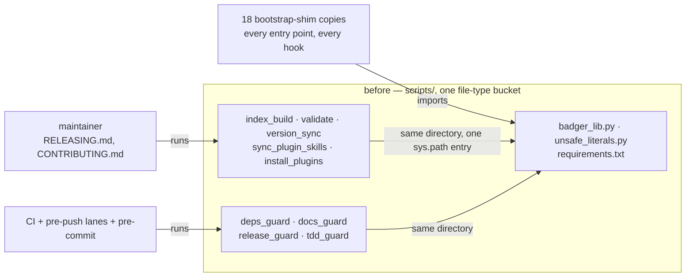
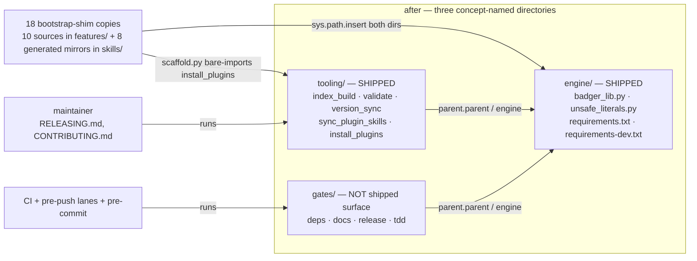
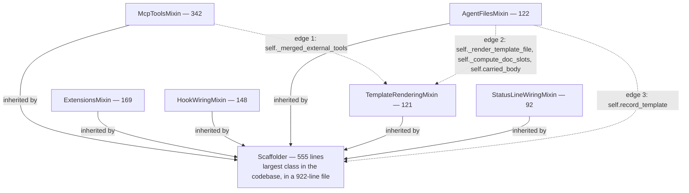
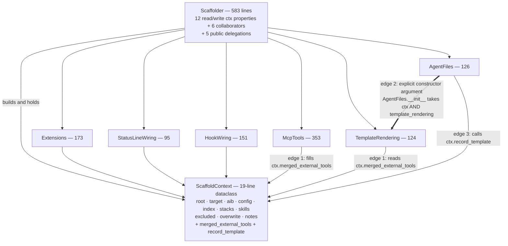
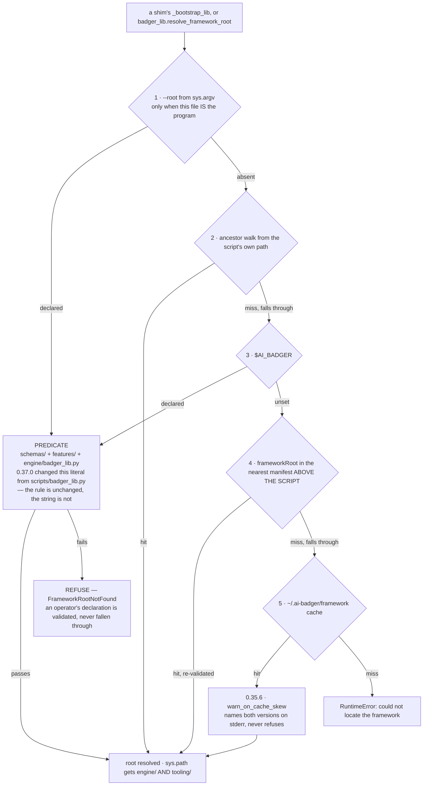
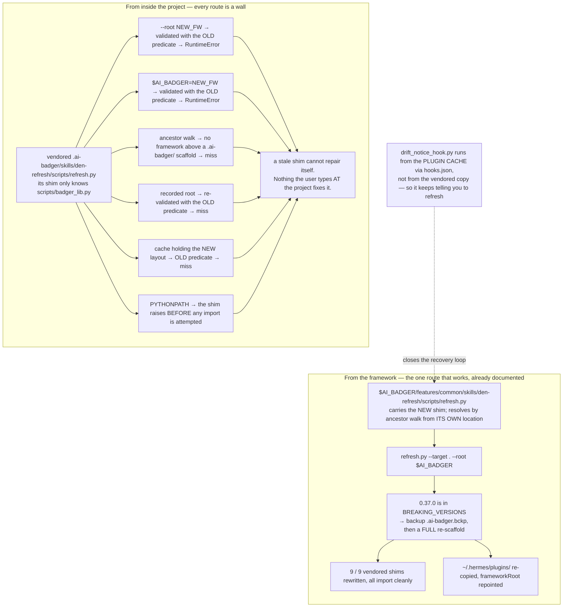

# The 0.35.3 → 0.37.0 arc — what was wrong, what was decided, what was measured

**Written:** 2026-07-28 · **Span:** 0.35.3 through 0.37.0, eight changelog entries in one day
**Sources:** [`docs/changelog/`](../changelog/README.md), [ADR-0009](../adr/0009-one-framework-root-resolution.md),
[ADR-0011](../adr/0011-engine-and-tooling-directories.md),
[the baseline](2026-07-28-architecture-baseline.md) and
[the after-measurement](2026-07-28-architecture-after-refactor.md),
[the migration research](../research/2026-07-28-engine-tooling-split-migration.md),
[Wave 6](../plans/2026-07-28-wave-6-scaffold-collaborators.md) and
[Wave 16](../plans/2026-07-28-wave-16-scripts-directory.md).

This is not a changelog — the changelogs exist and are linked. It is the arc: the shape of the
problem, the decisions, the two predictions that failed, the plan that was overturned by running
it, and what is still open. Every structural claim below was re-checked against the tree at
`4f64612`; §9 lists what was verified and where two source documents disagree.

---

## 1. The arc in one table

| Version | What was wrong | What changed |
|---|---|---|
| [0.35.3](../changelog/0.35.3-an-untagged-release-fails-the-guard.md) | `release_guard` **detected** untagged releases and returned 0. Three releases shipped untagged; every later run compared against a nine-commit-stale baseline. | An untagged release returns 1, checked before the diff and independently of it. |
| [0.35.6](../changelog/0.35.6-the-cache-reports-its-own-skew.md) | `~/.ai-badger/framework` is never updated in place. Last in the resolution order, and silent when it answered — 0.13.0 engine against a 0.35.x catalog on the maintainer's machine. | The cache names both versions on stderr when it wins and disagrees. A warning, not a refusal. |
| [0.36.0](../changelog/0.36.0-a-project-can-decline-an-artifact.md) | No supported way for a project to decline an artifact. Deleting a skill got it restored and left a dangling symlink; the docs promised a mechanism that did not exist. | `config.exclude`, enforced once in `Scaffolder.__init__` so the two entry points cannot disagree. |
| [0.36.0](../changelog/0.36.0-an-explicit-debug-sink.md) | The suite still leaked 76 records into the real audit log; a session-scoped fixture runs after collection, and modules imported during collection had already resolved `Path.home()`. | `$AI_BADGER_DEBUG_DIR`, set at conftest **import** time. 0 leaked records. |
| [0.36.1](../changelog/0.36.1-stack-local-skill-discovery.md) | `auto-wm` was declared a universal default but lived in a stack directory the scaffolder never scanned — registered everywhere, delivered nowhere. | Stack-local skill discovery ([ADR-0010](../adr/0010-stack-local-skill-discovery.md)). |
| [0.36.2](../changelog/0.36.2-the-gates-move-out-of-scripts.md) | `scripts/` held three unrelated concerns behind one file-type name. | The four repo gates move to `gates/` — ADR-0011 phase 1, the cut with no bricking risk. |
| [0.37.0](../changelog/0.37.0-engine-and-tooling.md) | The remaining bucket, and a root predicate anchored on the bucket's name. | `engine/` + `tooling/`. **Breaking**; listed in [`BREAKING_VERSIONS`](../../BREAKING_VERSIONS). |
| [0.37.0](../changelog/0.37.0-scaffolder-collaborators.md) | `Scaffolder` inherited six mixins, none independently constructible, all communicating through `self`. | A `ScaffoldContext` plus six composed collaborators. Zero `*Mixin` classes remain. |

Two themes run through all eight. **A check that reports without failing is not a check** —
0.35.3's warning-on-green, 0.35.5's fixture that ran too late, the exclusion mechanism the docs
described but nothing implemented. And **a name that hides what a thing is will eventually cost
something** — `scripts/` hid three audiences behind one file type, `Scaffolder`'s mixins hid six
collaborators behind one `self`.

---

## 2. Directory structure — one bucket becomes three audiences

`scripts/` held eleven Python files serving three different people. A reader could not tell from
the tree which of them a consumer depends on and which exist only to police the repository.

Everything in that box was shipped surface, so a gate-only edit demanded a `VERSION` bump.
Nothing in the tree said which third of it a consumer actually depends on.

The line the names divide on is **what a consumer's code imports** versus **what a maintainer
runs**. `catalog/`, `distribution/` and `release/` were rejected because each names one of the
five tooling scripts' jobs and misnames the other four.

Two consequences worth keeping in view:

- **`gates/` is deliberately not in `release_guard.SHIPPED_PATHS`.** A gate-only change no longer
  demands a `VERSION` bump. That is a real change to release discipline, made on purpose.
- **`unsafe_literals.py` had to move with `badger_lib.py`.** There is one `sys.path` entry for
  both. Left behind, `learned_skills_sync.py` raises `ModuleNotFoundError` — and that import sits
  *after* the `try/except RuntimeError` that ADR-0009 relies on, so the Hermes plugin fails to
  load rather than degrading to silence. That is the exact defect 0.34.1 had already fixed once.
  Found by running the split, not by reading it.

---

## 3. `Scaffolder` — six mixins become a context plus six collaborators

Before: one class inheriting six mixins that could not be constructed alone. They communicated
through `self`, so any of them could reach any attribute or method of any other. Three of those
reaches were method calls *between* mixins — the reason "just split the files" does not work.

After: a plain class holding a `ScaffoldContext` and six collaborators. The three dotted edges
above are the ones that had to be resolved rather than moved, and each went somewhere different.

The three resolutions, and why they differ:

| Edge | Before | After | Why this shape |
|---|---|---|---|
| external-tools cache | `McpTools` wrote `self._merged_external_tools`, `TemplateRendering` read it | both go through `ctx.merged_external_tools` | shared state belongs on the context; collaborators never reference each other for it |
| `AgentFiles` → `TemplateRendering` | three method calls through `self` | `AgentFiles(ctx, template_rendering)` | the dependency is real and should be **visible**, not hidden in `self` |
| `record_template` | a `Scaffolder` method reached through `self` | `ctx.record_template`, a callable field | manifest bookkeeping is shared state, not `Scaffolder` behaviour |

Two things made this safe rather than brave, and both are worth copying:

- **E1's zero-test-diff constraint.** 103 direct `Scaffolder(...)` constructions across 23 test
  files were the highest-degree nodes in the whole knowledge graph. `ScaffoldContext` was
  therefore introduced with **zero lines changed under `tests/`**, via read/write property
  delegation. That checkpoint, not a reading, is what proves the extraction behaviour-preserving.
- **The step-order golden master.** `run()`'s step order is recorded into
  `manifest.json.partial`. The literal was captured from a real run *before* any edit and
  asserted after every one of the nine work packages. It never changed.

The plan was wrong in three places and the code corrected it: `carried_body` is a method, not a
data attribute, so making it a context field would have shadowed it; `statusline_wiring` imports
`hook_wiring` for two command-parsing helpers, a second permitted edge that was documented rather
than removed; and two tests needed seams a naive delegation would have closed — one calls
`_merge_external_tools` unbound on the class, one patches `_scaffold_claude_mcp_user` on the
instance. The suite found all three.

---

## 4. Framework-root resolution — where the 0.37.0 predicate change sits

One predicate, stated once in `badger_lib.is_framework_root` and repeated **verbatim** in every
bootstrap shim, because locating `badger_lib` is what a shim exists to do. Five ordered inputs,
first hit wins, every one of them derived from the script's own location or from an operator —
never from the working directory.

Three properties of this diagram carry most of the weight:

- **Declared inputs refuse; discovered inputs fall through.** An operator who says where the
  framework is and is wrong must be told, because the alternative is the framework resolving
  somewhere else and the operator never learning their pointer is stale.
- **The ancestor walk outranks `$AI_BADGER`** (ADR-0009 amendment, decision 7). A stale export
  paired a 0.13.0 engine with this repo's catalog and produced 269 failures. A script living
  inside a framework tree is not ambiguous about which engine belongs to it.
- **The recorded root is read above the *script*, never above the working directory** (decision
  6). The invariant is that a repository cannot steer the `sys.path` of a hook that runs on
  session start. Re-validation proves a target is a framework tree — never *whose*.

The 0.37.0 change is one literal inside the `PREDICATE` box. That is also what made it breaking.

---

## 5. The breaking change, and why the recovery must come from outside

This is the single most important thing to understand about 0.37.0.

Every scaffolded project carries **vendored copies** of the bootstrap shim. A project scaffolded
before 0.37.0 carries nine of them, all still asking for `scripts/badger_lib.py`. Against a
0.37.0 framework they answer "not a framework root" about a framework root — and because
`checked()` validates an operator's declaration with that *same stale predicate*, ADR-0009's
"refuse rather than fall through" turns the escape hatch into a second wall.

The asymmetry is the whole point: **the vendored copy is what gets repaired, never what does the
repairing.** `den-refresh/SKILL.md` — in the catalog, in the plugin mirror, and in the copy
vendored inside a scaffolded project — has always instructed the agent to run the framework's
copy. Same for `welcome-ai-badger` and `feed-badger`.

Of the four deployment shapes, only two carry stale shims. A framework checkout resolves by
ancestor walk and the Claude plugin cache is a versioned directory replaced wholesale, so both
self-heal. Before recovery the damage is a *degraded* framework, not a bricked one: the Hermes
learned-skills sync goes quiet, `mcp-index` reports a misleading "index not found", six vendored
CLI copies that nothing invokes become dead files, and no session breaks.

A tolerance release and a migration script were both **built and rejected**. Tolerance buys
nothing for a project that skips the window (verified: it fails identically) and costs two
releases plus a period where the pinned shim invariant asserts a deliberately wrong predicate. A
migration script has the same "run it from the new framework" precondition as `den-refresh` while
skipping the backup, the Hermes re-copy and all non-shim drift — a second, weaker scaffolder
maintained for one release.

---

## 6. The research that overturned the plan

[Wave 16's §1](../plans/2026-07-28-wave-16-scripts-directory.md) argued the rename should not
happen, and its decisive sentence was:

> The upgrade path runs through the exact thing the rename breaks. A project cannot refresh its
> way out of the breakage, because refreshing is what breaks.

**That is false.** `den-refresh` is one of the ten shims, but the vendored copy is never on any
documented invocation path — every `SKILL.md` names `"$AI_BADGER/features/…"`. The plan's
load-bearing argument was an inference from the file list, and it was confidently wrong.

What settled it was **running it**: three framework trees built under `mktemp -d`, a project
scaffolded by the old layout, the old layout then removed from the machine entirely, and all five
ordered inputs tried against the stranded shim. The plan's §1 is left standing with a correction
block on top rather than edited away, which is the right treatment — the record of a wrong
argument is worth more than a tidy document.

The research also confirmed the *other* half of §1 exactly: there is no manual escape hatch. Both
halves came out of the same experiment. The general lesson is narrow and worth keeping: an
argument about what a system does under an unusual condition is a hypothesis until somebody
produces the condition.

Three findings changed the work rather than the sequencing, and all three came from running:
`unsafe_literals.py` must move with `badger_lib.py`; a tolerant predicate without a tolerant
`sys.path` insert resolves happily and `ImportError`s one line later; and `scaffold.py`
bare-imports `install_plugins`, so every shim must insert **both** directories.

---

## 7. What was measured — including two predictions that failed

The [baseline](2026-07-28-architecture-baseline.md) recorded six predictions *before* the work,
so they could be wrong. Two were.

### Failure 1 — `Scaffolder` grew, 555 → 583 lines

The baseline predicted it would "drop well below 555 lines; it should become a constructor plus
delegations". It became exactly that **and grew by 28 lines.**

What replaced the mixin bodies is not free: twelve read/write context properties (the price of
E1's zero-test-diff constraint), the construction of six collaborators, and a delegation for
every public method that used to be inherited. The 994 lines of mixin bodies did move out — into
six classes that now sum to **1,022** as independent collaborators, verified by measuring them.

**Explicit wiring costs the lines inheritance hid.** Inheritance made those lines invisible;
composition makes them explicit. That is not a regression, it is the bill. The honest reading is
that this refactor did not reduce code — it converted implicit coupling into explicit wiring.

**Line count was never the metric.** The baseline said so in advance — *"line count is not the
metric; independent constructibility and cohesion are"* — and flagged the risk for the *total*
while predicting a drop for `Scaffolder` anyway. That specific prediction was wrong. The framing
is the only reason the +28 reads as a known cost rather than a surprise; had it not been written
down first, this section would be a rationalisation.

### Failure 2 — community count fell, 11 → 10

The baseline predicted phase 2 would push the count **up** by splitting `scripts-root`. Two
communities did appear (`engine-root` 44, `tooling-items` 38), but three were absorbed
(`scripts-root-skill`, `hooks-root`, `adjustments-adjust-prune`). Net −1.

Community detection is Leiden, which re-partitions globally on every run. The baseline already
warned to compare sizes and cohesion rather than IDs — **it should have said the same about the
count.** Community count is not a quality metric and should not have been predicted at all. This
failure is a defect in the prediction, not in the refactor.

### What held

| Prediction | Result |
|---|---|
| Zero `*Mixin` classes remain | 0, was 6 — verified against the tree |
| `ScaffoldContext` appears, small | a 19-line dataclass in a 36-line file; the baseline guessed ~36 |
| Six independently constructible collaborators | all six, each constructed from a context alone in tests |
| `engine`/`tooling` communities appear | `engine-root` 44, `tooling-items` 38 |
| Cross-community edges stay 0 | 0, and 0 architecture warnings |
| Hub table barely moves | still all test helpers; `_config` 148 → 155 |

Cohesion of the main production community rose 0.1821 → 0.1949. Small, and the one number that
moved in the direction the refactor was for.

### What the graph cannot see, and it is the actual point

Six classes that could not be instantiated without a `Scaffolder` **now can be** — proven by the
17 tests in `tests/test_scaffold_context.py`, ten of which construct a collaborator (or the one
collaborator pair) from a hand-built context with no `Scaffolder` in scope at all. The remaining
seven pin the module-import boundaries between collaborators and the `run()` step order.

No line count expresses that. The line count moved the wrong way while the property the refactor
existed to create came into being. **If the goal had been "make the codebase smaller", this
refactor failed. That was not the goal.**

---

## 8. Still open

- **`Scaffolder` at 583 lines is still the largest class in the codebase.** The five public
  delegations kept for API stability are the obvious first cut — **four of them have no callers
  at all** (`wire_statusline_capture`, `unwire_statusline_capture`, `assemble_instructions_doc`,
  `assemble_hermes_doc`). Only `wire_hooks` is called, from `run()` and from three tests.
- **`tooling-items` has the lowest cohesion of any production community** (0.1133) — expected for
  five scripts that share a directory and little else, but worth watching if it grows.
- **The hub table is still entirely test helpers.** Wave 6 was never going to move it: the 106
  `Scaffolder(...)` constructions across 24 test files *are* the hub. Wave 15 — splitting the
  test files — is the change that would.
- **`docs/scripts.md` still carries the old directory's name** although its content describes
  `engine/`, `tooling/` and `gates/` correctly and `scripts/` no longer exists.
- **Shape D still records no `frameworkVersion`**, so `~/.hermes/plugins/` hooks stay silent on
  cache skew — recorded in 0.35.6 rather than fixed.
- **`learned_skills_sync` still calls `_bootstrap_lib()` unguarded at module scope**, so a
  genuinely rootless machine breaks its plugin load rather than degrading to silence. Predates
  this arc; degrading properly means making the whole module lazy.
- **An excluded skill's `.ai-badger/skills/<name>/` directory is left on disk** by design, so
  `feed-badger`'s `detect_additions` can read a declined skill as a project addition.
- **How many consumers exist is still unknown.** Recovery is one command whether there is one or
  fifty — but the cost of not announcing scales with a number nobody has.

---

## 9. Claims checked against the tree, not taken from a document

Measured at `4f64612` on branch `docs/refactor-summary`.

| Claim | Source said | Tree says |
|---|---|---|
| Zero mixins remain | changelog | `grep -rn "Mixin" features/` → 0 matches |
| `Scaffolder` is 583 lines | review | 583 — AST-measured, lines 315–897 in a 957-line file |
| Six collaborators sum to 1,022 | review | 353 + 173 + 151 + 126 + 124 + 95 = **1,022**, each class matching the review's table exactly |
| `ScaffoldContext` is small | baseline predicted ~36 | 19-line class in a 36-line file |
| Twelve context properties | review | 12 `_ctx_property` declarations on `Scaffolder` |
| Edge 1 — external-tools cache on the context | plan | `McpTools.fill_merged_external_tools` writes `ctx.merged_external_tools`; `TemplateRendering` reads it |
| Edge 2 — explicit constructor argument | plan | `AgentFiles(self.ctx, self.rendering)` in `Scaffolder.__init__` |
| Edge 3 — `record_template` on the context | plan | `record_template` is a `Callable` field on `ScaffoldContext`; `AgentFiles` calls `self.ctx.record_template` |
| 103 constructions in 23 test files | baseline, at 0.36.2 | 106 in 24 files today — exactly +3 in the one new test file. The baseline reproduces. |
| 17 tests | changelog and review | `pytest --collect-only` on `tests/test_scaffold_context.py` → 17 collected |
| Predicate anchors on `engine/badger_lib.py` | ADR-0011 | confirmed in `badger_lib.is_framework_root` and verbatim in every shim |
| Resolution order | ADR-0009 amendment | `--root`, ancestor walk, `$AI_BADGER`, recorded root, cache — as documented in `resolve_framework_root` |
| Three directories, correct contents | ADR-0011 | `ls engine tooling gates` matches the ADR's table file for file |
| Tooling and gates reach the engine | research finding 1 | all five tooling scripts and all four gates do `parent.parent / "engine"` |
| `scaffold.py` bare-imports `install_plugins` | research finding 3 | two sites, lines 603 and 949 |
| `gates/` is not shipped surface | 0.36.2 | `SHIPPED_PATHS = ["skills", "features", "engine", "tooling", "schemas", "index.json"]` — no `gates` |
| Untagged release now fails | 0.35.3 | `_check` calls `_report_skipped` **before** the diff and returns 1 |
| 0.37.0 is a breaking version | changelog | present in `BREAKING_VERSIONS`, with 0.7.0 and 0.25.0 |
| Four delegations have no callers | review §5 | confirmed — see the disagreement below |

### Two places where the sources disagree

1. **How many public delegations `Scaffolder` keeps.** The
   [changelog](../changelog/0.37.0-scaffolder-collaborators.md) says *five*, of which one
   (`wire_hooks`) has a caller. The [after-measurement](2026-07-28-architecture-after-refactor.md)
   §5 says *"the six public delegations kept purely for API stability"* and then lists **four**
   names. **The tree says five**, at lines 646, 650, 654, 659 and 663 of `scaffold.py`, of which
   `wire_hooks` is called from `run()` and three tests and the other four are called nowhere. The
   changelog is right; the review's "six" is a slip, and its own list of four is the accurate
   part. The count of *uncalled* delegations — four — is consistent everywhere.

2. **How many bootstrap shims there are.** ADR-0011 and Wave 16 say *ten*; the
   [0.37.0 changelog](../changelog/0.37.0-engine-and-tooling.md) says *all 18 copies*. Both are
   right and counting different things: 10 source shims under `features/`, plus 8 generated
   mirrors under `skills/` that `sync_plugin_skills.py` derives, is 18 files on disk carrying the
   predicate. A scaffold run derives more again inside a consumer's `.ai-badger/` — which is why
   a stranded project has nine. Worth stating once rather than leaving three numbers in
   circulation.

Neither is a defect in the work; both are a document drifting from a tree it described correctly
at the time. That is the failure mode `gates/docs_guard.py` exists to catch for paths, and does
not catch for counts.
