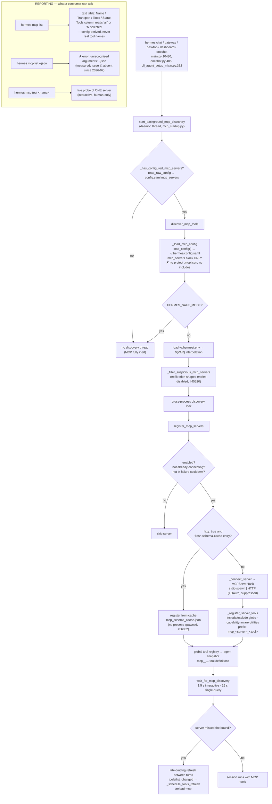
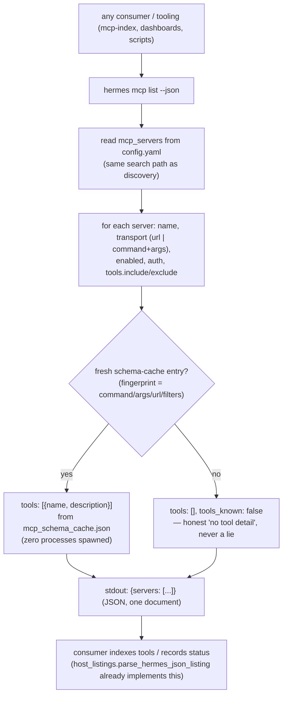

# 2026-08-05 — Hermes MCP server setup flow: actual vs expected

Task `mcp-hermes`. Trace how Hermes **searches and loads** MCP servers (code at
`~/.hermes/hermes-agent`, measured on this machine 2026-08-05), draw the actual flow, draw the
expected flow, diff them, and plan the fix.

## 1. Actual flow — how hermes searches and loads MCP servers

Sources: `hermes_cli/mcp_startup.py`, `tools/mcp_tool.py`
(`discover_mcp_tools` :6435, `register_mcp_servers` :6221, `_register_server_tools` :5810),
`hermes_cli/config.py`, measured `hermes mcp list` output.



Key facts of the actual flow:

1. **Search**: hermes looks in exactly one place — the `mcp_servers` block of
   `~/.hermes/config.yaml` (`HERMES_HOME`/`HERMES_PROFILE`/`HERMES_CONFIG` override the file
   location; `_load_mcp_config` mcp_tool.py:4640). There is **no** `.mcp.json` scanning, no
   config include/merge — `grep -r '\.mcp\.json'` across the codebase returns nothing.
2. **Load**: background daemon-thread discovery (never blocks startup), bounded wait
   (1.5 s interactive / 15 s single-query), late-binding refresh for stragglers, dynamic
   `tools/list_changed` refresh, `/reload-mcp`.
3. **Security**: `HERMES_SAFE_MODE` → zero servers; suspicious stdio entries auto-disabled
   (config.py post-migration); stdio env filtered (explicit `env` + safe baseline only).
4. **Registration**: `mcp_<server>_<tool>` prefixing, include/exclude globs (include wins),
   capability-aware resource/prompt utilities, lazy startup from the schema cache.
5. **Reporting is the broken leg**: the only machine-consumable surface (`--json`) errors
   out; the text table's Tools column never carries tool names; `hermes mcp test` probes one
   server at a time for a human.

## 2. Expected flow

The expected flow keeps 1–4 above (they match the documented behavior in
`hermes-agent/website/docs/user-guide/features/mcp.md` — discovery at startup, filtering,
dynamic refresh, recycling) and completes the reporting leg: a machine-readable inventory
that answers "which MCP servers does hermes have, and which tools does each expose?" in one
call, without spawning servers.



The expected JSON document (contract already implemented on the consumer side in the
ai-badger `mcp-index` skill, `scripts/host_listings.py`):

```json
{
  "servers": [
    {
      "name": "glider",
      "enabled": true,
      "url": "http://127.0.0.1:64342/stream",
      "tools_known": true,
      "tools": [{"name": "find_callers", "description": "..."}]
    }
  ]
}
```

Field semantics: `tools` present + non-empty when tool detail is known; `tools_known: false`
when it is not (the consumer must then treat the server as `unknown`, never as empty).

## 3. The diff

| Leg | Actual | Expected | Gap |
|---|---|---|---|
| Search (config.yaml) | ✅ | ✅ | — |
| Load (discovery, lazy, security) | ✅ | ✅ | — |
| Register (prefix, filters, utilities) | ✅ | ✅ | — |
| Refresh (late-binding, list_changed, reload) | ✅ | ✅ | — |
| **Report (machine-readable inventory)** | **✗ `--json` errors; text table has no tool names** | **`hermes mcp list --json` → `{servers: [...]}` with tool detail** | **THE FIX** |

Consequences of the gap (measured this session): `mcp-index update` records hermes-side
servers (dotnet-sdk, glider, glider-trace, ai-raccoon, …) with **status but zero tools**;
the tooling falls back to `claude mcp list` (≈14 s of health checks) and misreads claude-only
reachability (ai-raccoon shown `unreachable` while hermes has it connected). ai-badger issue
#188 closed the *skill-side* workaround; the root cause — hermes cannot report its own MCP
surface — was never fixed.

## 4. Plan

1. **hermes-agent (upstream, the fix)**: add `--json` to `hermes mcp list`
   (`hermes_cli/subcommands/mcp.py` parser + `hermes_cli/mcp_config.py::cmd_mcp_list`).
   Tool detail from the on-disk schema cache (`tools/mcp_schema_cache.py`,
   fingerprint-checked — the same source lazy startup trusts), so a fresh CLI process emits
   real tool names without spawning servers; `tools_known: false` when no entry. TDD in
   `tests/hermes_cli/test_mcp_config.py`. PR to `NousResearch/hermes-agent` via fork
   `Arasz/hermes-agent`.
2. **ai-badger**: `mcp-index` skill's "absent from hermes since 2026-07" note becomes stale
   once the fix ships — update via feed-badger after upstream merge.
3. **Re-measure**: re-run `mcp-index update` on this machine after the fix to verify
   hermes-side servers now carry tool detail.

## 5. Outcome (measured 2026-08-05, after the fix)

Implemented and verified on this machine:

```text
$ hermes mcp list --json        # exit 0
{"servers": [ {name, enabled, command|url|args, auth?, tools_known, tools: [{name, description}]} ]}
```

- `hermes mcp list --json` emits the full inventory; tool detail comes from the schema
  cache (post-filter callable tools, fingerprint-checked) — zero servers spawned.
- `hermes mcp list` text path byte-identical to before.
- Consumer integration (the reason the fix exists): `parse_hermes_json_listing` on the real
  output → 10 servers, `carries_tool_detail=True` — dotnet-sdk 12 tools, glider 49,
  glider-trace 23; llmstudio (disabled, no cache) honestly `tools_known: false`.
- Tests: 6 new (RED → GREEN) in `tests/hermes_cli/test_mcp_config.py`; 40 MCP-related tests
  pass; `ruff check` clean on the three changed files.

Next: upstream PR (`fix/mcp-list-json` on `Arasz/hermes-agent` fork), then `mcp-index update`
re-run + skill note refresh once upstream merges.
