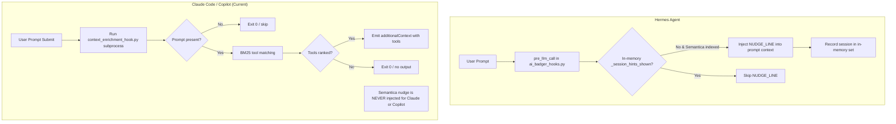
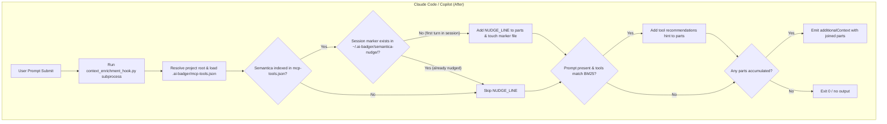

# Semantica once-per-session export nudge for Claude Code and GitHub Copilot — Plan

**Date:** 2026-08-23  
**Task:** `semantica-nudge-claude-copilot` (Issue #418 remaining half)  
**Target Version:** 0.134.0  

---

## 1. Context & Motivation

Issue #418 requested porting both Semantica auto-save and the once-per-session export nudge to Claude Code and GitHub Copilot.
In version 0.130.0 (PR #421), auto-save was shipped via `semantica_export_autosave_hook.py` (`PostToolUse` / `postToolUse`).
However, the once-per-session export nudge was deferred because Claude Code (`UserPromptSubmit`) and Copilot (`userPromptSubmitted`) invoke their hook scripts as separate subprocesses per turn. Unlike Hermes (which runs `ai_badger_hooks.py` in-process with a live memory `set`), Claude and Copilot require disk-persisted session marker state to ensure the nudge only fires once per session rather than on every prompt.

### Current State (Before)

### Target State (After)

---

## 2. Architecture & Design

### 2.1 Marker File Storage
- Directory: `~/.ai-badger/semantica-nudge/` (overridable via test fixture / parameter).
- File name: Sanitized `session_id` (e.g. `20260823_165523_2b8782` or `claude-sess-1`).
- Permissions: standard owner permissions (`0600` / `0700` dir).

### 2.2 Shared Module Enhancements (`features/common/retrieval/context_enrichment.py`)
Add pure/isolated helper functions:
- `semantica_nudge_marker_path(session_id: str | None, base_dir: Path | None = None) -> Path`
- `semantica_nudge_already_shown(session_id: str | None, base_dir: Path | None = None) -> bool`
- `record_semantica_nudge_shown(session_id: str | None, base_dir: Path | None = None) -> bool`
- `semantica_indexed(index: dict | None) -> bool`
- `NUDGE_LINE` constant matching `export_semantica_graph.py` and `ai_badger_hooks.py`.

### 2.3 Hook Implementation (`features/common/skills/mcp-index/scripts/context_enrichment_hook.py`)
- In `main()`:
  - Load payload from stdin (`json.load`).
  - Resolve project directory and load `.ai-badger/mcp-tools.json`.
  - Check if semantica is indexed (`semantica_indexed(index)`).
  - Extract session ID: `session_id = payload.get("session_id") or payload.get("sessionId")`.
  - If semantica is indexed and `not semantica_nudge_already_shown(session_id)`:
    - Add `NUDGE_LINE` to `parts`.
    - `record_semantica_nudge_shown(session_id)`.
  - If `prompt`:
    - Perform BM25 tool matching; if tools match, append `build_hint(ranked, index)` to `parts`.
  - If `parts`:
    - Emit `hookSpecificOutput` with `additionalContext = "\n".join(parts)`.

### 2.4 Invariants & Failure Modes
- A missing session ID or IO error touching the marker must never crash the hook (advisory only).
- If no prompt is provided, but it's turn 1 of a session with Semantica indexed, the nudge is still emitted.
- If prompt matches tools AND nudge fires, both are emitted separated by `\n`.

---

## 3. TDD & Verification Plan

1. **RED Tests First (`tests/test_context_enrichment_hook.py` & `tests/test_context_enrichment.py`)**:
   - Helper unit tests in `test_context_enrichment.py`:
     - `test_semantica_nudge_marker_path`
     - `test_semantica_nudge_record_and_check`
     - `test_semantica_indexed`
   - Subprocess hook tests in `test_context_enrichment_hook.py`:
     - `test_first_prompt_with_semantica_emits_nudge` (Claude spelling)
     - `test_copilot_spelling_emits_nudge` (Copilot spelling)
     - `test_second_prompt_in_same_session_skips_nudge`
     - `test_prompt_with_tool_match_and_nudge_emits_both`
     - `test_empty_prompt_with_semantica_emits_nudge`
     - `test_non_semantica_index_emits_no_nudge`
     - `test_marker_dir_io_failure_gracefully_degrades`
2. **GREEN Implementation**:
   - Implement helpers in `context_enrichment.py`.
   - Update `context_enrichment_hook.py`.
   - Copy to scaffolded copies if required (via project copy sync).
3. **Regression & Full Suite**:
   - Run `pytest -q -n auto` (4095+ tests).
   - Run `python3 tooling/validate.py --all`.
   - Run `pylint`.
4. **Documentation & Version Bump**:
   - Bump `VERSION` to `0.133.0`.
   - Add changelog `docs/changelog/0.133.0-semantica-nudge-claude-copilot.md`.
   - Update `tooling/version_sync.py` outputs if needed.
