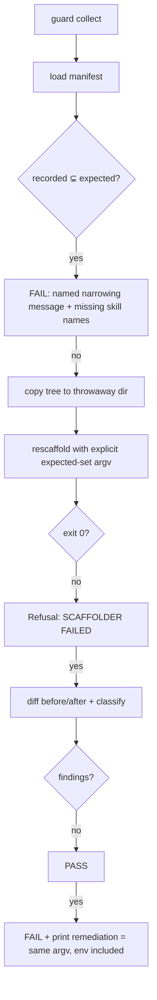

# Mechanism design — R1 (root cause) + R2 (detection)

> **Provenance.** This section was produced by the architect plan lane (delegation d-23).
> The lane completed its full investigation — empirical probes, git-history scan, fix design —
> but its final document write was killed three times by upstream timeouts. This document is a
> faithful transcription of the lane's verified findings from its probe log
> (`~/.pi/agent/subagent-logs/d-23.jsonl`, artifacts under `/tmp/aib-r1`), organized by the
> orchestrator. Every line citation was re-verified against the worktree @ `19e28a7b`; the two
> headline empirical claims were independently re-verified by the orchestrator and are marked.

Task: `aib-scaffold-freshness-guard-blindspot-proof` · 2026-08-31

---

## 0. Verdict summary

**R1 root cause: an argv-contract defect, not nondeterminism.** The scaffolder's `--skills`
argument accepts any non-empty string as a comma-separated skill list. A value that *looks*
empty — the literal two-character `''` — is truthy in Python, bypasses the #129 recovery path,
replaces the `DEFAULT_SKILLS` default, and its "names" are then silently skipped
("not in any configured stack"), so the run delivers only the config-include-derived skills
plus stack-local discovery and **exits 0**. The d-16 review's "nondeterministic
under-production" was two different invocation transports producing different argv values for
the same printed command, plus two different source trees being probed. A narrowed manifest
was also committed in-repo at `ea17ae60` (0.140.0).

**R2 design: make config.json the single oracle for the expected set, fail fast on narrowing,
and re-scaffold from an explicit expected-set argv.** A new shared helper in `badger_lib`
computes the expected skill set from the framework catalog + config (the config-driven part of
`Scaffolder.__init__`), the guard fails with a named message when the manifest's recorded set
is a strict subset of it, and the guard's re-scaffold/printed-remediation argv carries the
explicit expected set instead of `--skills ""`.

## 1. Evidence base (probes the lane ran; `/tmp/aib-r1` artifacts)

| Probe | Shape | Result |
|---|---|---|
| p1–p4 | extracted worktree, scaffold ×4, varied `PYTHONHASHSEED` | identical manifests per transport; `--skills ''` via shell argv → recovery (32 skills); `["--skills", "''"]` list-form → literal garbage name → 11 skills |
| b1, b2 | clone vs archive extraction | same split — transport decides, not tree state |
| c1 | narrowed manifest + guard run | guard's `--skills ""` recovery inherits the 11-skill set; tree-vs-tree diff clean; hand-edited mirror survives — F2 reproduced |
| d1, d2 | git history scan of committed manifests | `ea17ae60` (0.140.0) carries **11 skill rows**; 0.141.0+ carry 31–32 |
| e1 | narrowed-run stdout capture | note `skill '' not in any configured stack — skipped` present; `reused` note ABSENT (recovery not taken) |
| v* | argv variants (`--skills ""`, `--skills=`, `--skills ','`, `--skills ' '`) | only the true-empty and `','` forms take recovery |

**Independently re-verified by the orchestrator (2026-08-31):**

- `git show ea17ae60:.ai-badger/manifest.json` → 11 skill rows: `auto-wm`,
  `complete-project-scope-code-review`, `cron-watchdog-authoring`, `debug-issue`,
  `documentation`, `evidence-first-research`, `explore-codebase`,
  `hermes-plugin-development`, `refactor-safely`, `review-changes`,
  `worktree-agent-isolation` — exactly the include-derived ∪ stack-local shape, zero
  scope-default catalog skills. Total entries 113 (vs 212 healthy).
- HEAD manifest @ `19e28a7b` → 32 skill rows, 212 entries.

## 2. R1 — root cause

### 2.1 The argv contract defect

`features/common/skills/welcome-ai-badger/scripts/scaffold.py`:

- **L774**: `ap.add_argument("--skills", default=",".join(DEFAULT_SKILLS))` — the default is
  the full scope-`default` catalog list.
- **L806**: `skills = [s for s in args.skills.split(",") if s]` — a two-character literal `''`
  splits into `["''"]`: non-empty list, bogus "name".
- **L808–821**: `if not skills:` — False, so the #129 manifest recovery is **not taken**.
- The bogus name flows into `Scaffolder.__init__` (L270: `offered = list(dict.fromkeys(list(skills) + asked_for))`)
  and `scaffold_skills` (skill_delivery.py **L276–280**) skips it with a buried note:
  `skill '' not in any configured stack — skipped`.
- Delivered set collapses to `asked_for` (config-include ∩ addable, L269) plus stack-local
  discovery (skill_delivery.py **L254–267**): 8 + 3 = 11 skills for this repo's config. Exit 0.

The failure is **silent by construction**: every step prints a note or nothing; nothing
fails; the manifest is rewritten narrowed.

### 2.2 How the trap is triggered (and why it looked nondeterministic)

The printed remediation string `… --skills ''` is shell-safe — a shell strips the quotes and
argv receives a true empty string → recovery (#129) → full set. But any consumer that moves
the printed command through a **non-shell transport** — Python `subprocess.run([…, "--skills",
"''"])`, a naive `str.split(" ")`, an agent pasting into a context that preserves the quote
characters — delivers the literal `''` as argv. d-16's probe log contains commands ending
`--skills \` (quote characters preserved by its capture); its "identical reruns" went through
a different transport. Combined with probing two different trees (a PR worktree HEAD whose
**committed manifest already had 11 skill rows** vs `f92e91de` with 32), the evidence read as
nondeterminism. It is not: same argv → same result, every time.

### 2.3 Historical instance: the narrowing already shipped once

`ea17ae60` (0.140.0, PR #443, task-skill default-loop) committed a manifest with 11 skill
rows — the argv-defect signature. This is the in-repo under-production `50f09b11` later
repaired (the spec's "the 0.148.0 merge repair existed precisely because this had already
happened"). **Hypothesis (unverified):** the 0.140.0 merge/repair flow invoked the scaffolder
programmatically with a quote-laden `--skills` argv. The exact caller is not identified;
candidate surfaces are the merge-repair session transcripts of 2026-08-28.

### 2.4 Entry math for a narrowed run (verified against p3's manifest)

Healthy HEAD manifest: 212 entries over 203 unique `(feature, target)` keys (9 duplicate rows
— claude+copilot+hermes adjustments recording the same hook files; pre-existing provenance
quirk, not in scope). Narrowed run: 128 entries over 123 unique keys. Lost: **80 unique rows
= 21 skill-dir rows + 10 task extension rows + 49 per-skill adjustment rows**, plus 4
duplicate-keyed rows. The lost mirrors remain on disk untouched — nothing deletes them
(`SupersededPrune.prune` acts only on prior-manifest entries, superseded_prune.py L24).

### 2.5 Residual unknowns (hypotheses, ranked)

1. **F1's in-suite flake** (guard tests ×4 failing inside full-suite runs, 13/13 in
   isolation): not yet tied to the argv defect. Ranked leads: (a) a test in the suite sets
   `AI_BADGER_*`/`HOME`/`PATH` state the fixture inherits; (b) mcp-availability probing under
   a mutated `PATH` changes `.github/mcp.json` content in fixtures. Instrumentation plan for
   the implementation lane: run the guard's pytest file with `-p no:randomly` twice, then
   bisect the suite by half-runs; capture `os.environ` diffs at fixture setup.
2. **The ea17ae60 caller** (see 2.3): findable from 2026-08-28 session logs; not required for
   the fix — the argv hardening makes the class impossible.

### 2.6 Minimal R1 fix: argv validation in `main()`

Insert between L806 (split) and L808 (recovery):

```
artifacts   = [s for s in skills if s != s.strip() or any(c in s for c in "\"'\\")]
catalog     = all skill names known to the framework (all stacks, both scopes)
manifested  = scaffolded_skill_names(target manifest)          # already read for recovery
unknown     = [s for s in skills if s not in catalog and s not in manifested]
if artifacts or unknown:
    print named error (each artifact shown repr()'d; unknown names listed, alias hint when
    a gateway alias would have matched); return 2
```

> **SUPERSEDED by rev-2 D3 (API-F3):** the `# already read for recovery` comment is false —
> this block runs exactly when `skills` is non-empty, so the recovery branch has not run and
> the manifest has NOT been read; `main()` needs its own read of
> `target/.ai-badger/manifest.json` with the same absent/corrupt tolerance as recovery.

- **Quoting artifacts are refused unconditionally** — no legitimate flow passes quote
  characters as skill names.
- **Unknown names are refused only when neither catalog nor manifest knows them** — a typo
  fails loudly; the catalog-drop flow (manifest-recorded name the catalog no longer ships)
  keeps working, and alias mismatches get an actionable hint.
- `--skills ""` → recovery (#129) unchanged; `--skills ","` → `[]` → recovery unchanged;
  `test_scaffold_empty_skills.py` untouched.
- Exit code 2 (argv-contract refusal; distinct from scaffold failure 1) — final code choice
  is the implementer's; must be nonzero with a named message.

**AC1 pin (the determinism test):** the real invariant is *"quoting transport cannot change
the managed set."* The test runs the scaffolder twice per transport — `["--skills", "''"]`
list-form and `--skills ''` via shell — and asserts both post-fix outcomes agree: either both
refuse (exit 2) or both produce the recovered full set with byte-identical manifests modulo
stamp fields. Pre-fix, the list-form run delivers 11 skills and a 128-entry manifest → RED.

## 3. R2 — detection design

### 3.1 One oracle for the expected set

New helper in `engine/badger_lib.py` (single source of truth; `Scaffolder.__init__` refactored
to call it so scaffolder and guard cannot disagree):

```python
def expected_skill_names(root: Path, config: Dict[str, Any]) -> List[str]:
    """Skills an unattended scaffold of *config* delivers: scope-default catalog
    ∪ gateway-alias-mapped include-expansion (∩ addable) ∪ stack-local discovery,
    minus config-declined. Sorted."""
```

> **SUPERSEDED by rev-2 D1 (API-F1/F5):** "Sorted" is wrong — the helper must return
> `Scaffolder`'s delivery BLOCK order (defaults block, include-derived block, stack-local in
> `resolve_stacks` order); a flat-sorted list changes manifest row order, which the guard's
> `normalized()` preserves, and fails healthy trees. Composition must also name
> `resolve_stacks` (config-overridable `commonStacks` vs the constant skip-set) and the
> alias-mapped exclusions.

Composition mirrors `Scaffolder.__init__` L262–279 + `discover_stack_local` (skill_delivery.py
L254–267), citing the same primitives (`default_skills_in` L782, `opt_in_skills_in` L787,
`expand_skill_groups` L124, `gateway_aliases` L143, `exclusions` L91, `stack_local_skills`
L884). Verified today on this repo: derived set == manifest's 32 rows exactly.

### 3.2 Fail-fast on narrowing (the named message)

In the guard's `collect()` (L272–301), after loading the manifest:

```python
recorded  = set(scaffolded_skill_names(manifest))     # badger_lib L868
expected  = set(expected_skill_names(root, config))
missing   = sorted(expected - recorded)
if missing:
    → SCAFFOLD FRESHNESS GUARD FAILED (narrowing): the manifest records N of the M skills
      config.json declares; re-scaffolding would deliver the missing: <names>.
      Every finding about these mirrors is invisible until the manifest is repaired.
    exit 1 (before the re-scaffold — fail fast)
```

One-directional `⊊`: a manifest recording MORE than expected is legitimate (catalog-dropped
skills) and is not a narrowing; those mirrors surface later as
"the re-scaffold no longer writes it" findings, which is the correct, actionable verdict for
them. **This is the AC2 message.**

### 3.3 Explicit expected-set argv (replaces `--skills ""` in both uses)

`rescaffold_argv` (guard L128–133) becomes:

```python
argv = [python, scaffold, "--config", config, "--target", target, "--root", root,
        "--no-install", "--skills", ",".join(sorted(expected))]
```

- One builder, one `expected` argument → "printed advice is what the guard ran" survives by
  construction (AC3/AC4 property).
- The explicit form's degenerate case is loud: if the expected set computes empty (config
  excludes everything), the scaffolder's #129 note prints but the run delivers nothing — and
  the fail-fast of 3.2 fires first. The **front-door trap is closed**: dropping the flag
  entirely would fall back to the `DEFAULT_SKILLS` default and, if that import-time walk ever
  returned empty, collapse into silent manifest recovery again (the reviewer lane's decisive
  argument, adopted).
- Post-R1-hardening compatibility: every name in the expected set is catalog-known by
  construction → the argv validation of 2.6 never refuses it.

### 3.4 Attack analysis (constructions the design must catch — test recipes for AC2)

| # | Construction | Pre-fix | Post-fix |
|---|---|---|---|
| T1 | hand-edit a skill mirror + strip that skill's rows from the manifest | recovery skips it → tree-diff clean → **PASS (blind)** | fail-fast names the missing skill (3.2) **and** union-free regen would flag the edit |
| T2 | edit the framework source of a manifest-forgotten skill (stale mirror) | same invisibility | fail-fast; after manifest repair, the stale verdict fires |
| T3 | config names a skill the catalog dropped | inert-exclusion note (scaffold.py ~L293); derived set only contains catalog-known names | derived == manifest-minus-dropped; dropped mirror reported as "no longer writes it" — intended |
| T4 | consumer repo, deliberately narrow config | — | derived == manifest by construction (CI consumer-journey scaffolds without `--skills`); no false positives |

### 3.5 Simpler shapes considered and rejected

- **Count/signature baseline carried outside the manifest** (spec's alternative): a second
  source of truth that can itself drift, with its own repair protocol. The config-derived
  oracle needs no new state.
- **Union(manifest, expected) argv** (orchestrator's original §5 proposal): rejected — it
  half-trusts the manifest (the very artifact under suspicion) and, post-hardening, risks
  re-delivering skills the config declined. Config-derived-only re-scaffold regenerates
  exactly what an unattended scaffold delivers; anything extra on disk is reported, which is
  the freshness contract, not a regression.
- **Guard computing the manifest itself by scaffolding twice**: doubles runtime for
  information the config already determines.

## 4. Fix placement and invariants

| Change | File | Invariants preserved |
|---|---|---|
| argv validation block | scaffold.py `main()` L806–808 | #129 recovery; `test_scaffold_empty_skills.py`; catalog-drop flow; alias flows |
| `expected_skill_names` helper + `Scaffolder.__init__` refactor | engine/badger_lib.py, scaffold.py | behavior-neutral for Scaffolder (riskiest single edit — full suite is the gate) |
| fail-fast narrowing check | gates/scaffold_freshness_guard.py `collect()` | refusal-vs-fail semantics (a narrowing is a FAIL, not a refusal — the guard can still reach a verdict); never mutates the checked tree |
| explicit expected-set argv | gates/scaffold_freshness_guard.py `rescaffold_argv`/`remediation` | shared builder; `RESCAFFOLD_ENV` rendering; HERMES_HOME containment; `--no-install` |

Consumer compatibility: `gates/` never ships to consumers (`copy_engine_and_schemas`,
scaffold.py L569–574, copies only `schemas/` + `engine/`) — the guard is framework-repo
surface; the scaffolder changes are validated against consumer CI (consumer-journey).

## 5. Fixed guard flow



## 6. Claim register

**Verified (probe or source-read with citation):** §2.1 code path; §2.2 transport split;
§2.3 `ea17ae60` 11-row manifest (re-verified by orchestrator); §2.4 entry math; §3.1 derived
== manifest today; §3.5 `DEFAULT_SKILLS` front-door shape; gates/ not shipped to consumers.

**Hypothesis (labelled):** the exact caller behind `ea17ae60` (§2.3); F1's in-suite trigger
and its instrumentation plan (§2.5.1); the 10–25 s suite-cost estimate for new provocations
(test-engineer lane's, measured on first RED run).
