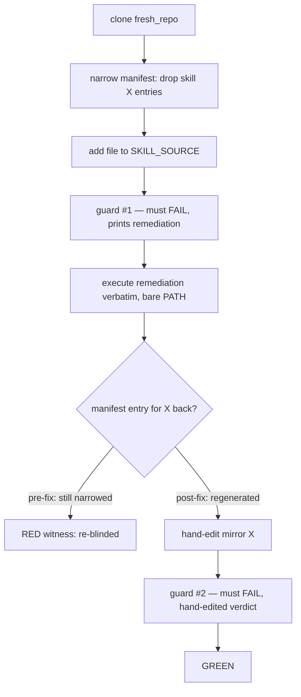

# Test-engineer plan — scaffold freshness guard blind-spot-proofing (AC1–AC4)

Task: `aib-scaffold-freshness-guard-blindspot-proof` · Base: main @ `19e28a7b` (v0.149.1) · Date: 2026-08-31
Role: test-engineer lane of the MoE plan. Companion docs: research record (`2026-08-31-scaffold-freshness-guard-research.md`), reviewer lane (`2026-08-31-scaffold-freshness-guard-moe-reviewer.md`).

## 0. Scope, provenance, and reading rules

This section designs the four tests (AC1–AC4) that make the scaffold freshness guard's blind
spots provocation-tested: witnessed RED against pre-fix code at `19e28a7b`, GREEN after the R2/R3
fix (guard derives its skill set independently of the manifest's own narrowing, and the printed
remediation stops carrying `--skills ''`). All line references are to the worktree at base
`19e28a7b`:

- `gates/scaffold_freshness_guard.py` (352 lines) — cited as *guard Lnnn*: `rescaffold_argv`
  L128–133 (carries `--skills ""`), `remediation` L135–137, `rescaffold` L142–155,
  `owning_entry` L217, `classify` L250, `collect` L275–301, `differences` L302,
  `check` L321 (PASS wording), `STAMP_KEYS` L57.
- `tests/test_scaffold_freshness_guard.py` (327 lines, 13 tests) — cited as *harness Lnnn*:
  `_git` L28, `_copy_working_tree` L33, `_freshen` L47 (drives scaffold with `--skills ""`,
  L56), `fresh_repo` fixture L66 (module-scoped), `mutable_repo` fixture L79 (copytree clone),
  `_run_gate` L86, `_tree_digest` L179, `_printed_remediation` L225, remediation-executes
  test L233, hermes-home mechanism test L260.
- `features/common/skills/welcome-ai-badger/scripts/scaffold.py` — cited as *scaffold Lnnn*:
  `--skills` default L774, split L806, empty→manifest recovery L808–816 (note "reused N skill(s)
  already scaffolded" L816), `--generated-at` flag L788, `run(generated_at=…)` L701/747.
- `tests/test_scaffold_empty_skills.py` (95 lines, 4 tests) — the legitimate `--skills ''`
  mode that must keep passing.

Reading rules: claims not verifiable from source or the research record are labelled
**hypothesis**. Every RED witness must be produced by running the pre-fix guard/scaffolder
inside `/tmp` scratch copies only (§6) — never against the worktree. This doc plans tests;
it does not implement them.

## 1. Per-AC test design (AC1–AC4)

### AC1 — re-scaffold determinism pinned

**Demand:** scaffold → snapshot manifest → scaffold again → byte-identical modulo
explicitly-normalized stamp fields. This is the foundation the tree-vs-tree comparison stands
on (guard `differences` L302) and the guardrail that the R2 union-form re-scaffold must not
introduce run-to-run churn.

**Placement:** new test in `tests/test_scaffold_freshness_guard.py`. The file's charter (its
module docstring, harness L1–13: "the self-scaffold must be reproducible") is literally AC1's
property, and the file already owns the fixtures and the `_tree_digest` byte-snapshot helper
(harness L179) the test needs.

**Fixture strategy:** two independent copies of the module-scoped `fresh_repo` — no new
scaffolds for the fixture itself (`fresh_repo` is scaffolded once per module, harness L47–64).
Clone A stays as committed by `_freshen` (the "first scaffold" snapshot). Clone B (a
`mutable_repo`-style copytree) gets a **second** scaffold run driven *directly against
scaffold.py*, not through `_freshen`, with a fully explicit env: `AI_BADGER_MCP_AVAILABILITY=all`
(mirror the stamp the fixture commits, harness L47–56), `HERMES_HOME` pointed at a scratch dir
inside `tmp_path` (the guard's own containment practice, guard L148–150 — belt-and-braces on a
host with hermes), and nothing else inherited. Explicit env is the F1 countermeasure: the file
failed ×4 only inside full-suite runs (research §1 F1), so the new test inherits no machine
state it does not name.

**Assertion set:**
1. Second scaffold exits 0.
2. `_tree_digest(clone_B)` vs `_tree_digest(clone_A)` differ only on files whose difference
   survives the guard's own normalization: compare via `load_script("gates/scaffold_freshness_guard.py")`
   + `normalized()` (guard L268–283: strips `STAMP_KEYS` from JSON, de-stamps the
   "Scaffolded by ai-badger <version>" markdown line) applied to both copies of every
   differing path. Assert the set of *normalized* differences is empty.
3. Name the stamp fields the test tolerated, so the exemption is explicit and closed:
   `frameworkVersion`, `frameworkCommit`, `frameworkDirty`, `generatedAt`, `configHash`
   (guard `STAMP_KEYS` L57) — plus the markdown stamp line. If the diff-set is non-empty,
   the failure message prints the path list so the first flake is diagnosable, not another
   ×4 mystery.
4. Optional determinism tightening: pass `--generated-at 2026-01-01T00:00:00Z` (scaffold L788)
   on the second run so `generatedAt` is pinned too, shrinking the tolerated diff to zero on
   JSON — then assert exactly that. **Hypothesis:** `--generated-at` threads through `run()`
   (L701, L747) to the manifest only; if it also stamps other surfaces the assertion list in
   (2) already tolerates them.

**RED witness protocol (honest):** AC1 is a *pin*, not a provocation — on identical reruns of
an unchanged tree the pre-fix scaffolder is expected to be deterministic (d-16 saw identical
reruns reuse 32/32; research §1 F2), so pre-fix GREEN is the likely outcome and is acceptable
for this AC. The pre-fix run is still executed and recorded: if it is RED, it is a witnessed
instance of the R1 under-production nondeterminism — paste `returncode`, the differing-path
list from assertion 3, and both scaffolds' stdout (the "reused N skill(s)" notes, scaffold
L816) into the task record. RED-first discipline is mandatory for AC2–AC4 only; AC1's job is
to fail the moment the fix makes scaffolding nondeterministic, and to be the control that
distinguishes "fix introduced churn" from "guard now sees real drift".

**GREEN condition:** both pre- and post-fix, assertions 1–4 hold. Post-fix it additionally
proves the union-form `rescaffold_argv` (R3) regenerates a byte-stable tree across consecutive
runs — i.e. AC3's remediation execution cannot green a tree by luck.

**Non-regression notes:** touches no fixture `_freshen` shares; runs two scaffolds (see §5).
No existing test reads the files it writes (both clones are per-test `tmp_path` children).
It does not change module state, so it cannot feed the F1 order-dependence.

### AC2 — manifest-narrowing blind spot (provocation, RED-first)

**Demand:** a hand-edit to a skill mirror whose manifest entries are gone must fail the guard,
naming the narrowing — today it prints `… only version stamps differ — PASS` (guard L321–324)
because `rescaffold_argv` recovers the manifest's own narrowed set (guard L128–133 →
scaffold L808–816).

**Placement:** new test in `tests/test_scaffold_freshness_guard.py` — it is exactly what
`mutable_repo` + `_run_gate` exist for (harness L79, L86), and its failure output format is
asserted the same way as the neighbouring provocation tests (harness L97–108).

**Fixture strategy:** `mutable_repo` as-is. The fixture itself stays trusted for this test
because the *test* performs the narrowing; `_freshen`'s `--skills ""` recovery operates on the
complete committed manifest (R4 probe: 32/32 skill entries at `19e28a7b`), so the fixture is
fresh by construction and blind-spot-free. Post-fix, `_freshen` needs **no change**: it drives
scaffold.py directly, not the guard, and recovery from a complete manifest yields the full set
whether or not the guard's argv changed — so the 13 existing tests do not break (§4).
Optional hardening, not required: `_freshen` could assert the scaffold's stdout note
"reused N skill(s)" (scaffold L816) has N equal to the manifest's skill-entry count, turning
the fixture itself into an AC0-style canary. **Hypothesis:** parsing that note couples the
fixture to wording that may change; leave to the implementation lane's judgement.

**Runnable recipe (the test body):**

> **SUPERSEDED by rev-2 (QA-F3, probes run):** this recipe cannot produce its claimed
> pre-fix PASS — the deterministic pick (first skills row) carries out-of-mirror adjustment
> rows (30/32 skills do), so the hand-narrowed manifest is not self-consistent and the guard
> FAILS pre-fix on `manifest.json content differs`; the two adjustment-free skills are
> stack-local and re-deliver regardless. Rebuilt recipe (plan Package 1/4): victim = pure
> scope-default skill (exclude config.include ∪ stack-local); strip **every** row whose
> target names the victim; pre-fix expectation = guard exit 0 PASS (the blindness);
> post-fix = D2 fail-fast naming mirror paths. The `"manifest" in stdout` discriminator is
> dropped (zero discriminating power — pre-fix finding lines contain `manifest.json` too).

1. `clone = mutable_repo` (fresh copytree of the self-scaffolded repo).
2. Pick the victim skill deterministically: read `.ai-badger/manifest.json`, take the first
   entry with `feature == "skills"` and a `/`-free name (the same predicate as
   `bl.scaffolded_skill_names`, badger_lib L868–880 per research §2); derive
   `mirror = f".ai-badger/skills/{name}"`. (No hardcoded skill name — the set churns.)
3. Hand-edit the mirror: append a line to `{mirror}/SKILL.md` — e.g. `\nEdited in place.\n`
   (same provocation shape as harness L123–127).
4. Narrow the manifest: rewrite `.ai-badger/manifest.json` dropping every entry whose
   `target` equals `mirror` or starts with `mirror + "/"` (the dir entry plus any per-file
   rows). Narrowed shape, schematically:

   ```json
   {"entries": [
     {"target": ".ai-badger/skills/welcome-ai-badger", "feature": "skills", …},   ← REMOVED
     {"target": ".ai-badger/skills/task", "feature": "skills", …},                 ← kept
     {"target": ".ai-badger/config.json", …}                                       ← kept
   ]}
   ```

   Leave everything else (config.json, sources) untouched — the only drift is the edited
   mirror plus its vanished manifest coverage.
5. `done = _run_gate(clone)`.

**Assertion set:**
- `done.returncode == 1` (and `!= 2`: a refusal would be a false green for this AC).
- `"PASS" not in done.stdout`.
- The mirror path appears in the findings: `f"{mirror}/SKILL.md" in done.stdout`.
- The narrowing is *named*, not just the path: assert a finding line for the mirror and that
  the output identifies the manifest-narrowing cause. Proposed message shape for R2:
  `SKILL MIRROR LOST FROM MANIFEST: {name} (re-scaffold recovered {N} of {M} skills)` —
  the test asserts on `mirror` presence plus `"manifest" in done.stdout` (case-insensitive
  scan of the finding block) rather than pinning exact wording, so implementation lanes keep
  message freedom. Over-pinning wording here would make the message unfixable later.

**RED witness protocol:** pre-fix, step 5 returns `0` with stdout ending
`N path(s) compared against a re-scaffold of this tree; only version stamps differ — PASS`
(guard L323–324) — the guard re-scaffolds its throwaway copy with `--skills ""` (guard
L128–133), recovers the narrowed set, never regenerates the edited mirror, and the
tree-vs-tree diff sees nothing. Paste into the task record: the exact `returncode`, the full
stdout (the PASS line), and the narrowed entry count vs original (e.g. `manifest entries:
212 → 209`), produced per §6 on a `/tmp` scratch copy at base `19e28a7b`.

**GREEN condition:** post-fix, the guard exits 1 on this tree. Mechanism (R2): the guard
derives the expected skill set independently of the manifest (config-driven union) and either
(a) fails fast naming the narrowing, or (b) re-scaffolds the union so the mirror regenerates
and `differences()` (guard L302) reports `content differs` on it. Either mechanism satisfies
the assertions above; the test deliberately does not force the choice.

**Non-regression notes:** uses only existing fixtures and helpers; one extra gate run (one
internal re-scaffold, §5). The `"manifest"` substring assertion is the only wording-sensitive
claim and is loose enough to survive message edits; if the fix routes detection through
`classify()` (guard L250) — the orphaned mirror's `owning_entry` (guard L217) returns `None`
→ `UNCLASSIFIED` — the path assertion still holds because the finding exists regardless of
verdict string.

### AC3 — remediation re-blinding trap (provocation, RED-first)

**Demand:** run guard → capture the printed remediation → execute it verbatim → hand-edit a
skill mirror → a second guard run must still fail. Pre-fix, the remediation (guard
`remediation()` L135–137 carries `--skills ''`) re-scaffolds via manifest recovery, so a tree
whose manifest was narrowed before the advice ran is left narrowed — the advice itself
re-blinds the tree, and any later hand-edit to a lost mirror is invisible.

**Placement:** new test in `tests/test_scaffold_freshness_guard.py`, reusing `_run_gate`
(harness L86) and `_printed_remediation` (harness L225) plus the bare-PATH execution pattern
of the existing remediation test (harness L241–246: `PATH=/usr/bin:/bin`,
`AI_BADGER_MCP_AVAILABILITY` popped, `python3 → sys.executable` substituted once). The victim
skill is picked with the same manifest-derived helper as AC2 (`feature == "skills"`, `/`-free
name → `mirror = .ai-badger/skills/{name}`); extract that helper once, share it.

**Fixture strategy:** `mutable_repo` as-is; same reasoning as AC2 — the test performs the
narrowing, the fixture stays complete. Three scaffold-equivalents run inside this test (guard
run ×2, remediation execution ×1); see §5.

**Sequence (the abbreviated form; the full why-this-order argument is §2):**
1. `clone = mutable_repo`.
2. Narrow the manifest: drop every entry for victim skill X's mirror (AC2 recipe steps 2, 4).
3. Provoke an *ordinary* failure so a remediation exists to capture: add
   `{SKILL_SOURCE}/scripts/added_after_scaffold.py` (harness L99–101 pattern). Guard#1 fails
   on the stale mirror — the narrowing alone would pre-fix PASS, producing no advice.
4. `failed = _run_gate(clone)`; assert `returncode == 1`.
5. `command = _printed_remediation(failed.stdout).replace("python3", sys.executable, 1)`;
   execute with `shell=True`, bare PATH env (harness L241–246); assert exit 0.
6. **Manifest-regeneration pin:** read `.ai-badger/manifest.json`; assert an entry with
   `target == mirror` (X's dir entry) is present again — the remediation must have restored
   the skill, not merely silenced the stale finding.
7. Hand-edit the mirror: append to `{mirror}/SKILL.md`; assert the file existed first
   (precondition — nothing may have deleted it).
8. `again = _run_gate(clone)`; assert `returncode == 1`, `f"{mirror}/SKILL.md" in again.stdout`,
   `"PASS" not in again.stdout`, and — the discriminating secondary observable —
   `"hand-edited" in again.stdout`.

**Why assertion 8's `"hand-edited"` matters (behaviour radius):** post-fix the manifest is
complete (assertion 6), so the edited mirror resolves through `owning_entry` (guard L217) →
`classify` (guard L250) → the ordinary HAND_EDITED verdict. If a future "fix" restored the
mirror path without regenerating the manifest entry, the verdict would be `UNCLASSIFIED` —
returncode and path assertions would still pass while the regeneration claim was false.
The verdict assertion closes that loophole.

**RED witness protocol:** pre-fix the test fails at assertion 6 first (the remediation's
`--skills ''` run recovers the narrowed set, scaffold L808–816, so X stays lost) and would
also fail at assertion 8 (guard#2 prints
`N path(s) compared … only version stamps differ — PASS`, returncode 0). Paste into the task
record: guard#1 stdout (with the printed remediation), the executed command string, the
remediation run's stdout showing `--skills was empty — reused {N} skill(s)` with N < full
(scaffold L816), and guard#2's returncode + PASS stdout. Produced per §6 on a `/tmp` scratch
copy at base `19e28a7b`.

**GREEN condition:** all eight assertions hold post-fix: the union-form remediation (R3)
restores X, regenerates the manifest completely, and the second guard catches the hand-edit
through the ordinary hand-edited path.

**Non-regression notes:** deliberately does NOT replace
`test_the_printed_remediation_produces_a_tree_the_gate_then_passes` (harness L233) — that
test pins an independent property (the advice executes to green on a minimal PATH); AC3
supersedes its *semantics* ("advice produces a passing tree" now means "and does not re-blind"
) but the executability pin keeps its own failure mode. Disposition in §4. Shares no state
with other tests (all mutation on its own `mutable_repo` clone); the bare-PATH env dict is
built fresh inside the test, never mutated at module level.

### AC4 — remediation message audit (no empty `--skills`)

**Demand:** the rendered remediation must never again advise `--skills` with an empty value
— the string that re-blinds any repaired tree. Audited at two tiers so the mechanism cannot
drift while the output happens to look right, and vice versa.

**Placement:** new tests in `tests/test_scaffold_freshness_guard.py` — one outcome-tier
(rendered stdout, uses `_run_gate` + `_printed_remediation`, harness L86/L225), one
mechanism-tier (calls `rescaffold_argv` / `remediation` directly through `load_script`,
the pattern of harness L260–262). Same file because both tiers consume this file's fixtures
and helpers.

**Fixture strategy:** outcome tier needs one failing guard run to produce a remediation —
provoke with the ordinary staleness trick (add a file under `SKILL_SOURCE`, harness L99–101
pattern); no narrowing needed here (AC2/AC3 own that provocation; AC4 audits the message on
any failure). Mechanism tier needs no scaffold at all.

**Assertion set:**
- *Mechanism tier:* load the guard via `load_script`; build `argv = guard.rescaffold_argv(
  sys.executable, guard.SCAFFOLD, guard.CONFIG, ".", ".")`; assert
  `guard.EMPTY_SKILLS_RE.search(" ".join(argv)) is None` (the regex is §3; if the fix
  implements the predicate as a module-level constant, assert against it — if not, the test
  carries its own compiled copy, which is the safer default since it audits the *contract*,
  not the implementation's self-assessment). Also assert on `guard.remediation()`'s rendered
  string the same way.
- *Outcome tier:* run the guard on the provoked clone; extract the joined remediation line;
  assert `EMPTY_SKILLS_RE.search(line) is None`.
- *Positive assertion (regenerates skills):* the audit must not be satisfiable by deleting
  `--skills` altogether in a way that stops regenerating skills. Two layers: (a) textual —
  every `--skills` occurrence in the remediation carries a non-empty value (§3's positive
  regex) — this permits the union form `--skills a,b,c` and, if R3 lands a flagless argv,
  is trivially true and the burden shifts to (b); (b) behavioural — AC3's assertion 6 (the
  manifest entry for the victim skill is present after executing the remediation) is the
  normative "remediation regenerates skills" proof, and AC3 references this AC rather than
  duplicating it. **Hypothesis:** if the implementation lane chooses a flagless argv
  (relying on `DEFAULT_SKILLS`, scaffold L774), the textual positive becomes vacuous — flag
  this in review and let AC3(b) carry the weight.

**RED witness protocol:** pre-fix both tiers fail: `rescaffold_argv` (guard L128–133) ends
with `"--skills", ""` → the joined argv contains `--skills ''` after shlex quoting in
`remediation()` (guard L135–137: `shlex.quote(arg)` of `""` is `''`); the rendered remediation
in guard stdout likewise ends `… --no-install --skills ''`. Paste into the task record: the
mechanism-tier match (`--skills ''` at offset N of the joined argv) and the outcome-tier
remediation line copied verbatim from guard stdout on a `/tmp` scratch copy at base
`19e28a7b` (§6).

**GREEN condition:** both tiers clean of the empty-value pattern; the positive layer holds
(textual non-empty values, or flagless with AC3(b) carrying the behavioural proof); and the
whole file still passes — the audit must not reject the union form the fix actually ships.

**Non-regression notes:** the outcome-tier test adds one guard run (one internal
re-scaffold, §5); the mechanism tier is free. It shares the provoked-clone pattern with the
existing remediation test but on its own `mutable_repo` clone — no shared state, no ordering
dependence (F1 countermeasure).

## 2. AC3 sequencing — why the test cannot pass by accident

The exact order of AC3's eight steps is load-bearing. Three properties must hold
simultaneously, and each pins one ordering decision:

1. **The narrowing precedes the remediation execution.** The trap under test is that the
   advice itself re-blinds: executed on a narrowed tree, the `--skills ''` run recovers the
   narrowed set (scaffold L808–816) and rewrites the manifest still narrowed. If the
   narrowing were applied *after* the remediation, guard#2's outcome would be attributable to
   the test's own hand-narrowing and would say nothing about the advice — the remediation
   could be anything at all. Pre-fix RED is only witnessed when the remediation inherited
   the narrowing.
2. **An ordinary staleness provocation creates guard#1's failure.** A merely narrowed tree
   pre-fix PASSES (that is AC2's blindness), so there would be no remediation to capture.
   The stale-source file (step 3) is the cheapest reliable failure and mirrors the fixture
   pattern the file already trusts (harness L99–101).

   > **SUPERSEDED by rev-2 (QA probe 3):** on this tree a hand-narrowed manifest pre-fix
   > FAILS (manifest content-differs finding), so guard#1 carries TWO findings (staleness +
   > manifest drift) and a remediation is capturable even without step 3. Step 3 stays (it
   > guarantees a mirror-path finding independent of the manifest shape); the rationale is
   > re-baselined accordingly.
3. **The hand-edit follows the remediation run.** Post-fix the union-form remediation
   *regenerates* every delivered mirror (delivered skills are always rmtree + copytree —
   research §2); an edit made before it would be clobbered, and guard#2 would then pass for
   the boring reason that there was nothing left to catch. The edit-after-remediation order
   is what forces guard#2's green path to depend on the regenerated manifest (assertion 6)
   and the ordinary hand-edited verdict (assertion 8).



**Why the test cannot pass by accident, stated as failure-mode counterfactuals:**

- *Fix skips the narrowing detection but keeps `--skills ''`:* assertion 6 fails (manifest
  still narrowed) — RED survives.
- *Fix regenerates skills but the argv stays empty-valued:* AC4 fails; AC3's assertion 8
  passes — which is exactly why AC4 exists as a separate textual gate.
- *Fix restores the mirror path without the manifest entry:* assertion 6 fails; even if it
  were relaxed, assertion 8's `"hand-edited"` verdict fails (entry-less mirrors classify as
  `UNCLASSIFIED`, guard L250–273) — the secondary observable catches the shortcut.
- *Test reordered (edit before remediation):* the edit is clobbered post-fix, guard#2 passes,
  the test goes RED post-fix — a false alarm that would misdiagnose the fix as broken. The
  order is asserted by the test's own GREEN status, and each step's comment in the test body
  must cite the property above it protects.

One residual ordering sensitivity: the narrowed-manifest rewrite (step 2) and the source-file
addition (step 3) commute — both precede guard#1 and neither is read by the other. The test
may perform them in either order; the plan fixes an order anyway (narrow first) so the diff
history of the test stays stable and review comparisons stay trivial.

## 3. AC4 predicate — exact regex, scan scope, positive assertion

**Negative predicate** — “`--skills` followed by an empty value”, covering the three
quote-shapes the remediation can realistically render (`--skills ''` from `shlex.quote("")`,
guard L136; `--skills ""` from any double-quote formatter; `--skills=` from an `=`-joined
argv renderer, with and without inner quotes):

```python
EMPTY_SKILLS_RE = re.compile(r"--skills(?:=|\s+)(?:\"\"|''|$)")
```

Match table (each row must match — the AC4 tests assert `search(...) is not None` on these
strings during development, then invert for the audit):

| Input string | Matches | Shape |
|---|---|---|
| `--skills '' --no-install` | yes | quoted-empty, space form, followed by more argv |
| `… --no-install --skills ''` | yes | quoted-empty at end of line |
| `--skills ""` | yes | double-quoted empty |
| `--skills=` | yes | bare `=` with nothing after (end of string) |
| `--skills='' --no-install` | yes | `=`-joined, single-quoted empty |
| `--skills=""` | yes | `=`-joined, double-quoted empty |

Non-match table (must NOT match — guards against a predicate so greedy it rejects the union
form and against false positives elsewhere in the output):

| Input string | Non-match reason |
|---|---|
| `--skills welcome-ai-badger,task --no-install` | non-empty space-form value |
| `--skills=welcome-ai-badger,task` | non-empty `=`-form value |
| `--no-install --root .` | no `--skills` at all |
| `--skills, --skills-file x` | **hypothesis:** `-` boundary not covered; if the scaffolder ever grows `--skills-file`, tighten to `--skills(?==|\s+)`. Not a live flag at `19e28a7b` (scaffold L788 area: only `--skills`, `--generated-at`, `--no-install` are skill-adjacent). |

Known limitation, accepted: exotic quoting such as `--skills ' '\` (a whitespace-only quoted
value) or a value split across a wrapped line is not matched. The wrapping case is neutralized
by scan scope: the audit runs on the *joined* remediation line (see below), which re-joins
what `_printed_remediation` split (harness L225–231). The whitespace-value case is theoretical;
the fix under test does not produce it.

**Scan scope:** both tiers scan line-by-line over the string they hold:

- *Outcome tier:* first the joined remediation line returned by `_printed_remediation`
  (primary — wrapping-proof), then the raw guard stdout as a defence-in-depth sweep so a
  future reformat of `check()`'s output (guard L321–331) cannot dodge the audit by moving the
  command out of the `Re-scaffold this repo` block.
- *Mechanism tier:* the space-joined `rescaffold_argv` list and the full `remediation()`
  return value.

**Positive assertion** — the remediation regenerates skills, not merely avoids the trap:

```python
# textual layer: every --skills occurrence carries a non-empty value
NONEMPTY_SKILLS_RE = re.compile(r"--skills(?:=|\s+)(?!\"\"|''|$)[^\s\"']+")
#   combined audit: matched_at_least_one_nonempty OR no --skills at all
```

Accepted-true disjunction: `NONEMPTY_SKILLS_RE.search(line)` succeeds, **or** `--skills` is
absent from the remediation entirely (a flagless argv relying on `DEFAULT_SKILLS`, scaffold
L774, is a legitimate R3 shape). The behavioural layer is not textual at all: AC3's
manifest-regeneration pin (§1 AC3 assertion 6) is the normative proof that the advice
actually restores skills — AC4 references it and must not duplicate it.

## 4. Non-regression inventory

Disposition of every existing test that the new work could plausibly touch. Baseline: 13
tests in `tests/test_scaffold_freshness_guard.py`, 4 in `tests/test_scaffold_empty_skills.py`.

**Must not change, and why they are safe:**

- `test_scaffold_empty_skills.py` — all 4 (L22, L40, L60, L76). They pin the legitimate
  `--skills ''` mode at the *scaffold CLI* level, recovery semantics included (#129). The fix
  is guard-side (`rescaffold_argv`/`remediation`/narrowing detection); scaffold.py's recovery
  path is out of scope, so these pass by construction. They are the canary that the fix did
  not "solve" AC4 by breaking the CLI contract.
- Harness L91 (`test_a_fresh_tree_passes`), L135 (`test_version_stamp_churn_alone_is_exempt`),
  L147/L160 (refusals), L169 (no-mutation), L206 (hermes-home outcome), L287/L309
  (`tracked_and_untracked` units). Outcome- or unit-scoped; a change to the guard's argv
  composition is invisible to them. One check owed post-fix: the fresh fixture still PASSes
  under the union form — it will, because union(manifest-complete, config-derived) regenerates
  exactly the committed tree (AC1 pins this byte-level).
- L97/L110/L123 (staleness/hand-edit classifications): verdicts unchanged by R2/R3; if R2
  adds findings, they appear only on narrowed manifests, which these tests never produce.

**Deliberately reworked or rippled — the two named tests:**

- `test_the_printed_remediation_produces_a_tree_the_gate_then_passes` (harness L233): AC3
  supersedes its *semantics* — "the advice produces a tree the gate then passes" is no longer
  sufficient; the advice must also not re-blind. Disposition: **keep, do not replace.** Its
  independent property — the advice executes to exit-0 on a minimal PATH
  (`PATH=/usr/bin:/bin`, harness L241–246) — has its own failure mode (the original bug it
  pins: env-assignment omission) that AC3's richer sequence does not isolate. Rework is
  additive only: extend the docstring to note AC3 carries the re-blinding dimension. Verify
  post-fix that the union-form command still executes green under bare PATH — **hypothesis:**
  a long union skill list changes nothing about PATH probing, so it holds.
- `test_the_rescaffold_points_hermes_home_away_from_the_operators` (harness L260): monkeypatches
  `guard.subprocess.run` with a `_record(argv, **kwargs)` and asserts on `kwargs["env"]`
  (L268–277). Argv changes (dropping `--skills ""`, adding a union list) ripple only through
  the ignored `argv` parameter — safe as written. The ripple to watch: if the fix changes
  `rescaffold()`'s *call shape* (e.g. passes skills as kwargs, or pre-builds env elsewhere),
  the stub's signature must still match. Constraint for the implementation lane, to be
  checked at review: keep `subprocess.run(argv, **kwargs)` with `env` in kwargs, or update
  this test in the same change — never leave the stub silently not called, which would pass
  vacuously. **Hypothesis:** the fix does not touch `rescaffold()`'s env assembly (guard
  L142–150), so no change is needed.

**AC1's flake avoidance (F1 context — this file failed ×4 inside full-suite runs, 13/13 in
isolation; research §1 F1):** the root cause is unidentified, so the new tests minimize every
known order/environment vector:

1. All mutations on per-test `tmp_path` clones (`mutable_repo`); `fresh_repo` stays read-only
   (its fixture contract, harness L66–68).
2. Fully explicit env dicts for every subprocess the new tests spawn —
   `AI_BADGER_MCP_AVAILABILITY` set or popped deliberately (never inherited), `HERMES_HOME`
   to scratch on any direct scaffold invocation, `HOME`/`USERPROFILE` only where the existing
   hermes test sets them (harness L217).
3. No module-level mutable state, no caches keyed on cwd, no `os.chdir`.
4. AC1's second-scaffold comparison is pure-function post-processing (`_tree_digest` +
   `normalized()`) — no shared files, no cross-test reads.
5. The new tests add full-suite scaffold work but no new *shared* scaffold: everything
   reuses the module-scoped fixture, so suite-order exposure is not increased.

If AC1 or any new test reproduces the ×4 flake pattern, that is an F1 lead, not noise:
capture the env diff (`os.environ` snapshot at test start) in the failure message.

## 5. Suite budget

Cost model: a scaffold run costs seconds (research §6); a `_run_gate` call is one internal
re-scaffold inside a throwaway copy (guard L275–299), i.e. one scaffold-equivalent; a
`mutable_repo` clone is a `copytree` of the already-scaffolded fixture (harness L79–83) —
cheap, no scaffold. The module-scoped `fresh_repo` (harness L66) scaffolds exactly once for
the whole file and is reused by every test.

**Current baseline (13 tests):** 1 fixture scaffold + ~10 gate runs (≈10 internal
re-scaffolds) + 1 remediation execution ≈ **12 scaffold-equivalents**.

**Added by this plan:**

| Test | Fresh scaffolds | Reuses module fixture | Scaffold-equivalents |
|---|---|---|---|
| AC1 determinism | 1 (second run on clone B) | yes (clone A = committed fixture state) | 1 |
| AC2 narrowing provocation | 0 | yes | 1 (guard's internal re-scaffold) |
| AC3 trap | 0 | yes | 3 (guard#1, remediation execution, guard#2) |
| AC4 mechanism tier | 0 | n/a (pure function calls) | 0 |
| AC4 outcome tier | 0 | yes | 1 (guard's internal re-scaffold) |
| **Total added** | **1** | — | **≈6** |

**Estimate:** at seconds per scaffold, the file's wall time grows by roughly a third to a
half — order of **+10–25 s** in isolation, **+15–40 s** under full-suite load
(**hypothesis:** exact numbers to be measured on the first RED run; the research record's
only hard datapoint is that the whole 4700-test suite ran in minutes, so this is noise-level
for CI). The single fresh scaffold (AC1's second run) is irreducible — determinism needs a
real second run, a cached fake would test nothing. AC2/AC3/AC4 add no fixture scaffolds
because the narrowing/hand-edit provocations are file edits on clones, and each guard run's
internal re-scaffold is already the unit the existing tests pay ~10 times.

Reuse rule going forward: any further provocation in this file must clone `fresh_repo` and
edit files, never re-scaffold the fixture; if a future test needs a scaffolded *variant*
(different config), it scaffolds its own throwaway target at tmp_path level
(`test_scaffold_empty_skills.py` pattern, L25–28) rather than forking the module fixture.

## 6. RED-witness runbook (scratch-copy protocol)

Constraint: the guard and scaffolder may only run inside `/tmp` scratch copies of the
worktree — never against the worktree itself (a scaffold run mutates `.ai-badger/`), and no
git state changes. Protocol for producing the four RED artifacts before implementation:

1. `rsync -a --exclude .git <worktree>/ /tmp/aib-red-base/` — a scratch copy at base
   `19e28a7b` (equivalent to `_copy_working_tree`'s contract, harness L33–45, minus git).

   > **SUPERSEDED by rev-2 (QA-F1, probe 1):** this command produces guard refusals —
   > `tracked_and_untracked` requires a git repo and the runbook stripped `.git`. Setup must
   > be fixture-style: copy the tree, `git init` + user config + `add -A` + commit
   > (harness L66–72 shape), then run the provocations.
2. Run each provocation there, out of pytest, mirroring what the test will do:
   - **AC2:** hand-edit the picked mirror's `SKILL.md`, strip its manifest entries (jq or a
     5-line python), run `AI_BADGER_MCP_AVAILABILITY=all python3 gates/scaffold_freshness_guard.py
     --root /tmp/aib-red-base`; record exit code + stdout (expected: PASS line).
   - **AC3:** continue on a fresh scratch copy: narrow manifest → add source file → guard run
     (capture remediation) → execute remediation verbatim → capture its
     `--skills was empty — reused N` note → hand-edit mirror → second guard run (expected:
     PASS, exit 0).
   - **AC4:** from AC3's captured remediation line (or a bare provoked run), paste the line
     and note the `--skills ''` match.
   - **AC1:** run the scaffolder twice on one scratch copy with explicit env; diff trees with
     the stamp normalization; expected pre-fix: identical (control), but capture anyway.
3. Paste each artifact (command, exit code, verbatim stdout) into the task record under the
   AC's heading. RED is *witnessed* only when the artifact shows the pre-fix behavior the
   test asserts against (guard L321–331 output shapes).
4. Re-run the same commands on the post-fix scratch copy for the GREEN side; both sides go
   into the task record so the diff is auditable without rerunning anything.

The pytest versions of these tests are then written against the same recipes; the runbook
exists so a RED witness survives even if a test itself is miswritten — the record shows the
behavior, not just the assertion failure.

## 7. Hypotheses and open questions

All labelled per the reading rules (§0); none block the test design, each names what to
check when the lane runs:

1. **`--generated-at` coverage** (AC1 assertion 4): hypothesis that it stamps only the
   manifest's `generatedAt` (scaffold L701/L747/L788). If it touches more surfaces, the
   assertion list shrinks accordingly — the design already tolerates stamp-only diffs.
2. **`_freshen` canary** (AC2): parsing the "reused N skill(s)" note (scaffold L816) couples
   the fixture to wording — optional, lane's judgement.
3. **Flagless R3 shape** (AC4): if the union form omits `--skills`, the textual positive
   goes vacuous and AC3's manifest pin carries the behavioural proof — flagged for review,
   not a defect.
4. **`rescaffold()` env assembly untouched** (§4): hypothesis that R2/R3 leave guard
   L142–150 alone, so the hermes-home mechanism test needs no edit; verify the
   `subprocess.run(argv, **kwargs)` call shape at review.
5. **Bare-PATH union form** (§4): hypothesis that a long explicit `--skills a,b,c` value
   changes nothing about the minimal-PATH execution the kept remediation test pins. Worth
   one deliberate look — an over-long command line is the only physical risk.
6. **F1 root cause** remains open (research §4 lead 4); the new tests' explicit-env
   discipline is prophylactic, not a diagnosis. If the ×4 flake recurs, the env-snapshot
   failure messages (§4) are the instrument.
7. **Victim-skill pick** (AC2/AC3): the manifest-derived first-skills-entry helper assumes
   at least one `feature == "skills"` entry with a `/`-free name exists in the fixture —
   true at `19e28a7b` (32 entries, R4 probe). If the fixture ever scaffolds zero skills the
   helper must fail loudly, not return `None`; the test asserts the mirror file exists as a
   precondition (AC3 step 7) which covers this.
