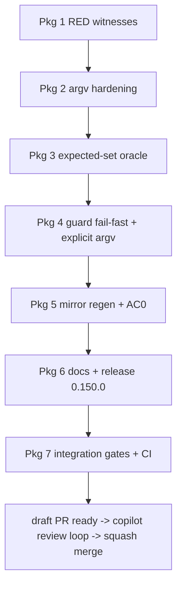

# Master plan — scaffold freshness guard must be blind-spot-proof

Task: `aib-scaffold-freshness-guard-blindspot-proof` · Base: main @ `19e28a7b` (v0.149.1) · Rev 1 · 2026-08-31
Effort: HIGH · MoE plan lanes: architect (d-23, transcribed), test-engineer (d-32), code-reviewer (d-27)

**Lane docs (read for depth; where they disagree, this plan wins):**
- `docs/work/2026-08-31-scaffold-freshness-guard-research.md` — evidence bundle
- `docs/work/2026-08-31-scaffold-freshness-guard-moe-architect.md` — R1 root cause + R2 design
- `docs/work/2026-08-31-scaffold-freshness-guard-moe-test-engineer.md` — AC1–AC4 test design
- `docs/work/2026-08-31-scaffold-freshness-guard-moe-reviewer.md` — R3/R4/R5 + release

## 0. The questions, answered up front

1. **Why does the scaffolder under-produce nondeterministically? (R1)** It doesn't — it
   under-produces **deterministically per argv transport**. `--skills` receiving the literal
   two-character `''` (any non-shell transport of the printed advice) bypasses #129 recovery,
   its "name" is silently skipped, and the run delivers only config-include + stack-local
   skills (11 here), exit 0. d-16's "nondeterminism" = different transports × different trees.
   A narrowed manifest also shipped in-repo: `ea17ae60` (0.140.0) carries 11 skill rows
   (verified). → D3.
2. **Why does the guard pass a stale tree?** Its re-scaffold passes `--skills ""`
   (guard L128–133) = recover the skill list from the manifest being audited; lost mirrors are
   never regenerated; the tree-vs-tree diff sees nothing. The 0.147.0 changelog documented the
   same blindness independently. → D1/D2.
3. **What is the honest remediation?** An explicit config-derived expected set — never
   `--skills ''`, never a bare omission (the front-door trap: empty `DEFAULT_SKILLS` walk
   collapses into silent recovery). → D1, D4.
4. **Is the 42-path loss still present at 0.149.1? (R4)** No — 32/32 skill entries, 212
   total. AC0 is a confirmation protocol, not a repair. → D9.
5. **Does `gates/` ship to consumers?** No — `copy_engine_and_schemas` copies only
   `schemas/` + `engine/` (scaffold.py L569–574). The spec's "shipped surface" premise is
   imprecise, but the version bump stands on RELEASING.md's own rule: the guard's output
   contract changes → 0.150.0 (reviewer §5.1). → D8.

## 1. Verified facts (all source-read in this worktree @ `19e28a7b`)

| # | Fact | Source |
|---|---|---|
| F1 | `rescaffold_argv` returns `--skills ""`; `remediation()` prints it; `rescaffold()` runs it | guard L128–137, L139–155 |
| F2 | `--skills ''` true-empty ⇒ recovery from target manifest (#129); literal `''` ⇒ garbage skill name, silently skipped | scaffold.py L774, L806–821; skill_delivery.py L276–280 |
| F3 | Delivered skills are always rmtree+copytree (no fingerprint-reuse in delivery) | skill_delivery.py L230–253 |
| F4 | A narrowed run leaves lost mirrors on disk; nothing deletes them | superseded_prune.py L24; probe c1 |
| F5 | `ea17ae60` committed an 11-skill-row manifest (include ∪ stack-local shape) | git show, re-verified by orchestrator |
| F6 | Live manifest healthy: 32/32 skills, 212 entries | research §3 |
| F7 | Derived expected set == manifest's 32 rows on the healthy tree | architect probe |
| F8 | Guard tests: 13, module-scoped `fresh_repo` fixture, `_freshen` uses `--skills ""` | tests/test_scaffold_freshness_guard.py L33–86 |
| F9 | `gates/` not shipped to consumers | scaffold.py L569–574 |
| F10 | Guard runs in pre-commit (.pre-commit-config.yaml:48) + consumer-journey imports it | reviewer §2 item 5 |

Hypotheses (labelled, non-blocking): the exact caller behind `ea17ae60`; F1's in-suite
(test-order) flake trigger; suite-cost estimate +10–25 s.

## 2. Decisions (D1–D9, each with provenance)

| D# | Decision | Provenance |
|---|---|---|
| D1 | **R3 form: explicit config-derived expected set.** `rescaffold_argv` returns `--skills <sorted expected>`; the set comes from a new shared helper `expected_skill_names(root, config)` in `engine/badger_lib.py` (scope-default ∪ alias-mapped include-expansion ∪ stack-local − exclusions); `Scaffolder.__init__` is refactored to call the same helper — one oracle, guard and scaffolder cannot drift. Union-with-manifest rejected (half-trusts the suspect artifact; keeps re-delivering declined skills). Bare omission rejected (front-door trap). | reviewer §1.2–1.3 (decisive), architect §3.3/§3.5 concurs |
| D2 | **R2 detection: fail-fast narrowing check** in guard `collect()` — `set(scaffolded_skill_names(manifest)) ⊊ set(expected)` ⇒ exit 1 **before the re-scaffold**, message names the narrowing + lists missing skills + counts. One-directional: superset manifests are legitimate (catalog-dropped skills surface later as "no longer writes it" findings — intended). | architect §3.2; test-engineer AC2 accepts fail-fast |
| D3 | **R1 fix: argv validation** in scaffold.py `main()` between split (L806) and recovery (L808): quoting-artifact names (quote chars, backslashes, untrimmed) refused unconditionally; names unknown to catalog-AND-manifest refused (typo/garbage; alias hint); manifest-known names allowed (catalog-drop flow preserved). `--skills ""`/`","` recovery unchanged; exit 2 with named message. Resolves the hardening×expected-set conflict: expected-set names are catalog-known by construction. | architect §2.6 |
| D4 | **Guard refuses (exit 2) if the derived expected set is empty** — broken derivation is never a licence to fall back to recovery. | reviewer §1.2 |
| D5 | **Fixture `_freshen` stays unchanged** (lanes disagreed: reviewer "change", test-engineer "keep"). Ruling: keep — it drives scaffold.py, not the guard, and the live manifest is healthy; post-fix, any fixture-enriched narrowing makes `test_a_fresh_tree_passes` fail loudly via D2's fail-fast, which **is** the canary. Revisit only if AC0 surprises. | test-engineer §1-AC2 + §4; reviewer §2 item 3 overruled with reason |
| D6 | **AC1 is two pins:** (a) consecutive-run idempotence (test-engineer's clone-B second scaffold, `normalized()`-compared, stamp set named); (b) **transport-invariance**: `["--skills", "''"]` list-form and shell `--skills ''` produce the same outcome (both recover 32, or both refuse) — the real invariant "quoting transport cannot change the managed set". (b) lives with the D3 CLI-contract tests. | architect §2.6 + test-engineer §1-AC1 |
| D7 | **R5 placement: guard failure output gains one rationale clause** (skill list is explicit so a narrowed manifest cannot narrow the repair); **welcome-ai-badger SKILL.md Gotchas** (source of truth `features/common/skills/welcome-ai-badger/SKILL.md` L123 area) gains the two-sentence gotcha (never `--skills ''` for remediation; regenerated mirrors ride in the same commit as their source edit); README rejected. | reviewer §4 |
| D8 | **Release: 0.150.0**, changelog `docs/changelog/0.150.0-remediation-cannot-be-narrowed.md` with upgrade notes (scripted `--skills ''` advice keeps running but stays blind; intended new "no longer writes it" findings; the two gotchas). Bump surface: VERSION, plugin.json, marketplace.json, index.json (via version_sync + index_build), changelog index (changelog_index.py), then self-scaffold re-stamps. | reviewer §5 |
| D9 | **AC0 = reviewer §3.1 protocol verbatim** on a `/tmp` scratch archive of the fix branch: double scaffold with fixed `--generated-at`, run-2 `git status` empty, no `reused` note, no skip notes, 32/32 & 212 counts ×2, guard PASS. | reviewer §3 |

## 3. Work packages

Parallelism verdict: Packages 2–4 all touch `scaffold.py` (validation block / `__init__`
refactor / mirror regen) and every source edit triggers a same-commit mirror+manifest
regen — shared-file sections **serialise**; parallel lanes would fight over one manifest.
Designed as ONE implementation lane (Packages 1–5), then docs+release, then integration.
Two dispatch levels max; the implementation lane takes no sub-agents.

### Package 1 — RED witnesses (scratch copies, no product code)

On `/tmp` scratch copies at base, per the test-engineer's runbook (§6): capture AC2
(hand-edit + narrowed manifest → guard PASSes, paste stdout), AC3 (trap sequence →
re-blinding, paste remediation + `reused N` note + guard#2 PASS), AC4 (the `--skills ''`
match in the rendered remediation), AC1 control (double scaffold → identical, recorded).
**ACs:** all four artifacts pasted into the task record with command + exit code + verbatim
stdout. **Gate:** orchestrator eyeballs each against the expected pre-fix shape.

### Package 2 — Scaffolder argv hardening (R1, D3)

Validation block in `main()`; CLI-contract tests (new file or `test_scaffold_empty_skills.py`
neighbor — implementation lane's choice, that file must stay green): artifacts refused
(`"''"`, `"\""`, untrimmed) exit 2 with named message; unknown-name refused with alias hint;
manifest-known-but-catalog-dropped name allowed; `""`/`","` recovery unchanged;
**transport-invariance pin (D6b)**. **ACs:** new tests green; `test_scaffold_empty_skills.py`
green; full suite green. **Gate:** pytest on the file + suite; RED evidence: the D6b test
against pre-fix code (paste).

### Package 3 — Expected-set oracle (D1 foundation)

`expected_skill_names(root, config)` in badger_lib.py; `Scaffolder.__init__` refactored to
call it (behavior-neutral). **ACs:** helper test asserts derived set == manifest's 32 rows on
a self-scaffold fixture (and the composition rules: include-expansion, alias mapping,
stack-local, exclusions); full suite green (behavior-neutrality is THE risk — reviewer §2
item 9). **Gate:** full pytest.

### Package 4 — Guard: fail-fast + explicit argv (R2/R3, D1/D2/D4)

`collect()` fail-fast (named narrowing message); `rescaffold_argv(python, scaffold, config,
target, root, expected)` — keep the builder's signature **explicit** (expected passed in, not
globally read) so the AC4 mechanism-tier test can call it directly; `remediation()` renders
the same argv; empty-set Refusal (D4); docstrings rewritten (the false "makes a stale tree
fresh" claim); guard tests: AC2, AC3 (8-step sequence, `hand-edited` verdict pin), AC4 (two
tiers + regex per test-engineer §3), AC1a (idempotence). Existing remediation test kept
(additive docstring note). **ACs:** AC2/AC3/AC4 RED→GREEN transitions witnessed (RED side =
Package 1 artifacts; re-run the same scratch recipe post-fix for GREEN); guard file green;
`test_the_rescaffold_points_hermes_home_away_from_the_operators` untouched-green (call-shape
constraint). **Gate:** pytest file + full suite.

### Package 5 — Mirror regen + AC0 confirmation (R4, D9)

Self-scaffold the worktree (P2–P4 source edits ⇒ mirrors + manifest regenerate;
**same-commit rule**), commit; run D9's protocol on a fresh scratch archive of the branch.
**ACs:** run-2 status empty; no `reused`/skip notes; counts 32/32 × 212 ×2; guard PASS.
**Gate:** AC0 protocol output pasted in the task record. If narrowing reproduces: reviewer
§3.3 contingency (lane untrusted, escalate R1) — stop and report.

### Package 6 — Docs + release (R5, D7/D8)

SKILL.md gotcha; guard rationale clause lands in Package 4's diff; VERSION → 0.150.0;
changelog entry + index regen; version_sync + index_build; final self-scaffold re-stamp
(picks up SKILL.md source edit + version stamps); commit mirrors+stamps same-commit.
**ACs:** RELEASING.md steps 1–6 checks pass (`version_sync --check`, `changelog_index
--check`, `release_guard`). **Gate:** those three commands green.

### Package 7 — Integration package (cross-package)

Full gates on the combined tree: full pytest, pylint 10.00 (`git ls-files '*.py' | grep -v
'^tests/'`), `tooling/index_build.py --check`, `verify.sh pre-push` lanes; push; **CI green =
pass condition**. Join checks: guard+scaffolder+manifest+tests consistent on ONE tree (the
AC0 protocol already proves the tree; the suite proves the units). Time-boxed F1 probe
(architect §2.5.1 instrumentation) may run here — stop condition: 2 hours or 2 negative
bisect runs, then document as open with the instrumentation left in the test failure
messages. **AC:** plan-AC = every package's ACs checked + met; CI green.

## 4. Risks

| Risk | Mitigation |
|---|---|
| Helper extraction not behavior-neutral (blast radius: every consumer) | full suite is the gate; Package 3 isolated; reviewer §2 item 9 |
| Post-fix guard fails on the live tree at landing (hidden narrowing) | Package 5 runs AC0 **before** release; research §3 says healthy |
| Operators' scripted remediation silently degraded | changelog upgrade note + guard-output clause (D7/D8) |
| New tests join the F1 flake class | explicit-env discipline per test-engineer §4; env-snapshot failure messages |
| Mirror/manifest drift during the packages | same-commit rule enforced at every regen (Packages 5, 6) |

## 5. Out of scope (spec)

Consumer-repo scaffolding (fixed by den-refresh after landing); concurrent-session user-scope
install drift; renaming/relocating the guard; release-lane version policy. `ea17ae60` caller
archaeology is documented as hypothesis, not chased.

## 6. Flow

## 7. Open questions for G0 (owner approval)

1. **D5 ruling** (fixture `_freshen` unchanged) — accept the test-engineer disposition over
   the reviewer's?
2. **Exit code 2** for the argv-contract refusal (vs reusing 1) — any constraint from your
   scripting?
3. **F1 time-box** (2h in Package 7) — worth it, or file-and-move-on?
