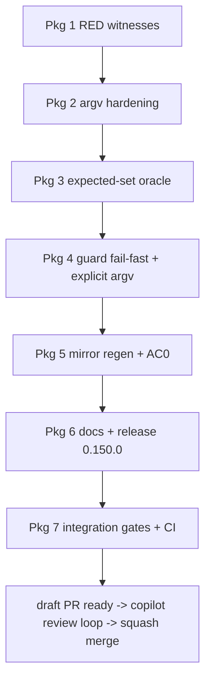

# Master plan — scaffold freshness guard must be blind-spot-proof

Task: `aib-scaffold-freshness-guard-blindspot-proof` · Base: main @ `19e28a7b` (v0.149.1) · **Rev 2** · 2026-08-31
Effort: HIGH · MoE plan lanes: architect (d-23, transcribed), test-engineer (d-32), code-reviewer (d-27)
Plan review: api-engineer (d-34, APPROVE-WITH-CHANGES), qa (d-35, REQUEST-CHANGES — probes run) — all findings folded, mapping in §8.

> **Rev-2 changes from rev 1:** D1 order contract + refactor shape (API-F1/F2/F5), D2 exit mechanism + message pinning (API-F4/F9, QA-F6/F7), D3 manifest-read correction (API-F3), D5 canary taken (API-F12, QA-F10), D6b restated per-transport (QA-F4), D8 changelog scope (API-F6/F10), AC2 recipe rebuilt (QA-F3), AC1 digest scoped (QA-F5), runbook scratch fixed (QA-F1), Package 7 two-green-runs (QA-F2), clause position pinned (QA-F8).

**Lane docs (read for depth; where they disagree, this plan wins):**
- `docs/work/2026-08-31-scaffold-freshness-guard-research.md` — evidence bundle
- `docs/work/2026-08-31-scaffold-freshness-guard-moe-architect.md` — R1 root cause + R2 design
- `docs/work/2026-08-31-scaffold-freshness-guard-moe-test-engineer.md` — AC1–AC4 test design
- `docs/work/2026-08-31-scaffold-freshness-guard-moe-reviewer.md` — R3/R4/R5 + release

## 0. The questions, answered up front

1. **Why does the scaffolder under-produce nondeterministically? (R1)** It doesn't — it
   under-produces **deterministically per argv transport**. `--skills` receiving the literal
   two-character `''` (any non-shell transport of the printed advice) bypasses #129 recovery,
   its "name" is silently skipped, and the run delivers only config-include + stack-local
   skills (11 here), exit 0. d-16's "nondeterminism" = different transports × different trees.
   A narrowed manifest also shipped in-repo: `ea17ae60` (0.140.0) carries 11 skill rows
   (verified). → D3.
2. **Why does the guard pass a stale tree?** Its re-scaffold passes `--skills ""`
   (guard L128–133) = recover the skill list from the manifest being audited; lost mirrors are
   never regenerated; the tree-vs-tree diff sees nothing. The 0.147.0 changelog documented the
   same blindness independently. → D1/D2.
3. **What is the honest remediation?** An explicit config-derived expected set — never
   `--skills ''`, never a bare omission (the front-door trap: empty `DEFAULT_SKILLS` walk
   collapses into silent recovery). → D1, D4.
4. **Is the 42-path loss still present at 0.149.1? (R4)** No — 32/32 skill entries, 212
   total. AC0 is a confirmation protocol, not a repair. → D9.
5. **Does `gates/` ship to consumers?** No — `copy_engine_and_schemas` copies only
   `schemas/` + `engine/` (scaffold.py L569–574). The spec's "shipped surface" premise is
   imprecise, but the version bump stands on RELEASING.md's own rule: the guard's output
   contract changes → 0.150.0 (reviewer §5.1). → D8.

## 1. Verified facts (all source-read in this worktree @ `19e28a7b`)

| # | Fact | Source |
|---|---|---|
| F1 | `rescaffold_argv` returns `--skills ""`; `remediation()` prints it; `rescaffold()` runs it | guard L128–137, L139–155 |
| F2 | `--skills ''` true-empty ⇒ recovery from target manifest (#129); literal `''` ⇒ garbage skill name, silently skipped | scaffold.py L774, L806–821; skill_delivery.py L276–280 |
| F3 | Delivered skills are always rmtree+copytree (no fingerprint-reuse in delivery) | skill_delivery.py L230–253 |
| F4 | A narrowed run leaves lost mirrors on disk; nothing deletes them | superseded_prune.py L24; probe c1 |
| F5 | `ea17ae60` committed an 11-skill-row manifest (include ∪ stack-local shape) | git show, re-verified by orchestrator |
| F6 | Live manifest healthy: 32/32 skills, 212 entries | research §3 |
| F7 | Derived expected set == manifest's 32 rows on the healthy tree | architect probe |
| F8 | Guard tests: 13, module-scoped `fresh_repo` fixture, `_freshen` uses `--skills ""` | tests/test_scaffold_freshness_guard.py L33–86 |
| F9 | `gates/` not shipped to consumers | scaffold.py L569–574 |
| F10 | Guard runs in pre-commit (.pre-commit-config.yaml:48) + consumer-journey imports it | reviewer §2 item 5 |

Hypotheses (labelled, non-blocking): the exact caller behind `ea17ae60`; F1's in-suite
(test-order) flake trigger; suite-cost estimate +10–25 s.

## 2. Decisions (D1–D9, each with provenance)

| D# | Decision | Provenance |
|---|---|---|
| D1 | **R3 form: explicit config-derived expected set.** `rescaffold_argv` returns `--skills <expected>`; the set comes from a new shared helper `expected_skill_names(root, config)` in `engine/badger_lib.py`. **Composition (pin all inputs):** `sorted(default_skills_in(common))` block, then include-derived block — expand_skill_groups FIRST, then gateway-alias mapping, then sort, then ∩ addable (expand-before-alias order is load-bearing, scaffold.py L268) — then stack-local per `resolve_stacks(config)` order (config-overridable `commonStacks`; the skip-set is the constant `DEFAULT_COMMON_STACKS`, badger_lib L955/L958–968) — minus the **alias-mapped** exclusions (`exclusions(config, aliases)`, badger_lib L98–101) at every stage. **Order contract (API-F1, empirically verified): the helper returns `Scaffolder`'s delivery BLOCK order — NOT flat-sorted.** The flat-sorted form changes manifest row order, which `normalized()` preserves (guard L182–203), so the guard would FAIL healthy trees; re-scaffold would perpetuate it. **Refactor shape (API-F2): `Scaffolder.__init__` consumes ONLY the include-derived block** (replacing L268–269's inline composition), keeping `offered = dict.fromkeys(list(skills) + asked_for)` verbatim — the full expected set is the guard's; the naive full-set form silently widens narrow-argv delivery (`--skills task` would gain catalog defaults), a consumer contract (V10) no existing test pins. New pin test: narrow argv delivers no scope-default skill. Union-with-manifest rejected (half-trusts the suspect artifact). Bare omission rejected (front-door trap). | reviewer §1.2–1.3; architect §3.3/§3.5 concurs; API-F1/F2/F5 fold |
| D2 | **R2 detection: fail-fast narrowing check** in guard `collect()` — `set(scaffolded_skill_names(manifest)) ⊊ set(expected)` ⇒ **exit 1 before the re-scaffold**, via a distinct `Narrowing` exception caught in `main()` (not a `Refusal` — the guard reached a verdict; AC2 asserts rc==1 and !=2), printing the standard findings + `Re-scaffold this repo` remediation block (AC3 step 5's `_printed_remediation` requires the header — QA-F6b). **Message names full mirror PATHS, not skill names** (QA-F7 — must satisfy AC2's `f"{mirror}/SKILL.md"` assertion), states recorded-vs-expected counts, and hedges delivery: names the missing set and flags that index-staleness can still silently skip delivery (API-F9 — the 0.147.0 incident). Config.json parse failure at this site ⇒ `Refusal` exit 2, not a traceback (API-F4). Module docstring (guard L1–17) updated — "every resulting difference is a finding" is no longer the whole charter (API-F4). One-directional: superset manifests legitimate; their mirrors surface as re-scaffold findings — for include-dropped skills the shape is "content differs on manifest.json" (SupersededPrune keeps the mirror), for catalog-dropped skills "no longer writes it" (API-F10) — changelog describes both. | architect §3.2; API-F4/F9/F10, QA-F6/F7 fold |
| D3 | **R1 fix: argv validation** in scaffold.py `main()` between split (L806) and recovery (L808): quoting-artifact names (quote chars, backslashes, untrimmed) refused unconditionally; names unknown to catalog-AND-manifest refused (typo/garbage; alias hint — real gateways exist: `documentation`, `dotnet-workload`); manifest-known names allowed (catalog-drop flow preserved). **The `manifested` set requires a NEW manifest read on this path** — the recovery branch (`if not skills:`) has not run, so `main()` reads `target/.ai-badger/manifest.json` here with the same absent/corrupt tolerance as recovery (API-F3; absent ⇒ `manifested = []`). `--skills ""`/`","` recovery unchanged; exit 2 with named message (argparse collision on unknown flags accepted — both argv-contract errors; match on message, G0 Q2 answered, API-F11). Resolves the hardening×expected-set conflict: expected-set names are catalog-known by construction. | architect §2.6; API-F3/F11 fold |
| D4 | **Guard refuses (exit 2) if the derived expected set is empty** — broken derivation is never a licence to fall back to recovery. | reviewer §1.2 |
| D5 | **Fixture `_freshen` stays unchanged** (lanes disagreed: reviewer "change", test-engineer "keep"). Ruling: keep — it drives scaffold.py, not the guard, and the live manifest is healthy; post-fix, any fixture-enriched narrowing makes `test_a_fresh_tree_passes` fail loudly via D2's fail-fast, which **is** the canary. **Amended (API-F12, QA-F10): take the cheap canary anyway** — `_freshen` asserts the scaffold's `reused N skill(s)` note (scaffold L816) has N == the manifest's skill-row count (note format probe-stable across QA's runs); and `test_a_fresh_tree_passes`' docstring must note that a D2 narrowing failure there means the FIXTURE's manifest narrowed (diagnosis cost QA-F10(1)). | test-engineer §1-AC2 + §4; reviewer §2 item 3 overruled; API-F12/QA-F10 fold |
| D6 | **AC1 is two pins:** (a) consecutive-run idempotence (test-engineer's clone-B second scaffold, `normalized()`-compared, stamp set named) — **digest/comparison scoped to the managed tree: exclude `.git` explicitly and apply the guard's `is_noise` semantics (QA-F5: `.git/index` differs environmentally post-copytree and would false-RED the control)**; (b) **transport contract, restated per-transport (QA-F4 — the rev-1 "same outcome" form contradicts D3):** list-form `["--skills", "''"]` ⇒ exit 2 with the quoting-artifact message; shell `--skills ''` ⇒ true-empty ⇒ recovery to the full set; **neither transport silently under-delivers** — that is the invariant. RED side pre-fix (probe-verified): list-form → exit 0 with 128 entries (the `ea17ae60` shape); shell → 212. (b) lives with the D3 CLI-contract tests. | architect §2.6 + test-engineer §1-AC1; QA-F4/F5, probe 5/6 fold |
| D7 | **R5 placement: guard failure output gains one rationale clause** (skill list is explicit so a narrowed manifest cannot narrow the repair); **welcome-ai-badger SKILL.md Gotchas** (source of truth `features/common/skills/welcome-ai-badger/SKILL.md` L123 area) gains the two-sentence gotcha (never `--skills ''` for remediation; regenerated mirrors ride in the same commit as their source edit); README rejected. | reviewer §4 |
| D8 | **Release: 0.150.0**, changelog `docs/changelog/0.150.0-remediation-cannot-be-narrowed.md` with upgrade notes: (1) scripted `--skills ''` advice keeps running but stays blind; (2) intended new findings on superset manifests — **both shapes** ("content differs on manifest.json" for include-dropped skills, "no longer writes it" for catalog-dropped — API-F10); (3) **the scaffolder argv-contract change is consumer-visible** (the scaffolder ships as mirrors): garbage/alias-absorbed argv now exits 2 instead of silent-skip (API-F6); (4) the two gotchas. Bump surface: VERSION, plugin.json, marketplace.json, index.json (via version_sync + index_build), changelog index (changelog_index.py), then self-scaffold re-stamps. | reviewer §5; API-F6/F10 fold |
| D9 | **AC0 = reviewer §3.1 protocol verbatim** on a `/tmp` scratch archive of the fix branch: double scaffold with fixed `--generated-at`, run-2 `git status` empty, no `reused` note, no skip notes, 32/32 & 212 counts ×2, guard PASS. | reviewer §3 |

## 3. Work packages

Parallelism verdict: Packages 2–4 all touch `scaffold.py` (validation block / `__init__`
refactor / mirror regen) and every source edit triggers a same-commit mirror+manifest
regen — shared-file sections **serialise**; parallel lanes would fight over one manifest.
Designed as ONE implementation lane (Packages 1–5), then docs+release, then integration.
Two dispatch levels max; the implementation lane takes no sub-agents.

### Package 1 — RED witnesses (scratch copies, no product code)

On `/tmp` scratch copies at base, per the corrected runbook: **scratch setup must be
fixture-style — copy the tree, `git init` + config + `add -A` + commit (harness L66–72
shape) — the guard refuses non-git trees (QA-F1, probe 1: `rsync --exclude .git` ⇒ exit 2
refusal).** Capture:
- **AC2 (rebuilt per QA-F3):** victim = pure scope-default skill (exclude config.include ∪
  stack-local); narrow by stripping **every manifest row whose target names the victim**
  (mirror rows AND out-of-mirror adjustment rows `.claude/skills/<victim>…`,
  `.github/skills/<victim>…` — 30/32 skills carry them; self-consistent narrowing is the
  load-bearing property the rev-1 recipe missed). Pre-fix expectation: **guard exit 0 PASS**
  (the blindness — d-16 witnessed shape); paste stdout + row-count delta.
- **AC3:** trap sequence as designed (QA probe 3 confirms RED at assertions 6+8, with a
  **two-finding guard#1** — staleness + manifest drift; §2's rev-1 rationale is superseded);
  paste remediation + `reused N` note + guard#2 PASS.
- **AC4:** the `--skills ''` match in the rendered remediation **and** the mechanism-tier
  trailing-space shape (`--skills ` + EOS, QA-F9).
- **AC1 control:** double scaffold with `--generated-at` pinned → identical modulo stamps,
  digest excluding `.git` (QA-F5); recorded as control, not RED.
- **D6b RED:** list-form `["--skills", "''"]` → exit 0, 128 entries (probe 5) vs shell → 212.

**ACs:** all artifacts pasted into the task record with command + exit code + verbatim
stdout. **Gate:** orchestrator eyeballs each against the probe-verified pre-fix shapes.

### Package 2 — Scaffolder argv hardening (R1, D3)

Validation block in `main()` (with its own target-manifest read, API-F3); CLI-contract tests
(new file or `test_scaffold_empty_skills.py` neighbor — implementation lane's choice, that
file must stay green): artifacts refused (`"''"`, `"\""`, untrimmed) exit 2 with named
message; unknown-name refused with alias hint; manifest-known-but-catalog-dropped name
allowed; `""`/`","` recovery unchanged; **D6b per-transport contract** (list-form refuse /
shell recover / neither under-delivers); **narrow-argv pin (API-F2): `--skills task`
delivers no scope-default skill**. **ACs:** new tests green; `test_scaffold_empty_skills.py`
green; full suite green. **Gate:** pytest on the file + suite; RED evidence: the D6b test
against pre-fix code (paste).

### Package 3 — Expected-set oracle (D1 foundation)

`expected_skill_names(root, config)` in badger_lib.py; `Scaffolder.__init__` refactored to
call it (behavior-neutral). **ACs:** helper test asserts derived set == manifest's 32 rows on
a self-scaffold fixture (and the composition rules: include-expansion, alias mapping,
stack-local, exclusions); full suite green (behavior-neutrality is THE risk — reviewer §2
item 9). **Gate:** full pytest.

### Package 4 — Guard: fail-fast + explicit argv (R2/R3, D1/D2/D4)

`collect()` fail-fast via distinct `Narrowing` exception → `main()` exit 1 with findings +
**standard remediation block printed** (QA-F6b); `rescaffold_argv(python, scaffold, config,
target, root, expected)` — signatures pinned (API-F8): expected passed explicitly;
`remediation(expected)`/`rescaffold(work)` computes expected from `work`'s own config
(faithful copy ⇒ one-oracle holds); **D7's rationale clause prints BEFORE the remediation
block** (QA-F8 — `_printed_remediation` joins everything after the header, so a trailing
clause would be executed as shell); empty-set Refusal (D4); module docstring + builder/
remediation docstrings rewritten (API-F4); guard tests: AC2 (rebuilt recipe: scope-default
victim, strip-all-rows, pre-fix PASS → post-fix fail-fast naming mirror paths), AC3
(8-step sequence, `hand-edited` verdict pin, two-finding guard#1 baseline), AC4 (two tiers +
regex + trailing-space row), AC1a (idempotence, `.git`-scoped digest). Existing remediation
test kept (additive docstring note). Non-regression inventory adds
`tests/test_every_check_can_fail.py` (own `--skills ""` fixture, API-F7; optional narrowing
provocation there as cheap symmetry). **ACs:** AC2/AC3/AC4 RED→GREEN transitions witnessed
(RED side = Package 1 artifacts; re-run the same scratch recipe post-fix for GREEN); guard
file green; `test_the_rescaffold_points_hermes_home_away_from_the_operators` untouched-green
(call-shape constraint). **Gate:** pytest file + full suite.

### Package 5 — Mirror regen + AC0 confirmation (R4, D9)

Self-scaffold the worktree (P2–P4 source edits ⇒ mirrors + manifest regenerate;
**same-commit rule**), commit; run D9's protocol on a fresh scratch archive of the branch.
**ACs:** run-2 status empty; no `reused`/skip notes; counts 32/32 × 212 ×2; guard PASS.
**Gate:** AC0 protocol output pasted in the task record. If narrowing reproduces: reviewer
§3.3 contingency (lane untrusted, escalate R1) — stop and report.

### Package 6 — Docs + release (R5, D7/D8)

SKILL.md gotcha; guard rationale clause lands in Package 4's diff; VERSION → 0.150.0;
changelog entry + index regen; version_sync + index_build; final self-scaffold re-stamp
(picks up SKILL.md source edit + version stamps); commit mirrors+stamps same-commit.
**ACs:** RELEASING.md steps 1–6 checks pass (`version_sync --check`, `changelog_index
--check`, `release_guard`). **Gate:** those three commands green.

### Package 7 — Integration package (cross-package)

Full gates on the combined tree: full pytest, pylint 10.00 (`git ls-files '*.py' | grep -v
'^tests/'`), `tooling/index_build.py --check`, `verify.sh pre-push` lanes; push; **pass
condition: CI green AND two consecutive green full-suite runs locally** (QA-F2 — d-16's MUST
ruling for this exact flake class binds this task's own merge; a single green run satisfies
neither branch of it). Join checks: guard+scaffolder+manifest+tests consistent on ONE tree
(the AC0 protocol already proves the tree; the suite proves the units). Time-boxed F1 probe
(architect §2.5.1 instrumentation) may run here — stop condition: 2 hours or 2 negative
bisect runs, then document as open with the instrumentation left in the test failure
messages. **AC:** plan-AC = every package's ACs checked + met; CI green; two consecutive
green full-suite runs recorded.

## 4. Risks

| Risk | Mitigation |
|---|---|
| Helper extraction not behavior-neutral (blast radius: every consumer) | full suite is the gate; Package 3 isolated; reviewer §2 item 9 |
| Post-fix guard fails on the live tree at landing (hidden narrowing) | Package 5 runs AC0 **before** release; research §3 says healthy |
| Operators' scripted remediation silently degraded | changelog upgrade note + guard-output clause (D7/D8) |
| New tests join the F1 flake class | explicit-env discipline per test-engineer §4; env-snapshot failure messages |
| Mirror/manifest drift during the packages | same-commit rule enforced at every regen (Packages 5, 6) |

## 5. Out of scope (spec)

Consumer-repo scaffolding (fixed by den-refresh after landing); concurrent-session user-scope
install drift; renaming/relocating the guard; release-lane version policy. `ea17ae60` caller
archaeology is documented as hypothesis, not chased.

## 6. Flow

## 7. Open questions for G0 (owner approval)

1. ~~D5 ruling~~ — resolved by review: keep, canary taken (D5 amended).
2. ~~Exit code 2~~ — resolved by review (API-F11): keep 2, document the argparse collision.
3. **F1 time-box** (2h in Package 7) — worth it, or file-and-move-on?

## 8. Review-finding disposition mapping (rev 2)

api-engineer (APPROVE-WITH-CHANGES): F1→D1, F2→D1+Pkg2, F3→D3, F4→D2+Pkg4, F5→D1, F6→D8,
F7→Pkg4, F8→Pkg4, F9→D2, F10→D2/D8, F11→G0-Q2 closed, F12→D5.
qa (REQUEST-CHANGES): F-QA1→Pkg1, F-QA2→Pkg7, F-QA3→Pkg1+Pkg4+D2, F-QA4→D6, F-QA5→D6+Pkg1,
F-QA6→D2+Pkg4, F-QA7→D2, F-QA8→Pkg4, F-QA9→Pkg1/AC4, F-QA10→D5.
Supersession markers placed on the affected lane-doc sections (architect §3.1 "Sorted.",
§2.6 manifest-read comment; test-engineer AC2 recipe, §2 property 2, §6 runbook).
